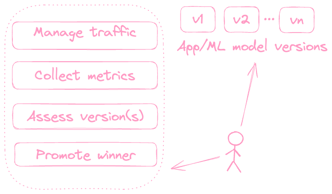

# Iter8: Kubernetes Release Optimizer

[](https://join.slack.com/t/iter8-tools/shared_invite/zt-awl2se8i-L0pZCpuHntpPejxzLicbmw)
[](https://iter8.tools/0.8/getting-started/help/)

>   - Safely rollout apps
>   - Maximize business value
>   - Use with any app/serverless/ML framework
>   - Setup in seconds




## To start using Iter8

Iter8 documentation is available [here](https://iter8.tools). You can get started with Iter8 experiments in seconds using the following links.

1.  [Install Iter8](https://iter8.tools/0.8/getting-started/install/)
2.  [Your first Iter8 experiment](https://iter8.tools/0.8/getting-started/your-first-experiment/)
3.  [Load test HTTP services with SLOs](https://iter8.tools/0.8/tutorials/load-test-http/usage/)
4.  [Load test gRPC services with SLOs](https://iter8.tools/0.8/tutorials/load-test-grpc/usage/)

## To start developing Iter8

Contributions are welcome! 

See [here](CONTRIBUTING.md) for information about ways to contribute, Iter8 community meetings, finding an issue, asking for help, pull-request lifecycle, and more.

### This repo
This repo is the source for [Iter8 documentation](https://iter8.tools) and uses [Mkdocs](https://www.mkdocs.org/user-guide/writing-your-docs/), and [Material for Mkdocs](https://squidfunk.github.io/mkdocs-material/).

#### Locally serve Iter8 docs
Use a Python 3 virtual environment to locally serve Iter8 docs. Clone this repo, and run the following commands from the root of the repo.

```shell
python3 -m venv .venv
source .venv/bin/activate
pip install -r requirements.txt
mkdocs serve -s
```

You can now see your local docs at [http://localhost:8000](http://localhost:8000).

#### View live changes
You will see live updates to [http://localhost:8000](http://localhost:8000) as you update the markdown files under the `docs` folder.

