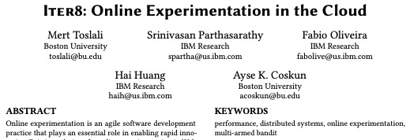

# News and announcements

* **June 2023:** Our [proposal](https://github.com/opendatahub-io/opendatahub-community/blob/f565e64242979673564e3c8c53c84b8a0abf8e3a/proposal/release-engineering.md) to integrate with Open Data Hub has been accepted!

* **March 2023:** New Stack blog article by Michael Kalantar. [Iter8: Simple A/B/n Testing of Kubernetes Apps, ML Models](https://thenewstack.io/iter8-simple-a-b-n-testing-of-kubernetes-apps-ml-models/)

* **February 2023:** DZone article by Alan Cha. [Automated Performance Testing With ArgoCD and Iter8](https://dzone.com/articles/automated-performance-testing-with-argocd-and-iter8)

* **December 2022:** DZone article by Michael Kalantar. [Simplifying A/B/n Testing of Backend Services](https://dzone.com/articles/simplifying-abn-testing-of-backend-services)

* **October 2022:** Iter8 at KubeCon. [Conference details](https://events.linuxfoundation.org/kubecon-cloudnativecon-north-america/)
    * Presentation by Srinivasan Parthasarathy. Video coming soon
    * Lightning talk by Alan Cha. Video link [here](https://www.youtube.com/watch?v=CloYk6W_7Ns)

* **August 2022:** ITNEXT article by Alan Cha. [Performance testing with Iter8, now with custom metrics!](https://itnext.io/performance-testing-with-iter8-now-with-custom-metrics-8c97bb7449c8)

* **August 2022:** Knative blog article by Srinivasan Parthasarathy. [Simple Performance Testing with SLOs](https://knative.dev/blog/articles/performance-test-with-slos/)

* **June 2022:** Iter8 at Open Source Summit. Video coming soon. [Conference details](https://events.linuxfoundation.org/open-source-summit-north-america/)

* **May 2022:** IBM Developer blog article by Srinivasan Parthasarathy. [Dead simple benchmarking and SLO validation for Kubernetes services](https://developer.ibm.com/articles/dead-simple-benchmarking-and-slo-validation-for-kubernetes-services/)

* **May 2022:** New Stack blog article by Srinivasan Parthasarathy. [Iter8 Unifies Performance Validation for gRPC and HTTP](https://thenewstack.io/iter8-unifies-performance-validation-for-grpc-and-http/)

* **March 2022:** New Stack blog article by Michael Kalantar. [Simple Load Testing with GitHub Actions](https://thenewstack.io/simple-load-testing-with-github-actions/)

* **Feb 2022:** New Stack blog article on [Simple HTTP Load Testing with SLOs](https://thenewstack.io/simple-http-load-testing-with-slos/)

* **Nov 2021:** Iter8 at ACM Symposium on Cloud Computing. Full paper [here](https://github.com/sriumcp/papers/blob/main/socc2021-final106.pdf)

    
    
???+ note "Iter8 v0.7 and older"
    
    * **Oct 2021:** New Stack blog article by Hai Huang: [Progressive Delivery on OpenShift](https://thenewstack.io/progressive-delivery-on-openshift/)

    ***

    * **Oct 2021:** Iter8 at PREVAIL conference. Video coming soon. [Conference details](https://www.ibm.com/blogs/academy-of-technology/events/)

    ***

    * **Oct 2021:** New Stack blog article by Srinivasan Parthasarathy: [Validate Service-Level Objectives of REST APIs Using Iter8](https://thenewstack.io/validate-service-level-objectives-of-rest-apis-using-iter8/)

    ***

    * **Jul 2021:** Blog article by Clive Cox: [ML‌ ‌Progressive‌ ‌Rollouts‌ ‌with‌ ‌Seldon‌ ‌and‌ ‌Iter8‌](https://www.seldon.io/ml%E2%80%8C-%E2%80%8Cprogressive%E2%80%8C-%E2%80%8Crollouts%E2%80%8C-%E2%80%8Cwith%E2%80%8C-%E2%80%8Cseldon%E2%80%8C-%E2%80%8Cand%E2%80%8C-%E2%80%8Citer8%E2%80%8C-%E2%80%8C/)

    ***

    * **Jul 2021:** Iter8 at Knative meetup

        <iframe width="560" height="315" src="https://www.youtube.com/embed/TAk6mLjbRmc" title="YouTube video player" frameborder="0" allow="accelerometer; autoplay; clipboard-write; encrypted-media; gyroscope; picture-in-picture" allowfullscreen></iframe>
        
    ***

    * **May 2021:** Iter8 at KubeCon + CloudNativeCon Europe

        <iframe width="560" height="315" src="https://www.youtube.com/embed/6lwgFzRykPY" title="YouTube video player" frameborder="0" allow="accelerometer; autoplay; clipboard-write; encrypted-media; gyroscope; picture-in-picture" allowfullscreen></iframe>

    ***

    * **Mar 2021:** Iter8 at Knative meetup

        <iframe width="560" height="315" src="https://www.youtube.com/embed/WNoa4KfKUOs?start=1062" title="YouTube video player" frameborder="0" allow="accelerometer; autoplay; clipboard-write; encrypted-media; gyroscope; picture-in-picture" allowfullscreen></iframe>

    ***

    * **Mar 2021:** Kubeflow blog article by Animesh Singh and Dan Sun: [Operationalize, Scale and Infuse Trust in AI Models using KFServing](https://blog.kubeflow.org/release/official/2021/03/08/kfserving-0.5.html)

    ***

    * **Oct 2020:** Medium blog article by Michael Kalantar: [Automated Canary Release of Microservices on Kubernetes using Tekton and iter8](https://medium.com/iter8-tools/automated-canary-release-of-microservices-on-kubernetes-using-tekton-and-iter8-42835c33f7e8)

    ***

    * **Oct 2020:** Medium blog article by Kusuma Chalasani: [Better Performance with kruize and iter8 for your microservices application](https://medium.com/@kusuma.ch/better-performance-with-kruize-and-iter8-for-your-microservices-application-e41a58566540)

    ***

    * **Oct 2020:** Medium blog article by Srinivasan Parthasarathy: [Automated Canary Release of TensorFlow Models on Kubernetes](https://medium.com/iter8-tools/automated-canary-release-of-tensorflow-models-on-kubernetes-7663c26613d3)

    ***

    * **Oct 2020:** Medium blog article by Sushma Ravichandran: [Iter8: Take a look at the magic under the hood](https://medium.com/iter8-tools/iter8-take-a-look-at-the-magic-under-the-hood-919235ec3c84)

    ***

    * **Aug 2020:** Medium blog article by Fabio Oliveira: [Iter8: Achieving Agility with Control](https://medium.com/iter8-tools/iter8-achieving-agility-with-control-dcd21e4437d2)
