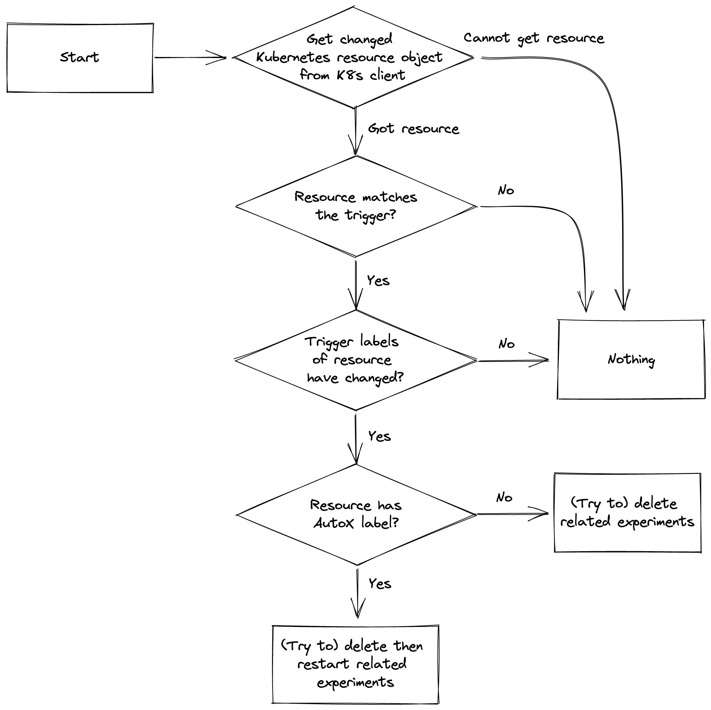

# Iter8
Iter8 is the Kubernetes release optimizer built for DevOps, MLOps, SRE and data science teams. Iter8 makes it easy to ensure that Kubernetes apps and ML models perform well and maximize business value.

Iter8 supports the following use-cases.

1.  Performance testing and SLO validation of HTTP services.
2.  Performance testing and SLO validation of gRPC services.
3.  SLO validation using custom metrics from any database(s) or REST API(s).
4.  A/B/n experiments.


## Iter8 experiment
Iter8 introduces the notion of an *experiment*. An experiment is simply a list of tasks that are executed in a specific sequence.

<p align='center'>
  
</p>

Iter8 provides a variety of configurable tasks. Authoring an experiment is as simple as specifying the names of the tasks and specifying their parameter values. The following are some examples of tasks provided by Iter8.

1.  Tasks for **generating load and collecting built-in metrics** for HTTP and gRPC services.
2.  A task for verifying **service-level objectives (SLOs)** for apps or app versions.
3.  A task for fetching **custom metrics** from any database(s) or REST API(s).
4.  A task for checking if an object **exists** in the Kubernetes cluster and is **ready**.

In addition to pre-defined tasks, Iter8 packs a number of powerful features that facilitate experimentation. They include the following.

1.  **HTML/text reports** that promote end-user understanding of experiment results through visual insights.
2.  **Assertions** that verify whether the target app satisfies the specified SLOs or not during/after an experiment.
3.  **Multi-loop experiments** that can be executed periodically instead of just once (single-loop).
4.  **Local experiments** that enable you to run experiments in your local environment.
5.  **Iter8 GitHub Action** that enables you to invoke the Iter8 CLI within a GitHub Actions workflow.

## Under the covers
In order to execute an experiment inside Kubernetes, Iter8 uses a Kubernetes [job](https://kubernetes.io/docs/concepts/workloads/controllers/job/) (single-loop) or a Kubernetes [cronjob](https://kubernetes.io/docs/concepts/workloads/controllers/cron-jobs/) (multi-loop) workload, along with a Kubernetes secret. Iter8 instantiates all experiments using a Helm chart, that is also pre-defined and provided by Iter8.

<p align='center'>
  
</p>

## Implementation
Iter8 is written in `go` and builds on a few awesome open source projects including:

- [Helm](https://helm.sh)
- [Fortio](https://github.com/fortio/fortio)
- [ghz](https://ghz.sh)
- [plotly.js](https://github.com/plotly/plotly.js)

## AutoX

AutoX, short for "auto experimentation", allows Iter8 to detect changes to your Kubernetes resources objects and automatically start new experiments, allowing you to test your applications as soon as you push out a new version.

To configure AutoX, you will need to specify a set of experiment groups and, for each group, the Kubernetes resource object (a.k.a. trigger object) that you expect AutoX to watch and one or more experiments to be performed in response to new versions of this object.

The trigger object is specified by providing the name, namespace, and the group-version-resource (GVR) metadata of the trigger object.

See the following example:

```bash
helm install autox iter8/autox --version 0.1.6 \
--set 'groups.httpbin.trigger.name=httpbin' \
--set 'groups.httpbin.trigger.namespace=default' \
--set 'groups.httpbin.trigger.group=apps' \
--set 'groups.httpbin.trigger.version=v1' \
--set 'groups.httpbin.trigger.resource=deployments' \
--set 'groups.httpbin.specs.iter8.name=iter8' \
--set 'groups.httpbin.specs.iter8.values.tasks={ready,http,assess}' \
--set 'groups.httpbin.specs.iter8.values.ready.deploy=httpbin' \
--set 'groups.httpbin.specs.iter8.values.ready.service=httpbin' \
--set 'groups.httpbin.specs.iter8.values.ready.timeout=60s' \
--set 'groups.httpbin.specs.iter8.values.http.url=http://httpbin.default/get' \
--set 'groups.httpbin.specs.iter8.values.assess.SLOs.upper.http/latency-mean=50' \
--set 'groups.httpbin.specs.iter8.values.assess.SLOs.upper.http/error-count=0' \
--set 'groups.httpbin.specs.iter8.version=0.13.0' \
--set 'groups.httpbin.specs.iter8.values.runner=job'
```

In this example, there is only one experiment group named `httpbin` (`groups.httpbin...`), and within that group, there is the trigger object definition (`groups.httpbin.trigger...`) and a single experiment spec named `iter8` (`groups.httpbin.specs.iter8...`).

***

Additionally, when a new version of the trigger object has been released, AutoX will make two additional checks before launching the experiment.

First, AutoX will perform the *version label check*. AutoX will ensure that that the `app.kubernetes.io/version` label (version label) has been changed. The purpose of this check is to ensure that AutoX does not relaunch experiments with every update to the trigger object. For example, AutoX should not relaunch experiments when only the `status` of a deployment changes.

Second, AutoX will perform the *AutoX label check*. AutoX will ensure that the trigger object has the `iter8.tools/autox=true` label (AutoX label). If the trigger object does not have the AutoX label, then AutoX will not relaunch any experiments on its behalf. 

If AutoX determines that a new version of the trigger object has been released and the trigger satisfies both label checks, then AutoX will first try to delete any preexisting experiments and then restart them. However, if the trigger object does not have the AutoX label, then AutoX will try to delete any preexisting experiments.

