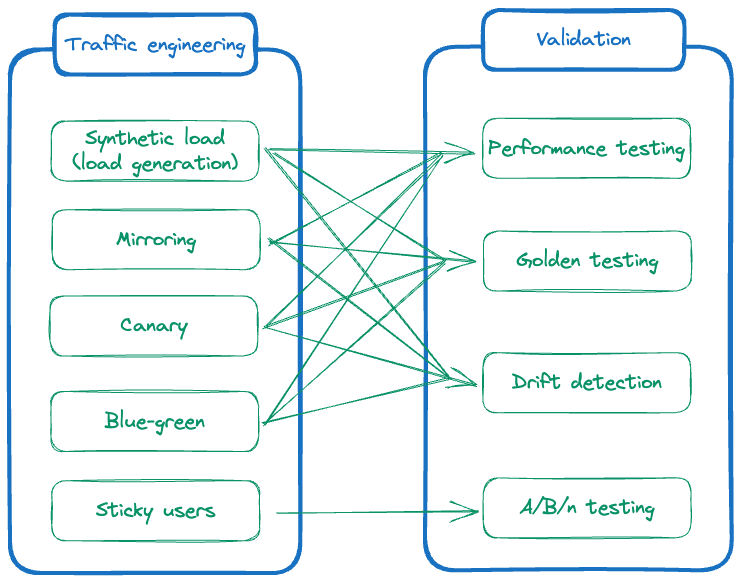
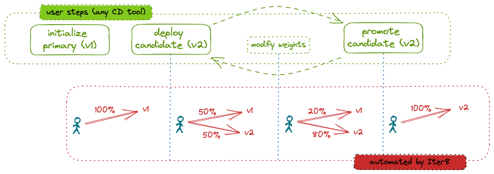

# Iter8
Iter8 is the Kubernetes release optimizer built for DevOps, MLOps, SRE and data science teams. Iter8 automates traffic control for new versions of apps/ML models in the cluster and visualizes their performance metrics.

## Use-cases

Iter8 simplifies a variety of traffic engineering and metrics-driven validation use-cases. They are illustrated below.

## Design

Iter8 provides three inter-related components to support the above use-cases.

1. CLI for experiments
2. Traffic controller
3. Client SDK

=== "CLI for experiments"
    Iter8 introduces the notion of an *experiment*, and provides a CLI for executing experiments and retrieving their results. An experiment is simply a list of tasks that are executed in a specific sequence. 
    
    The following picture illustrates a performance testing experiment for an HTTP application; this experiment consists of two tasks.

    

    In addition to performance testing for HTTP and gRPC services, Iter8 experiments can also be used to compare versions of an app/ML model in terms of their business metrics.

=== "Traffic controller"

    Iter8 provides a traffic controller that automatically and dynamically reconfigures routing resources based on the state of Kubernetes apps/ML models. 
    
    The following picture illustrates a Blue-Green rollout scenario that is orchestrated by this traffic controller.

    
    
    As part of the dynamic reconfiguration of route resources, the Iter8 controller also looks into readiness (for e.g., in KServe modelmesh), availability (for e.g., in Kubernetes deployments) and other relevant status conditions before configuring traffic splits to candidate versions. Similarly, before candidate versions are deleted, the Iter8 controller uses finalizers to first ensure that all traffic flows to the primary version of the ML model. This makes for a very high-degree of reliability and zero-downtime/loss-less rollouts of new app/ML model versions. Users do not get this level of reliability out-of-the-box with a vanilla service mesh.

    With Iter8, the barrier to entry for end-users is significantly reduced. In particular, by just providing names of their ML serving resources, and (optional) traffic weights/labels, end users can get started with their release optimization use cases rapidly. Further, Iter8 does not limit the capabilities of the underlying service mesh in anyway. This means more advanced teams still get to use all the power of the service-mesh alongside the reliability and ease-of-use that Iter8 brings.

=== "Client SDK"

    Iter8 provides a client-side SDK to facilitate routing as well as metrics collection task associated with distributed (i.e., client-server architecture-based) A/B/n testing in Kubernetes. 
    
    The following picture illustrates the use of the SDK for A/B testing.

    

    Iter8's SDK is designed to handle user stickiness, collection of business metrics, and decoupling of front-end and back-end releases processes during A/B/n testing.

## Implementation
Iter8 is written in `go` and builds on a few awesome open source projects including:

- [Helm](https://helm.sh)
- [Istio](https://istio.io)
- [plotly.js](https://github.com/plotly/plotly.js)
- [Fortio](https://github.com/fortio/fortio)
- [ghz](https://ghz.sh)
