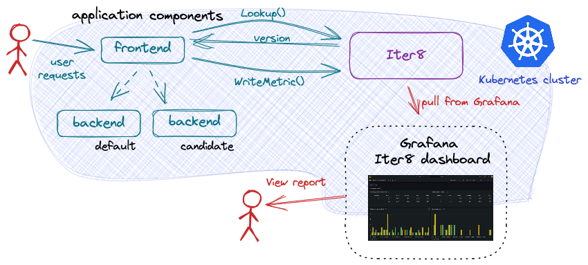

# Iter8
Iter8 is the Kubernetes release optimizer built for DevOps, MLOps, SRE and data science teams. Iter8 automates traffic control for new versions of apps/ML models in the cluster and visualizes their performance metrics.

## Use-cases

Iter8 simplifies a variety of traffic engineering and metrics-driven validation use-cases. To support such use cases, Iter8 provides support for the key challenges enabling simpler implementation and quicker adoption.

**Progressive release with automated traffic management** Iter8 supports blue-green and canary release of new application and ML models. When new models are deployed, Iter8 automatically reconfigures the routing to desired traffic pattern. Deployment of new versions and their promotion is done by describing the desired state.

**A/B/n testing wtih client SDK and business metrics** Iter8 addresses the challenge of doing A/B/n testing of backend application components/ML models. It provides a simple client SDK allowing a user-facing component to easily reliably associate business metrics with the backend components that are used. This SDK provides stick lookup based on user request headers.

**Performance testing for HTTP and gRPC endpoints** To enable rapid testing, Iter8 provides sythentic load generation and mechanisms to support test notifications. A set of reusable tasks can be used to implement the desired test and notification behavior.

## Design Principles

**Support all application** Iter8 does not limit what types of resources define an application. It supports applications that are composed of any Kubernetes resources including those defined by custom resource definitions (CRDs). Adding support for a new resource type is both straightforward and declartive.

**Support any routing technology** Progress release use cases are supported using an service mesh or ingress. Iter8 natively supports the Kubernetes Gateway API allowing easy adoption of many of these technologies. However, native interfaces can also be supported declaratively.

**Simplify user interaction** Iter8 leverages Helm to allow users to declartively specify deployment patterns and to describe test scenarios. The Helm charts provided by Iter8 minimize the barrier to entry by providing common out examples. Extension is often possible just be modifying the input to the charts. However, more complicated use cases can also be supported by (user) modification of the Helm charts as well.

**Minimize Access** Progressive release and A/B/n use cases require the user to install a Kubernetes controller. However, Iter8 allows for users with only namespace level access to install and use Iter8. It can also be installed and run with cluster level access.

## Implementationn Choices

### Iter8 controller

Iter8 is a controller based architecture. It monitors the Kubernetes objects that make up versions of an application/ML model and automatically reconfigures the routing resources based on their state. In this way, a user just deploys and evaluates versions; she does not con

The following picture illustrates a blue-green rollout scenario that is orchestrated by this controller.

As part of the dynamic reconfiguration of route resources, the Iter8 controller also checks for readiness (for e.g., in KServe ModelMesh), availability (for e.g., in Kubernetes deployments) and other relevant status conditions before configuring traffic splits to candidate versions. Similarly, before candidate versions are deleted, the Iter8 controller uses finalizers to first ensure that all traffic flows to the primary version of the ML model. This makes for a very high-degree of reliability and zero-downtime/loss-less rollouts of new app/ML model versions. Users do not get this level of reliability out-of-the-box with a vanilla service mesh.

With Iter8, the barrier to entry for end-users is significantly reduced. In particular, by just providing names of their ML serving resources, and (optional) traffic weights/labels, end users can get started with their release optimization use cases rapidly. Further, Iter8 does not limit the capabilities of the underlying service mesh in any way. This means more advanced teams still get to use all the power of the service-mesh alongside the reliability and ease-of-use that Iter8 brings.

### Client SDK

Iter8 provides a client-side SDK to facilitate routing as well as metrics collection task associated with distributed (i.e., client-server architecture-based) A/B/n testing in Kubernetes. 

The following picture illustrates the use of the SDK for A/B testing.

Iter8's SDK is designed to handle user stickiness, collection of business metrics, and decoupling of front-end and back-end releases processes during A/B/n testing.

In addition, Iter8 provides a simple metrics store, eliminating the need for an external database.

### Performance testing tasks

Iter8 introduces a set of tasks which which can be composed in order to conduct a variety of performance tests.

The following picture illustrates a performance test for an HTTP application, and this test consists of two tasks.

In addition to load testing HTTP and gRPC services, Iter8 tasks can perform other actions such as sending notifications to Slack or GitHub.

## Built using open source

Iter8 is written in `go` and builds on a few awesome open source projects including:

- [Helm](https://helm.sh)
- [Istio](https://istio.io)
- [Kubernetes Gateway API](https://gateway-api.sigs.k8s.io/)
- [Fortio](https://github.com/fortio/fortio)
- [ghz](https://ghz.sh)
- [Grafana](https://grafana.com/)
