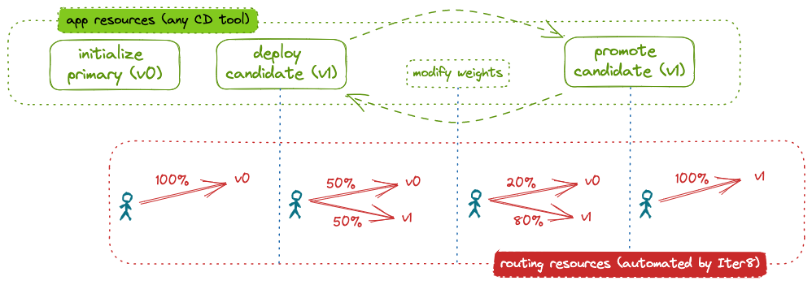

# Automated blue-green rollout

This tutorial shows how Iter8 can be used to implement a blue-green rollout of a Kubernetes application. In a blue-green rollout, a percentage of requests are directed to a candidate version of the application. The remaining requests go to the primary, or initial, version. Iter8 enables a blue-green rollout by automatically configuring routing resources to distribute requests.

After a one-time initialization step, the end user merely deploys candidate versions, evaluates them, and either promotes or deletes them. Optionally, the end user can modify the percentage of requests being sent to the candidate. Iter8 automatically handles all underlying routing configuration.



???+ warning "Before you begin"
    1. Ensure that you have the [kubectl CLI](https://kubernetes.io/docs/reference/kubectl/).
    2. Install [Istio](https://istio.io). You can install the [demo profile](https://istio.io/latest/docs/setup/getting-started/).

## Install Iter8 controller

--8<-- "docs/tutorials/installiter8controller.md"

## Initialize primary

### Application

Deploy the primary version of the application. In this tutorial, the application is a Kubernetes `Deployment`. We use `httpbin` as our application. Initialize the resources for the primary version (`v0`) as follows:

```shell
kubectl create deployment httpbin-0 --image=kennethreitz/httpbin --port=80
kubectl label deployment httpbin-0 iter8.tools/watch=true
kubectl expose deployment httpbin-0 --port=80
```

??? note "About the primary"
    Naming the instance with the suffix `-0` (and the candidate with the suffix `-1`) simplifies the routing initialization (see below). However, any name can be specified.
    
    The label `iter8.tools/watch: "true"` is required. It lets Iter8 know that it should pay attention to changes to this application resource.

You can inspect the deployed `Deployment`. When the `AVAILABLE` field becomes `1`, the application is fully deployed.

```shell
kubectl get deployment httpbin-0
```

### Routing

Initialize the routing resources for the application to use a blue-green rollout strategy:

```shell
cat <<EOF | helm template routing --repo https://iter8-tools.github.io/iter8 routing-actions -f - | kubectl apply -f -
appType: deployment
appName: httpbin
action: initialize
strategy: blue-green
EOF
```

The `initialize` action (with strategy `blue-green`) configures the (Istio) service mesh to route all requests to the primary version of the application (`httpbin-0`). It further defines the routing policy that will be used when changes are observed in the application resources. By default, this routing policy splits requests 50-50 between the primary and candidate versions. For detailed configuration options, see the [Helm chart](https://github.com/iter8-tools/iter8/blob/v0.16.0/charts/routing-actions/values.yaml).

### Verify routing

To verify the routing configuration, you can inspect the `VirtualService`:

```shell
kubectl get virtualservice -o yaml httpbin
```

To send inference requests to the model:

=== "From within the cluster"
    1. Create a `sleep` pod in the cluster from which requests can be made:
    ```shell
    curl -s https://raw.githubusercontent.com/iter8-tools/docs/v0.15.2/samples/kserve-serving/sleep.sh | sh -
    ```

    2. Exec into the sleep pod:
    ```shell
    kubectl exec --stdin --tty "$(kubectl get pod --sort-by={metadata.creationTimestamp} -l app=sleep -o jsonpath={.items..metadata.name} | rev | cut -d' ' -f 1 | rev)" -c sleep -- /bin/sh
    ```

    3. Send requests:
    ```shell
    curl httpbin.default -s -D - \
    | grep -e HTTP -e app-version
    ```

=== "From outside the cluster"
    1. In a separate terminal, port-forward the ingress gateway:
    ```shell
    kubectl -n istio-system port-forward svc/istio-ingressgateway 8080:80
    ```

    2. Send requests:
    ```shell
    curl -H 'Host: httpbin.default' localhost:8080 -s -D - \
    | grep -e HTTP -e app-version
    ```

??? note "Sample output"
    The primary version of the application `httpbin-0` will output the following:

    ```
    HTTP/1.1 200 OK
    app-version: httpbin-0
                                        <p>A simple HTTP Request &amp; Response Service.
    ```

Note that the model version responding to each inference request is noted in the response header `app-version`. In the requests above, we display only the response code and this header.

## Deploy candidate

Deploy a candidate model using a second `Deployment`:

```shell
kubectl create deployment httpbin-1 --image=kennethreitz/httpbin --port=80
kubectl label deployment httpbin-1 app.kubernetes.io/version=v1
kubectl label deployment httpbin-1 iter8.tools/watch=true
kubectl expose deployment httpbin-1 --port=80
```

??? note "About the candidate"
    In this tutorial, the image is the same as for the primary version. In a real world example, it would be different.

### Verify routing changes

The deployment of the candidate triggers an automatic routing reconfiguration by Iter8. Inspect the `VirtualService` to see that the routing has been changed. Inspect the `VirtualService` to see that the routing has been changed. Requests are now distributed between the primary model and the secondary model:

```shell
kubectl get virtualservice httpbin -o yaml
```

You can send additional inference requests as described above. They will be handled by both versions of the model.


??? note "Sample output"
    You will see output from both the primary and candidate version of the application, `httpbin-0` and `httpbin-1` respectively.


    `httpbin-0` output:
    ```
    HTTP/1.1 200 OK
    app-version: httpbin-0
                                        <p>A simple HTTP Request &amp; Response Service.
    ```

    `httpbin-1` output:
    ```
    HTTP/1.1 200 OK
    app-version: httpbin-1
                                        <p>A simple HTTP Request &amp; Response Service.
    ```

## Modify weights (optional)

You can modify the weight distribution of inference requests as follows:

```shell
cat <<EOF | helm template routing --repo https://iter8-tools.github.io/iter8 routing-actions -f - | kubectl apply -f -
appType: deployment
appName: httpbin
action: modify-weights
strategy: blue-green
appVersions:
  - weight: 20
  - weight: 80
EOF
```

Note that using the `modify-weights` action overrides the default traffic split for all future candidate deployments.

As above, you can verify the routing changes.

## Promote candidate

Promoting the candidate involves redefining the primary version of the application and deleting the candidate version.

### Redefine primary

```shell
kubectl set image deployment/httpbin-0 httpbin=kennethreitz/httpbin
kubectl label deployment httpbin-0 app.kubernetes.io/version=v1 --overwrite
```

??? note "What is different?"
    The version label (`app.kubernets.io/version`) was updated. In a real world example, the image would also have been updated.

### Delete candidate

Once the primary has been redeployed, delete the candidate:

```shell
kubectl delete deployment/httpbin-1 service/httpbin-1
```

### Verify routing changes

Inspect the `VirtualService` to see that the it has been automatically reconfigured to send requests only to the primary.

## Cleanup

If not already deleted, delete the candidate:

```shell
kubectl delete deployment/httpbin-1 service/httpbin-1
```

Delete routing:

```shell
cat <<EOF | helm template routing --repo https://iter8-tools.github.io/iter8 routing-actions -f - | kubectl delete -f -
appType: deployment
appName: httpbin
action: initialize
strategy: blue-green
EOF
```

Delete primary:

```shell
kubectl delete deployment/httpbin-0 service/httpbin-0
```

Uninstall Iter8 controller:

--8<-- "docs/tutorials/deleteiter8controller.md"
