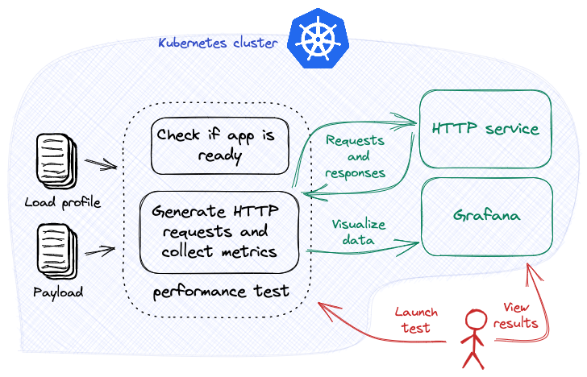

# Your First Experiment

Run your first [Iter8 experiment](concepts.md#design) by load testing a Kubernetes HTTP service and visualizing the experiment results with an Iter8 Grafana dashboard.



???+ warning "Before you begin"
    1. Ensure that you have a Kubernetes cluster and the [`kubectl` CLI](https://kubernetes.io/docs/reference/kubectl/). You can create a local Kubernetes cluster using tools like [Kind](https://kind.sigs.k8s.io/) or [Minikube](https://minikube.sigs.k8s.io/docs/).
    2. Deploy the sample HTTP service in the Kubernetes cluster.
    ```shell
    kubectl create deploy httpbin --image=kennethreitz/httpbin --port=80
    kubectl expose deploy httpbin --port=80
    ```
    3. Have Grafana available. For example, Grafana can be installed on your cluster as follows:
    ```shell
    kubectl create deploy grafana --image=grafana/grafana
    kubectl expose deploy grafana --port=3000
    ```

***

## Install Iter8 CLI
--8<-- "docs/getting-started/install.md"

## Install Iter8

--8<-- "docs/tutorials/installiter8controller.md"

## Launch experiment
Launch the Iter8 experiment inside the Kubernetes cluster.

=== "GET example"
    ```shell
    iter8 k launch \
    --set "tasks={ready,http}" \
    --set ready.deploy=httpbin \
    --set ready.service=httpbin \
    --set ready.timeout=60s \
    --set http.url=http://httpbin.default/get
    ```

=== "POST example"
    ```shell
    iter8 k launch \
    --set "tasks={ready,http}" \
    --set ready.deploy=httpbin \
    --set ready.service=httpbin \
    --set ready.timeout=60s \
    --set http.url=http://httpbin.default/post \
    --set http.payloadStr=hello
    ```

??? note "About this experiment"
    This experiment consists of two [tasks](concepts.md#design), namely, [ready](../user-guide/tasks/ready.md) and [http](../user-guide/tasks/http.md). 
    
    The [ready](../user-guide/tasks/ready.md) task checks if the `httpbin` deployment exists and is available, and the `httpbin` service exists. 
    
    The [http](../user-guide/tasks/http.md) task sends requests to the cluster-local HTTP service using the specified `url`, and collects [Iter8's built-in HTTP load test metrics](../user-guide/tasks/http.md#metrics). This tasks supports both GET and POST requests, and for POST requests, a payload can be provided by using either `payloadStr` or `payloadURL`.

## Assert experiment outcomes
Assert that the experiment completed without failures. The timeout flag below specifies a period of 120 seconds for assert conditions to be satisfied.

```shell
iter8 k assert -c completed -c nofailure --timeout 120s
```

## View results using Grafana
Inspect the metrics using Grafana. If Grafana is deployed to your cluster, port-forward requests as follows:

```shell
kubectl port-forward service/grafana 3000:3000
```

Open Grafana in a browser:

```shell
http://localhost:3000/
```

[Add a JSON API data source](http://localhost:3000/connections/datasources/marcusolsson-json-datasource) `Iter8` with the following parameters:

* URL `http://iter8.default:8080/httpDashboard` 
* Query string `namespace=default&experiment=default`

[Create a new dashboard](http://localhost:3000/dashboards) by *import*. Paste the contents of this [JSON definition](https://gist.githubusercontent.com/Alan-Cha/112565542bf8829223bbc12bece8099c/raw/2c7f740ddd53e7e7fa9f662e9cc7e8df145b704f/gistfile1.txt) into the text box and *load* it. Associate it with the JSON API data source defined above.

The Iter8 dashboard will look like the following:


## View experiment logs
Logs are useful when debugging an experiment.

```shell
iter8 k log
```

--8<-- "docs/getting-started/logs.md"

***

## Cleanup
Remove the Iter8 experiment and the sample app from the Kubernetes cluster and the local Iter8 `charts` folder.
```shell
iter8 k delete
kubectl delete svc/httpbin
kubectl delete deploy/httpbin
```

***

Congratulations! :tada: You completed your first Iter8 experiment.

***

??? note "Some variations and extensions of this experiment"
    1. The [http task](../user-guide/tasks/http.md) can be configured with load related parameters such as the number of requests, queries per second, or number of parallel connections.
    2. The [http task](../user-guide/tasks/http.md) can be configured to send various types of content as payload.
