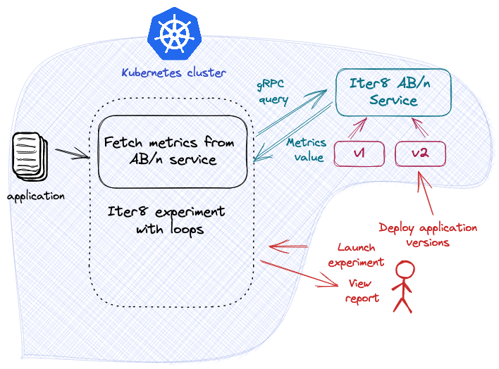
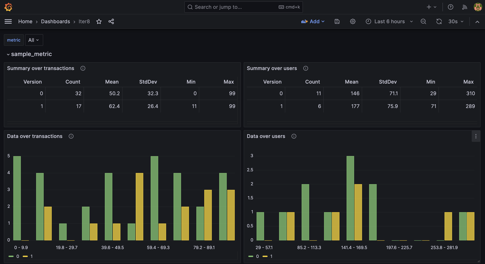

# A/B Testing with the Iter8 SDK

This tutorial describes how to do A/B testing of a backend component using the [Iter8 SDK](../../user-guide/topics/ab_testing.md). 



***

???+ warning "Before you begin"
    1. Try [your first experiment](../../getting-started/your-first-experiment.md). Understand the main [concepts](../../getting-started/concepts.md) behind Iter8 experiments.
    2. Have Grafana available. For example, Grafana can be installed on your cluster as follows:
    ```shell
    kubectl create deploy grafana --image=grafana/grafana
    kubectl expose deploy grafana --port=3000
    ```
 
## Launch the Iter8 controller

Deploy the Iter8 controller using either `helm` or `kustomize`:

--8<-- "docs/tutorials/installiter8controller.md"

## Deploy the sample application

A sample application using the Iter8 SDK is provided. Deploy both the frontend and backend components of this application as described in each tab:

=== "frontend"
    Install the frontend component using an implementation in the language of your choice:

    === "node"
        ```shell
        kubectl create deployment frontend --image=iter8/abn-sample-frontend-node:0.15.0
        kubectl expose deployment frontend --name=frontend --port=8090
        ```
        <!-- kubectl create deployment frontend --image=kalantar/frontend-node:20230717-1552 -->

    === "Go"
        ```shell
        kubectl create deployment frontend --image=iter8/abn-sample-frontend-go:0.15.0
        kubectl expose deployment frontend --name=frontend --port=8090
        ```
        <!-- kubectl create deployment frontend --image=kalantar/frontend-go:20230717-1339 -->
    
    The frontend component is implemented to call `Lookup()` before each call to the backend component. The frontend component uses the returned version number to route the request to the recommended version of the backend component.

=== "backend"
    Deploy an initial version of the *backend* component:

    ```shell
    kubectl create deployment backend --image=iter8/abn-sample-backend:0.13-v1
    kubectl label deployment backend iter8.tools/watch="true"

    kubectl expose deployment backend --name=backend --port=8091
    ```

## Describe the Application

In order to support `Lookup()`, Iter8 needs to know what the application component versions look like. A `ConfigMap` is used to describe the make up of possible versions:

```shell
cat <<EOF | kubectl apply -f -
apiVersion: v1
kind: ConfigMap
metadata:
  name: backend
  labels:
    app.kubernetes.io/managed-by: iter8
    iter8.tools/kind: routemap
    iter8.tools/version: "v0.16"
immutable: true
data:
  strSpec: |
    versions:
    - resources:
      - gvrShort: svc
        name: backend
        namespace: default
      - gvrShort: deploy
        name: backend
        namespace: default
    - resources:
      - gvrShort: svc
        name: backend-candidate-1
        namespace: default
      - gvrShort: deploy
        name: backend-candidate-1
        namespace: default
EOF
```

In this definition, each version of the application is composed of a `Service` and a `Deployment`. In the primary version, both are named `backend`. In any candidate version they are named `backend-candidate-1`. Iter8 uses this definition to identify when any of the versions of the application are available. It can then respond appropriately to `Lookup()` requests. 

## Generate load

In separate shells, port-forward requests to the frontend component and generate load for multiple users. A [script](https://raw.githubusercontent.com/iter8-tools/docs/main/samples/abn-sample/generate_load.sh) is provided to do this. To use it:
    ```shell
    kubectl port-forward service/frontend 8090:8090
    ```
    ```shell
    curl -s https://raw.githubusercontent.com/iter8-tools/docs/v0.15.0/samples/abn-sample/generate_load.sh | sh -s --
    ```
    <!-- # source /Users/kalantar/projects/go.workspace/src/github.com/iter8-tools/docs/samples/abn-sample/generate_load.sh -->

## Deploy a candidate version

Deploy the candidate version of the *backend* component, naming it `backend-candidate-1`.

```shell
kubectl create deployment backend-candidate-1 --image=iter8/abn-sample-backend:0.13-v2
kubectl label deployment backend-candidate-1 iter8.tools/watch="true"

kubectl expose deployment backend-candidate-1 --name=backend-candidate-1 --port=8091
```

Until the candidate version is ready; that is, until all expected resources are deployed and available, calls to `Lookup()` will return only the version number `0`; the existing version.
Once the candidate version is ready, `Lookup()` will return both version numbers (`0` and `1`) so that requests can be distributed across versions.

## Compare versions using Grafana

Inspect the metrics using Grafana. If Grafana is deployed to your cluster, port-forward requests as follows:

```shell
kubectl port-forward service/grafana 3000:3000
```

Open Grafana in a browser by going to [http://localhost:3000](http://localhost:3000)

[Add a JSON API data source](http://localhost:3000/connections/datasources/marcusolsson-json-datasource) `Iter8` with the following parameters:

* URL: `http://iter8.default:8080/metrics`
* Query string: `application=default%2Fbackend`

[Create a new dashboard](http://localhost:3000/dashboards) by *import*. Copy and paste the contents of the [`abn` Grafana dashboard](https://raw.githubusercontent.com/iter8-tools/iter8/v0.16.2/grafana/abn.json) into the text box and *load* it. Associate it with the JSON API data source above.

The Iter8 dashboard allows you to compare the behavior of the two versions of the backend component against each other and select a winner. Since user requests are being sent by the load generation script, the values in the report may change over time. The Iter8 dashboard will look like the following:



Once you identify a winner, it can be promoted, and the candidate version deleted.

## Promote candidate version

To promote the candidate version (`backend-candidate-1`), first update the primary version, `backend`, using the new image. You can also overwrite any metadata describing the version.

```shell
kubectl set image deployment/backend abn-sample-backend=iter8/abn-sample-backend:0.13-v2
```

Finally, delete the candidate version:

```shell
kubectl delete svc/backend-candidate-1 deploy/backend-candidate-1
```

Calls to `Lookup()` will now recommend that all traffic be sent to the primary version `backend` (currently serving the promoted version of the code).

## Cleanup

### Delete sample application

```shell
kubectl delete \
svc/frontend deploy/frontend \
svc/backend deploy/backend \
svc/backend-candidate-1 deploy/backend-candidate-1
```

### Delete the application description

```shell
kubectl delete cm/backend
```

### Uninstall the Iter8 controller

--8<-- "docs/tutorials/deleteiter8controller.md"
