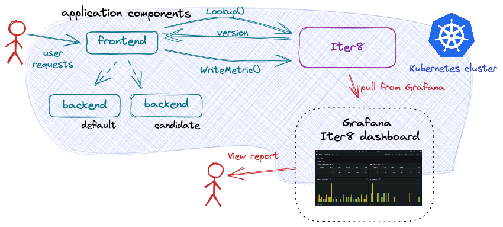

# A/B Experiments

A/B testing an application's backend component is challenging.
A/B testing typically relies on business metrics computed by a frontend, user-facing, service.
Metric values often depend on one or more interactions with backend (not user-facing) components.
To A/B test a backend component, it is necessary to be able to associate a metric value (computed by the frontend) to the version of the backend component that contributed to its computation.
The challenge is that the frontend service often does not know which version of the backend component processed a given request.

To address this challenge, Iter8 introduces an A/B/n SDK which provides a frontend service with two APIs:

a. **Lookup()** - identifies a version of a backend component to send a request to

b. **WriteMetric()** - associates a metric with a backend component

This SDK, implemented using gRPC, can be used from a number of frontend implementation languages including *Node.js*, *Python*, *Ruby*, and *Go*, among others. Details of the Iter8 SDK are documented in the [gRPC protoc file](https://github.com/iter8-tools/iter8/blob/v0.12.0/abn/grpc/abn.proto).

This tutorial describes an A/B testing experiment for a backend component.
Example frontends are provided in *Node.js*, *Python* and *Go*.

??? note "A/B testing frontend services"
    Note that A/B testing a frontend service is a simpler use case becaue metrics are generated by component itself. 
    In this case, traditional testing methods can be applied.

<p align='center'>

</p>

***

???+ warning "Before you begin"
    1. Try [your first experiment](../../getting-started/your-first-experiment.md). Understand the main [concepts](../../getting-started/concepts.md) behind Iter8 experiments.
 
## Deploy the sample application

Deploy both the frontend and backend components of the application as described in each tab:

=== "frontend"
    Install the frontend service using an implementation in the language of your choice:

    === "node"
        ```shell
        kubectl create deployment frontend --image=iter8/abn-sample-frontend-node:latest
        kubectl expose deployment frontend --name=frontend --port=8090
        ```

    === "Python"
        ```shell
        kubectl create deployment frontend --image=iter8/abn-sample-frontend-python:latest
        kubectl expose deployment frontend --name=frontend --port=8090
        ```

    === "Go"
        ```shell
        kubectl create deployment frontend --image=iter8/abn-sample-frontend-go:latest
        kubectl expose deployment frontend --name=frontend --port=8090
        ```
    
    The frontend service is implemented to call **Lookup()** before each call to the backend service. It sends its request to the recommended backend service.

=== "backend"
    Deploy the *v1* version of the *backend* component as track *default*.

    ```shell
    kubectl create deployment backend --image=iter8/abn-sample-backend:latest
    kubectl expose deployment backend --name=backend --port=8091

    kubectl label deployment backend app.kubernetes.io/name=backend
    kubectl label deployment backend app.kubernetes.io/version=v1
    kubectl label deployment backend iter8.tools/track=default
    kubectl label deployment backend iter8.tools/abn=true
    ```
 
## Generate load
Generate load. In separate shells, port-forward requests to the frontend service and generate load for multiple users.  For example:
    ```shell
    kubectl port-forward svc/frontend 8090:8090
    ```
    ```shell
    curl -s https://raw.githubusercontent.com/iter8-tools/docs/main/samples/abn-sample/generate_load.sh | sh -s -- -u foo
    ```
    ```shell
    curl -s https://raw.githubusercontent.com/iter8-tools/docs/main/samples/abn-sample/generate_load.sh | sh -s -- -u foobar
    ```

## Launch Iter8 A/B/n service

If not already deployed, deploy the Iter8 A/B/n service. This service implements the gRPC interfaces. Specify which Kubernetes resource types to watch in which namespaces:

```shell
helm install --repo https://iter8-tools.github.io/hub iter8-abn iter8-abn \
--set "resources={deployments,services}" \
--set "namespaces={default}"
```

??? warn "Currently supported resource types"
    Iter8 currently supports watching Kubernetes deployments and services as well as Knative services.
    The Helm chart used to deploy the service can be easily extended to support additional resource types.

## Deploy a candidate version

Deploy the *v2* version of the *backend* component as track *candidate*.

```shell
kubectl create deployment backend-candidate --image=iter8/abn-sample-backend:latest
kubectl expose deployment backend-candidate --name=backend-candidate --port=8091

kubectl label deployment backend-candidate app.kubernetes.io/name=backend
kubectl label deployment backend-candidate app.kubernetes.io/version=v2
kubectl label deployment backend-candidate iter8.tools/track=candidate
```

When version *v2* of the backend component is deployed, the frontend service continues to send requests only to version *v2* until the new version is marked as *ready* by adding the `iter8.tools/abn` label.

## Mark the candidate version ready

Once the candidate version is ready to receive user traffic, for example, when the pods are `Ready`, label the deployment object as a valid participant in A/B/n experiments:

```shell
kubectl label deployment backend-candidate iter8.tools/abn=true
```

Once labeled, subsequent `Lookup()` requests may return the candidate version. 
To terminate traffic to the candidate version, simply remove the `iter8.tools/abn` label.

??? note "How labels are used"
    The Iter8 service watches resources where the label `iter8-tools/abn` is set to `true`. On resources where this is the case, the following additional labels are expected to be present. They identify the role of the resource in an A/B/n experiment. Note that an application _version_ might be composed of multiple resources. Iter8 expects only one of these resources to be labeled.

    1. `app.kubernetes.io/name`: the application (component) name
    2. `app.kubernetes.io/version`: the version name
    3. `iter8-tools/track`: the track identifier (used by frontend service to route requests)

    If any of these labels is missing, Iter8 will ignore the resource.

## Launch experiment

```shell
iter8 k launch \
--set abnmetrics.application=default/backend \
--set "tasks={abnmetrics}" \
--set runner=cronjob \
--set cronjobSchedule="*/1 * * * *"
```

??? note "About this experiment"
    This experiment periodically (in this case, once a minute) reads the `abn` metrics associated with the `backend` application component in the `default` namespace. These metrics are written by the frontend service using the `WriteMetrics()` gRPC interface as a part of processing user requests.

## Inspect experiment report

Inspect the metrics:

```shell
iter8 k report
```

??? note "Sample output from report"
    ```
    Experiment summary:
    *******************

    Experiment completed: false
    No task failures: true
    Total number of tasks: 1
    Number of completed tasks: 18

    Latest observed values for metrics:
    ***********************************

    Metric                   | candidate | default
    -------                  | -----     | -----
    abn/sample_metric/count  | 765.00    | 733.00
    abn/sample_metric/max    | 100.00    | 100.00
    abn/sample_metric/mean   | 50.11     | 49.64
    abn/sample_metric/min    | 0.00      | 0.00
    abn/sample_metric/stddev | 28.63     | 29.25
    ```
The output allows you to compare the versions against each other and select a winner. Since the experiment runs periodically, you should expect the values in the report to change over time.

Once a winner is identified, it can be promoted and the canidiate versions can be deleted.

***

## Cleanup

### Delete the experiment

```shell
iter8 k delete
```

### Delete the A/B/n service

```shell
helm delete iter8-abn
```

### Delete sample application

```shell
kubectl delete \
deploy/frontend deploy/backend deploy/backend-candidate \
svc/frontend svc/backend svc/backend-candidate \
secret/backend.iter8abnmetrics
```
