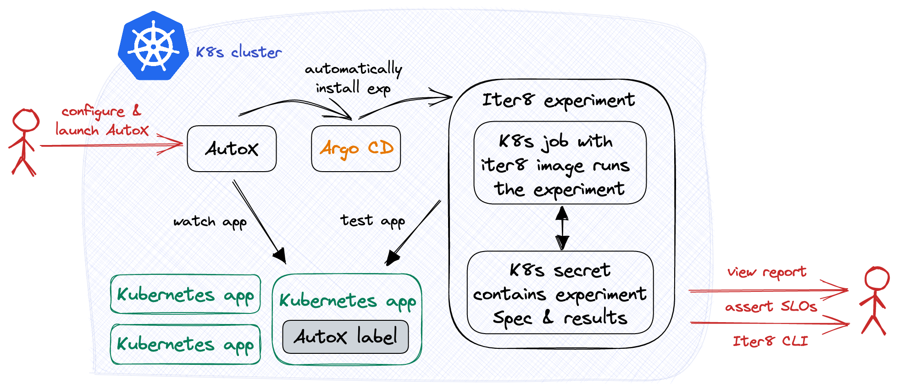
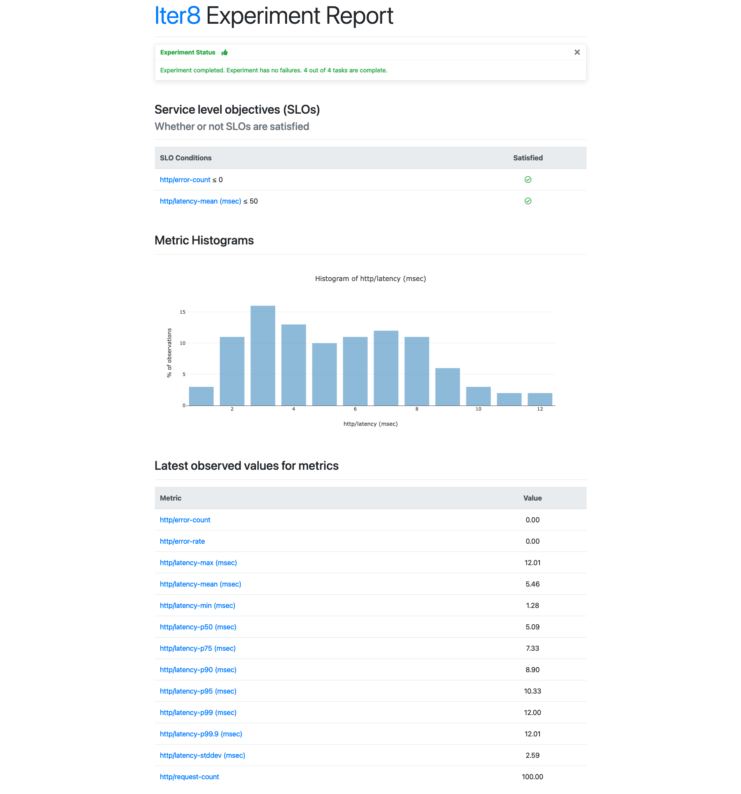

# AutoX: Automatic Experiments

AutoX, short for "automatic experiments", allows Iter8 to detect changes to your Kubernetes resources objects and automatically start new experiments, allowing you to test your services as soon as you release a new version.



Releasing a new version of an application typically involves the creation of new Kubernetes resource objects and/or updates to existing ones. AutoX can be configured to watch for such changes and automatically launch new experiments. You can configure AutoX with multiple experiment groups and, for each group, you specify the Kubernetes resource object that you expect AutoX to watch and one or more experiments to be performed in response to new versions of this object. Let us now see this in action using a Kubernetes HTTP service and configuring AutoX so that whenever a new version of the service is released, AutoX will start a new HTTP performance test that will validate if the service meets latency and error-related requirements.

***

???+ warning "Before you begin"
    1. Try [your first experiment](../../getting-started/your-first-experiment.md). Understand the main [concepts](../../getting-started/concepts.md) behind Iter8 experiments.

## Setup Kubernetes cluster with ArgoCD

AutoX uses [Argo CD](https://argo-cd.readthedocs.io), a popular continuous delivery tool, in order to launch the experiments.

```bash
kubectl create namespace argocd
kubectl apply -n argocd -f https://raw.githubusercontent.com/argoproj/argo-cd/stable/manifests/install.yaml
```

See [here](https://argo-cd.readthedocs.io/en/stable/getting_started/#1-install-argo-cd) for more information about installation.

## Deploy application

Now, we will create an `httpbin` deployment and service.

```bash
kubectl create deployment httpbin --image=kennethreitz/httpbin --port=80
kubectl expose deployment httpbin --port=80
```

## Apply labels

Currently, AutoX will not respond to changes to the `httpbin` deployment. In order to turn the deployment into a *trigger object*, we will assign it the `iter8.tools/autox=true` label (AutoX label). Otherwise, AutoX will not relaunch experiments on behalf of this resource object.

```bash
kubectl label deployment httpbin iter8.tools/autox=true
```

Next, we will assign it the `app.kubernetes.io/version` label (version label). AutoX will relaunch experiments when the version label changes.

The purpose of this *version label check* is to ensure that AutoX does not relaunch experiments with every update to the trigger object. For example, AutoX should not relaunch experiments when only the `status` of a deployment changes.

```bash
kubectl label deployment httpbin app.kubernetes.io/version=1.0.0
```

## Setup Kubernetes cluster with Iter8 AutoX

Next, we will configure and install the AutoX controller.

```bash
helm install autox autox --repo https://iter8-tools.github.io/hub/ --version 0.1.6 \
--set 'groups.httpbin.trigger.name=httpbin' \
--set 'groups.httpbin.trigger.namespace=default' \
--set 'groups.httpbin.trigger.group=apps' \
--set 'groups.httpbin.trigger.version=v1' \
--set 'groups.httpbin.trigger.resource=deployments' \
--set 'groups.httpbin.specs.iter8.name=iter8' \
--set 'groups.httpbin.specs.iter8.values.tasks={ready,http,assess}' \
--set 'groups.httpbin.specs.iter8.values.ready.deploy=httpbin' \
--set 'groups.httpbin.specs.iter8.values.ready.service=httpbin' \
--set 'groups.httpbin.specs.iter8.values.ready.timeout=60s' \
--set 'groups.httpbin.specs.iter8.values.http.url=http://httpbin.default/get' \
--set 'groups.httpbin.specs.iter8.values.assess.SLOs.upper.http/error-count=0' \
--set 'groups.httpbin.specs.iter8.values.assess.SLOs.upper.http/latency-mean=50' \
--set 'groups.httpbin.specs.iter8.version=0.13.0' \
--set 'groups.httpbin.specs.iter8.values.runner=job'
```

The configuration of the AutoX controller is composed of a *trigger object definition* and a set of *experiment specifications*. In this case, the trigger object is the `httpbin` deployment and there is only one experiment, an HTTP performance test with SLO validation associated with this trigger.

To go into more detail, the configuration is a set of *groups*, and each group is composed of a trigger object definition and a set of *experiment specs*. This enables AutoX to manage one or more trigger objects, each associated with one or more experiments. In this tutorial, there is only one group named `httpbin` (`groups.httpbin...`), and within that group, there is the trigger object definition (`groups.httpbin.trigger...`) and a single experiment spec named `iter8` (`groups.httpbin.specs.iter8...`). 

The trigger object definition is a combination of the name, namespace, and the group-version-resource (GVR) metadata of the trigger object, in this case `httpbin`, `default`, and GVR `apps`, `deployments`, and `v1`, respectively. 

The experiment is an HTTP SLO validation test on the `httpbin` service that is described in greater detail [here](../../getting-started/your-first-experiment/). This Iter8 experiment is composed of three tasks, `ready`, `http`, and `assess`. The `ready` task will ensure that the `httpbin` deployment and service are running. The `http` task will make requests to the specified URL and will collect latency and error-related metrics. Lastly, the `assess` task will ensure that the mean latency is less than 50 milliseconds and the error count is 0. In addition, the runner is set to job as this will be a [single-loop experiment](../../getting-started/concepts#iter8-experiment).

## Observe experiment

After starting AutoX, the HTTP SLO validation test should quickly follow. You can now use the Iter8 CLI in order to check the status and see the results of the test. 

The following command allows you to check the status of the test. Note that you need to specify an experiment group via the `-g` option. The *experiment group* for experiments started by AutoX is in the form `autox-<group name>-<experiment spec name>` so in this case, it would be `autox-httpbin-iter8`.

```bash
iter8 k assert -c nofailure -c slos -g autox-httpbin-iter8
```

??? note "Sample output from assert"
    ```
    INFO[2023-01-11 14:43:45] inited Helm config                           
    INFO[2023-01-11 14:43:45] experiment has no failure                    
    INFO[2023-01-11 14:43:45] SLOs are satisfied                           
    INFO[2023-01-11 14:43:45] all conditions were satisfied  
    ```

    We can see in the sample output that the experiment has completed and all SLOs and conditions were satisfied.

And the following command allows you to check the results of the experiment.

```bash
iter8 k report -g autox-httpbin-iter8
```

??? note "Sample output from report"
    ```
    Experiment summary:
    *******************

    Experiment completed: true
    No task failures: true
    Total number of tasks: 4
    Number of completed tasks: 4

    Whether or not service level objectives (SLOs) are satisfied:
    *************************************************************

    SLO Conditions                 | Satisfied
    --------------                 | ---------
    http/error-count <= 0          | true
    http/latency-mean (msec) <= 50 | true
    

    Latest observed values for metrics:
    ***********************************

    Metric                     | value
    -------                    | -----
    http/error-count           | 0.00
    http/error-rate            | 0.00
    http/latency-max (msec)    | 25.11
    http/latency-mean (msec)   | 5.59
    http/latency-min (msec)    | 1.29
    http/latency-p50 (msec)    | 4.39
    http/latency-p75 (msec)    | 6.71
    http/latency-p90 (msec)    | 10.40
    http/latency-p95 (msec)    | 13.00
    http/latency-p99 (msec)    | 25.00
    http/latency-p99.9 (msec)  | 25.10
    http/latency-stddev (msec) | 4.37
    http/request-count         | 100.00
    ```

    In the sample output, we can see an experiment summary, a list of SLOs and whether they were satisfied or not, as well as any additional metrics that were collected as part of the experiment.

You can also produce an HTML report that you can view in the browser.

```bash
iter8 k report -g autox-httpbin-iter8 -o html > report.html
```

??? note "Sample output from HTTP report"
    

##### Continuous and automated experimentation

Now that AutoX is watching the `httpbin` deployment, a new version will relaunch the HTTP SLO validation test. The version update must be accompanied by a change to the deployment's *version label* (specifically, the `app.kubernetes.io/version` label); otherwise, AutoX will not do anything.

For simplicity, we will simply change the version label to the deployment in order to relaunch the HTTP SLO validation test. In the real world, a new version would typically involve a change to the deployment spec (e.g., the container image) and this change should be accompanied by a change to the version label.

```bash
kubectl label deployment httpbin app.kubernetes.io/version=2.0.0 --overwrite
```

## Observe new experiment

Check if a new experiment has been launched. Refer to [Observe experiment](#observe-experiment) for the necessary commands.

If we were to continue to update the deployment (and change its version label), then AutoX would relaunch the experiment for each such change.

## Next steps

Firstly, the HTTP SLO validation test is flexible, and you can augment it a number of ways, such as adding headers, providing a payload, or modulating the query rate. To learn more, see the [documentation](../../user-guide/tasks/http) for the `httpbin` task.

AutoX is designed to use any Kubernetes resource object (including those with a custom resource type) as a trigger object in AutoX. For example, the trigger object can be a Knative service, a KServe inference service, or a Seldon deployment.

AutoX is designed to automate a variety of experiments. For example, instead of using the `http` task, you can use `grpc` task in order to run an GRPC SLO validation test. Here is the [documentation](../../user-guide/tasks/grpc) for the `grpc` task as well as a [tutorial](../../tutorials/load-test-grpc) for GRPC SLO Validation.

Furthermore, you can add additional tasks that ship out-of-the-box with Iter8, in order to enrich the experiments. For example, you can add a `slack` task so that your experiment results will be posted on Slack. That way, you can automatically have the lastest performance statistics after every update. Here is the [documentation](../../user-guide/tasks/slack) for the `slack` task as well as a [tutorial](../../tutorials/integrations/slack) for using the Slack task.

You can also automate experiments that are not from Iter8. For example, a [Litmus Chaos chaos experiment](https://github.com/iter8-tools/hub/tree/8e40c740a33afba4afd5623588128da49b7f08f1/charts/litmuschaos) is available on Iter8 hub, which can also be configured with AutoX.

Lastly, recall that you can provide multiple groups and experiment specs so AutoX can launch and manage a whole suite of experiments for multiple Kubernetes applications and namespaces.

## Clean up

```bash
helm delete autox-httpbin
kubectl delete deployment/httpbin
kubectl delete service/httpbin
```