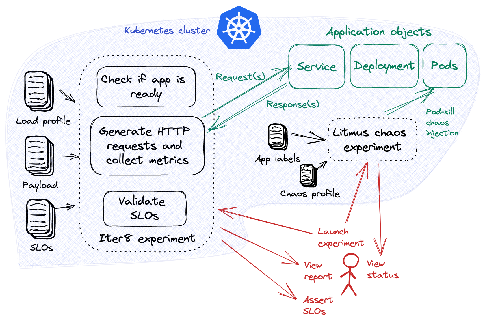

# Chaos Injection with SLOs

Perform a joint Iter8 and [LitmusChaos](https://litmuschaos.io/) experiment. This joint experiment enables you to verify if an app continues to be resilient (satisfies SLOs) in the midst of chaos (pod kill).

In the tutorial, the app consists of a Kubernetes service and deployment. The chaos experiment kills the app's pods intermittently. At the same time, the Iter8 experiment performs a load test of the app and validates its [service-level objectives (SLOs)](../../getting-started/concepts.md#service-level-objectives). 




???+ warning "Before you begin"
    1. Try [your first experiment](../../getting-started/your-first-experiment.md). Understand the main [concepts](../../getting-started/concepts.md) behind Iter8 experiments.
    2. Ensure that you have the [kubectl](https://kubernetes.io/docs/reference/kubectl/) CLI.
    3. Install [Litmus](https://litmuschaos.io/) in Kubernetes using [these steps](https://docs.litmuschaos.io/docs/getting-started/installation).
    4. Create the `httpbin` deployment file.
    ```shell
    cat <<EOF> deploy.yaml
    apiVersion: apps/v1
    kind: Deployment
    metadata:
      name: httpbin
      labels:
        app: httpbin
    spec:
      replicas: 1
      selector:
        matchLabels:
          app: httpbin
      template:
        metadata:
          labels:
            app: httpbin
        spec:
          containers:
          - name: httpbin
            image: kennethreitz/httpbin
            ports:
            - containerPort: 80
          initContainers:
          - name: init-myservice
            image: busybox:1.28
            command: ['sh', '-c', 'sleep 1']
    EOF
    ```
    5. Create the `httpbin` deployment.
    ```shell
    kubectl apply -f deploy.yaml
    ```
    6. Create the `httpbin` service.
    ```shell
    kubectl expose deploy httpbin --port=80
    ```

***

## Launch experiments
Launch the LitmusChaos and Iter8 experiments as described below.
=== "LitmusChaos"
    ```shell
    helm install httpbin litmuschaos \
    --repo https://iter8-tools.github.io/hub/ \
    --set applabel='app=httpbin' \
    --set totalChaosDuration=3600 \
    --set chaosInterval=5
    ```

    ??? note "About this LitmusChaos experiment"
        This is a [LitmusChaos pod-delete experiment](https://litmuschaos.github.io/litmus/experiments/categories/pods/pod-delete/) packaged for reusability in the form of a Helm chart. This experiment causes (forced/graceful) pod failure of specific/random replicas of application resources, in this case, pods with a label called `app` with value `httpbin`.

        The deletion of pod(s) will be attempted by the chaos experiment once every  `chaosInterval` (5) seconds, and this experiment will terminate after `totalChaosDuration` (3600) seconds.

=== "Iter8" 
    ```shell
    iter8 k launch \
    --set "tasks={ready,http,assess}" \
    --set ready.deploy=httpbin \
    --set ready.service=httpbin \
    --set ready.chaosengine=litmuschaos-httpbin \
    --set ready.timeout=60s \
    --set http.url=http://httpbin.default/get \
    --set http.duration=30s \
    --set http.qps=20 \
    --set assess.SLOs.upper.http/latency-mean=50 \
    --set assess.SLOs.upper.http/latency-p99=100 \
    --set assess.SLOs.upper.http/error-count=0 \
    --set runner=job
    ```

    ??? note "About this Iter8 experiment"
        This Iter8 experiment is similar to [your first Iter8 experiment](../../getting-started/your-first-experiment.md) with some notable changes. The `ready` task in this experiment also checks if the `chaosengine` resource exists before it starts, and in addition to the mean latency and error count SLOs, it verifies that the 99th percentile latency is under 100 msec.

*** 

## Observe experiments
Observe the LitmusChaos and Iter8 experiments as follows. The chaos and Iter8 experiments 

=== "LitmusChaos"
    Verify that the phase of the chaos experiment is `Running`.
    ```shell
    kubectl get chaosresults/litmuschaos-httpbin-pod-delete -n default \
    -o jsonpath='{.status.experimentStatus.phase}'
    ```

    ??? note "On completion of the LitmusChaos experiment"
        After the LitmusChaos experiment completes (in ~3600 sec), the phase of the experiment will change to `Completed`. At that point, you can verify that the chaos experiment returns a `Pass` verdict. The `Pass` verdict states that the application is still running after chaos has ended.

        When the LitmusChaos experiment is still running, its verdict will be set to `Awaited`.

        ```shell
        kubectl get chaosresults/litmuschaos-httpbin-pod-delete -n default \
        -o jsonpath='{.status.experimentStatus.verdict}'
        ```

=== "Iter8"
    Due to chaos injection, and the fact that the number of replicas is set to 1, SLOs are not expected to be satisfied within the Iter8 experiment. Verify this is the case.

    ```shell
    # the SLOs assertion is expected to fail
    iter8 k assert -c completed -c nofailure -c slos --timeout 30s
    ```

    For a more detailed report of the Iter8 experiment, run the `report` command.
    ```shell
    iter8 k report
    ```

***

## Cleanup experiments

Clean up the LitmusChaos and Iter8 experiments as described below.

=== "LitmusChaos"
    ```shell
    helm uninstall httpbin
    ```

=== "Iter8"
    ```shell
    iter8 k delete
    rm -rf charts
    ```

***

## Scale app and retry
Scale up the app so that replica count is increased to 3. 
```shell
kubectl scale --replicas=3 -n default deploy/httpbin
```

The scaled app is now more resilient. Performing the same experiments as above will now result in SLOs being satisfied. [Relaunch the experiments](#launch-experiments) and [observe the experiments](#observe-experiments). You should now find that the SLOs are satisfied.

***

## Cleanup

Cleanup the Kubernetes cluster.

=== "App"
    Cleanup the app.

    ```shell
    kubectl delete svc/httpbin
    kubectl delete deploy/httpbin
    ```

=== "Experiments"
    Cleanup the experiments as described [here](#cleanup-experiments).

=== "LitmusChaos"
    Uninstall LitmusChaos from your cluster as described [here](https://docs.litmuschaos.io/docs/user-guides/uninstall-litmus/).

***

??? note "Some variations and extensions of this experiment"
    1. Reuse the above experiment with *your* app by replacing the `httpbin` app with *your* app, and modifying the experiment values appropriately.
    2. Iter8 supports load testing and SLO validation for [gRPC services](../load-test-grpc.md). Try a joint chaos injection and SLO validation experiment for gRPC.
    3. Litmus makes it possible to inject [over 51 types of chaos](https://hub.litmuschaos.io/). Modify the LitmusChaos Helm chart with new templates in order to use any of these other types of chaos experiments.
