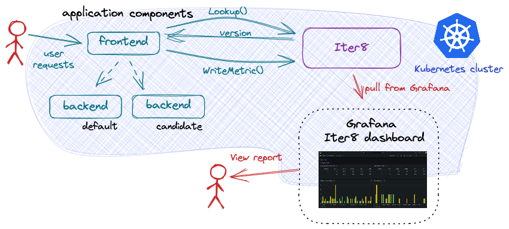
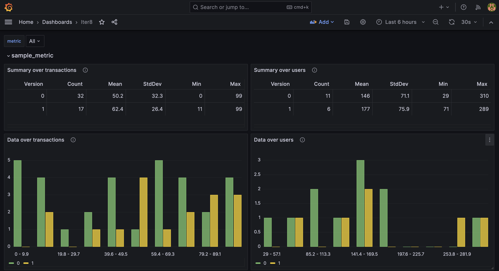

# A/B Testing a backend ML model

This tutorial describes how to do A/B testing of a backend ML model hosted on [KServe ModelMesh](https://github.com/kserve/modelmesh) using the [Iter8 SDK](../../../user-guide/topics/ab_testing.md). 



***

???+ warning "Before you begin"
    1. Ensure that you have a Kubernetes cluster and the [`kubectl`](https://kubernetes.io/docs/reference/kubectl/) and [`helm`](https://helm.sh/) CLIs. You can create a local Kubernetes cluster using tools like [Kind](https://kind.sigs.k8s.io/) or [Minikube](https://minikube.sigs.k8s.io/docs/).
    2. Have access to a cluster running [KServe ModelMesh Serving](https://github.com/kserve/modelmesh-serving). For example, you can create a modelmesh-serving [Quickstart](https://github.com/kserve/modelmesh-serving/blob/release-0.11/docs/quickstart.md) environment.  If using the Quickstart environment, change your default namespace to `modelmesh-serving`: 
    ```shell
    kubectl config set-context --current --namespace=modelmesh-serving
    ```
    3. Have Grafana available. For example, Grafana can be installed on your cluster as follows:
    ```shell
    kubectl create deploy grafana --image=grafana/grafana
    kubectl expose deploy grafana --port=3000
    ```
 
## Install the Iter8 controller

--8<-- "docs/tutorials/installiter8controller.md"

## Deploy the sample application

A sample application using the Iter8 SDK is provided. Deploy both the frontend and backend components of this application as described in each tab:

=== "frontend"
    ```shell
    kubectl create deployment frontend --image=kalantar/mm-frontend:20230913-1715
    kubectl expose deployment frontend --name=frontend --port=8090
    ```

    The frontend component is implemented to call the Iter8 SDK method `Lookup()` before each call to the backend ML model. The frontend component uses the returned version number to route the request to the recommended version of the model.

=== "backend"
    The backend application component is an ML model. Deploy the primary version of the model using an `InferenceService`:

    ```shell
    cat <<EOF | kubectl apply -f -
    apiVersion: "serving.kserve.io/v1beta1"
    kind: "InferenceService"
    metadata:
      name: backend-0
      labels:
        app.kubernetes.io/name: backend
        app.kubernetes.io/version: v0
        iter8.tools/watch: "true"
      annotations:
        serving.kserve.io/deploymentMode: ModelMesh
        serving.kserve.io/secretKey: localMinIO
    spec:
      predictor:
        model:
          modelFormat:
              name: sklearn
          storageUri: s3://modelmesh-example-models/sklearn/mnist-svm.joblib
    EOF
    ```

    ??? note "About the primary `InferenceService`"
        The base name (`backend`) and version (`v0`) are identified using the labels `app.kubernets.io/name` and `app.kubernets.io/version`, respectively. These labels are not required.

        Naming the instance with the suffix `-0` (and the candidate with the suffix `-1`) simplifies describing the application (see below). However, any name can be specified.
        
        The label `iter8.tools/watch: "true"` is required. It lets Iter8 know that it should pay attention to changes to this application resource.

## Describe the application

In order to support `Lookup()`, Iter8 needs to know what the backend component versions look like. A `ConfigMap` is used to describe the make up of possible versions:

```shell
cat <<EOF | kubectl apply -f -
apiVersion: v1
kind: ConfigMap
metadata:
  name: backend
  labels:
    app.kubernetes.io/managed-by: iter8
    iter8.tools/kind: routemap
    iter8.tools/version: "v0.17"
immutable: true
data:
  strSpec: |
    versions:
    - resources:
      - gvrShort: isvc
        name: backend-0
        namespace: modelmesh-serving
    - resources:
      - gvrShort: isvc
        name: backend-1
        namespace: modelmesh-serving
EOF
```

In this definition, each version of the backend application component is composed of a single `InferenceService`. In the primary version, it is named `backend-0`. Any candidate version is named `backend-1`. Iter8 uses this definition to identify when any of the versions of the application are available. It can then respond appropriately to `Lookup()` requests. 

## Generate load

In separate shells, port-forward requests to the frontend component and generate load simulating multiple users. A [script](https://raw.githubusercontent.com/iter8-tools/docs/main/samples/abn-sample/generate_load.sh) is provided to do this. To use it:
    ```shell
    kubectl -n modelmesh-serving port-forward service/frontend 8090:8090
    ```

    ```shell
    curl -s https://raw.githubusercontent.com/iter8-tools/docs/v0.15.0/samples/abn-sample/generate_load.sh | sh -s --
    ```
 
<!--
    ```shell
    cat  samples/modelmesh-serving/grpc_input.json \
    | grpcurl -vv -plaintext -d @ \
    -proto samples/modelmesh-serving/kserve.proto \
    -H 'mm-vmodel-id: backend-0' \
    localhost:8033 inference.GRPCInferenceService.ModelInfer
    ```
-->

## Deploy candidate

Deploy the candidate version of the backend model:

```shell
cat <<EOF | kubectl apply -f -
apiVersion: "serving.kserve.io/v1beta1"
kind: "InferenceService"
metadata:
  name: backend-1
  labels:
    app.kubernetes.io/name: backend
    app.kubernetes.io/version: v1
    iter8.tools/watch: "true"
  annotations:
    serving.kserve.io/deploymentMode: ModelMesh
    serving.kserve.io/secretKey: localMinIO
spec:
  predictor:
    model:
      modelFormat:
        name: sklearn
      storageUri: s3://modelmesh-example-models/sklearn/mnist-svm.joblib
EOF
```

??? note "About the candidate `InferenceService`"
    In this tutorial, the model source (field `spec.predictor.model.storageUri`) is the same as for the primary version of the model. In a real example, this would be different.

Until the candidate version is ready, calls to `Lookup()` will return only the version number `0`; the primary version of the model.
Once the candidate version is ready, `Lookup()` will return both version numbers (`0` and `1`) so that requests can be distributed across versions.

## Compare versions using Grafana

Inspect the metrics using Grafana. If Grafana is deployed to your cluster, port-forward requests as follows:

```shell
kubectl port-forward service/grafana 3000:3000
```

Open Grafana in a browser by going to [http://localhost:3000](http://localhost:3000)

[Add a JSON API data source](http://localhost:3000/connections/datasources/marcusolsson-json-datasource) `default/backend` with the following parameters:

* URL: `http://iter8.modelmesh-serving:8080/abnDashboard`
* Query string: `namespace=modelmesh-serving&application=backend`

[Create a new dashboard](http://localhost:3000/dashboards) by *import*. Copy and paste the contents of the [`abn` Grafana dashboard](https://raw.githubusercontent.com/iter8-tools/iter8/v0.16.2/grafana/abn.json) into the text box and *load* it. Associate it with the JSON API data source above.

The Iter8 dashboard allows you to compare the behavior of the two versions of the backend component against each other and select a winner. Since user requests are being sent by the load generation script, the values in the report may change over time. The Iter8 dashboard will look like the following:



Once you identify a winner, it can be promoted, and the candidate version deleted.

## Promote candidate

Promoting the candidate involves redefining the primary version of the ML model and deleting the candidate version.

### Redefine primary

```shell
cat <<EOF | kubectl replace -f -
apiVersion: "serving.kserve.io/v1beta1"
kind: "InferenceService"
metadata:
  name: backend-0
  labels:
    app.kubernetes.io/name: backend
    app.kubernetes.io/version: v1
    iter8.tools/watch: "true"
  annotations:
    serving.kserve.io/deploymentMode: ModelMesh
    serving.kserve.io/secretKey: localMinIO
spec:
  predictor:
    model:
      modelFormat:
        name: sklearn
      storageUri: s3://modelmesh-example-models/sklearn/mnist-svm.joblib
EOF
```

??? note "What is different?"
    The version label (`app.kubernets.io/version`) was updated. In a real world example, `spec.predictor.model.storageUri` would also be updated.

### Delete candidate

Once the primary `InferenceService` has been redeployed, delete the candidate version:

```shell
kubectl delete inferenceservice backend-1
```

Calls to `Lookup()` will now recommend that all traffic be sent to the primary version `backend-0` (currently serving the promoted version of the code).

## Cleanup

If not already deleted, delete the candidate version of the model:

```shell
kubectl delete isvc/backend-1
```

Delete the application description:

```shell
kubectl delete cm/backend
```

Delete the primary version of the model:

```shell
kubectl delete isvc/backend-0
```

Delete the frontend:

```shell
kubectl delete deploy/frontend svc/frontend
```

Uninstall Iter8 controller:

--8<-- "docs/tutorials/deleteiter8controller.md"
