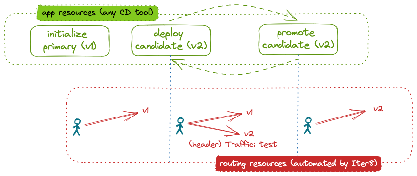

# Your first blue-green release

This tutorial shows how Iter8 can be used to release ML models hosted in a KServe ModelMesh environment using a canary rollout strategy. The user declaratively describes the desired application state at any given moment. An Iter8 `release` chart ensures that Iter8 can automatically respond to automatically deploy the application components and configure the necessary routing.

In a canary rollout, inference requests that match a particular pattern, for example those that have a particular header, are directed to the candidate version of the model. The remaining requests go to the primary, or initial, version of the model.



In this tutorial, we use the Istio service mesh to distribute inference requests between different versions of a model.

???+ warning "Before you begin"
    1. Ensure that you have the [`kubectl`](https://kubernetes.io/docs/reference/kubectl/) and [`helm`](https://helm.sh/) CLIs.
    2. Have access to a cluster running [KServe ModelMesh Serving](https://github.com/kserve/modelmesh-serving). For example, you can create a modelmesh-serving [Quickstart](https://github.com/kserve/modelmesh-serving/blob/release-0.11/docs/quickstart.md) environment.  If using the Quickstart environment, change your default namespace to `modelmesh-serving`: 
    ```shell
    kubectl config set-context --current --namespace=modelmesh-serving
    ```
    3. Install [Istio](https://istio.io). You can install the [demo profile](https://istio.io/latest/docs/setup/getting-started/).

## Install the Iter8 controller

--8<-- "docs/getting-started/install.md"

```shell
export IMG=kalantar/iter8:20231004-1030
export CHARTS=/Users/kalantar/projects/go.workspace/src/github.com/iter8-tools/iter8/charts
helm upgrade --install iter8 $CHARTS/controller \
--set image=$IMG --set logLevel=trace \
--set clusterScoped=true
```

## Deploy initial version

```shell
cat <<EOF | helm upgrade --install wisdom $CHARTS/release -f -
environment: kserve-modelmesh-istio
# service:
#   host: modelmesh-serving.modelmesh-serving
#   port: 8033
application: 
  metadata:
    labels:
      app.kubernetes.io/name: wisdom
    annotations:
      serving.kserve.io/secretKey: localMinIO
  versions:
  - metadata:
      labels:
        app.kubernetes.io/version: v0
    modelFormat: sklearn
    storageUri: s3://modelmesh-example-models/sklearn/mnist-svm.joblib
    # inferenceServiceSpecification:
  strategy: canary
EOF
```

??? note "What happens?"
    _Application components_

    - Because `environment` is set to `kserve-modelmesh-istio`, the following application components are created:
        - `InferenceService` `default/wisdom-0`. It will have label `iter8.tools/watch=true`.
    - The namespace `default` is inherited from the helm release namespace since it is not specified in either the version or in `application.metadata.namespace`.
    - The name `wisdom-0` is derived from the helm release name since it is not specified in either the version or in `application.metadata.name`. `-0` (the index of the version in `versions`) is appended to the base name.
    - Alternatively, an `inferenceServiceSpecification` could have been specified.

    _Routing components_

    - A `ServiceEntry` named `default/wisdom` pointing at the modelmesh service is deployed.

    _Iter8 components_

    - The routemap (`ConfigMap` `wisdom-routemap`) is created with 1 version and a single routing template.

    _What else happens?_

    Once the application components are ready, the Iter8 controller will trigger the routing template defined in the routemap. As a consequence, a `VirtualService` named `default/wisdom` will be created. It will send all traffic sent to the service `wisdom` to the deployed version `wisdom-0`.

You can inspect the deployed `InferenceService`. When the `READY` field becomes `True`, the model is fully deployed.

## Sending requests

To send requests to the application:

=== "From within the cluster"
    1. Create a `sleep` pod in the cluster from which requests can be made:
    ```shell
    curl -s https://raw.githubusercontent.com/iter8-tools/docs/v0.17.3/samples/modelmesh-serving/sleep.sh | sh -
    ```

    2. Exec into the sleep pod:
    ```shell
    kubectl exec --stdin --tty "$(kubectl get pod --sort-by={metadata.creationTimestamp} -l app=sleep -o jsonpath={.items..metadata.name} | rev | cut -d' ' -f 1 | rev)" -c sleep -- /bin/sh
    ```

    3. Make inference requests:
    ```shell
    cat wisdom.sh
    . wisdom.sh
    ```
    or, to send a request with header `traffic: test`:
    ```shell
    cat wisdom-test.sh
    . wisdom-test.sh
    ```

=== "From outside the cluster"
    1. In a separate terminal, port-forward the ingress gateway:
    ```shell
    kubectl -n istio-system port-forward svc/istio-ingressgateway 8080:80
    ```

    2. Download the proto file and a sample input:
    ```shell
    curl -sO https://raw.githubusercontent.com/iter8-tools/docs/v0.17.3/samples/modelmesh-serving/kserve.proto
    curl -sO https://raw.githubusercontent.com/iter8-tools/docs/v0.17.3/samples/modelmesh-serving/grpc_input.json
    ```

    3. Send inference requests:
    ```shell
    cat grpc_input.json | \
    grpcurl -vv -plaintext -proto kserve.proto -d @ \
    -authority wisdom.modelmesh-serving \
    localhost:8080 inference.GRPCInferenceService.ModelInfer \
    | grep -e app-version
    ```
    Or, to send a request with header `traffic: test`:
    ```shell
    cat grpc_input.json | \
    grpcurl -vv -plaintext -proto kserve.proto -d @ \
    -H 'traffic: test' \
    -authority wisdom.modelmesh-serving \
    localhost:8080 inference.GRPCInferenceService.ModelInfer \
    | grep -e app-version
    ```

Note that the model version responding to each inference request is noted in the response header `app-version`. In the requests above, we display only this header.

??? note "Sample output"
    The output is only the `app-version` header. This header identifies the :

    ```
    app-version: wisdom-0
    ```

## Deploy candidate

```shell
cat <<EOF | helm upgrade --install wisdom $CHARTS/release -f -
environment: kserve-modelmesh-istio
application: 
  metadata:
    labels:
      app.kubernetes.io/name: wisdom
    annotations:
      serving.kserve.io/secretKey: localMinIO
  versions:
  - metadata:
      labels:
        app.kubernetes.io/version: v0
    modelFormat: sklearn
    storageUri: "s3://modelmesh-example-models/sklearn/mnist-svm.joblib"
  - metadata:
      labels:
        app.kubernetes.io/version: v1
    modelFormat: sklearn
    storageUri: "s3://modelmesh-example-models/sklearn/mnist-svm.joblib"
  strategy: canary
EOF
```

??? note "What happens?"
    _Application components_

    - Since the definition for the first version does not change, there is no change to the `InferenceService` named `default/wisdom-0`.
    - `InferenceService` named `default/wisdom-1` is deployed. It has label `iter8.tools/watch=true`.

    _Routing components_

    - no changes

    _Iter8 components_

    - The routemap (`ConfigMap` `wisdom-routemap`) is updated with 2 versions and an updated `routingTemplate`.

    _What else happens?_

Once the candidate model is ready, Iter8 will automatically reconfigure the routing (the `VirtualService`) so that requests containing the header `traffic: true` will now be sent to the candidate version. Remaining requests will be sent to the primary version.

### Verify routing

You can send additional inference requests as described above. They will be handled by both versions of the model.

## Promote candidate

Redefine the primary to use the candidate model remove the candidate:

```shell
cat <<EOF | helm upgrade --install wisdom $CHARTS/release -f -
environment: kserve-modelmesh-istio
application: 
  metadata:
    labels:
      app.kubernetes.io/name: wisdom
    annotations:
      serving.kserve.io/secretKey: localMinIO
  versions:
  - metadata:
      labels:
        app.kubernetes.io/version: v1
    modelFormat: sklearn
    storageUri: "s3://modelmesh-example-models/sklearn/mnist-svm.joblib"
  strategy: canary
EOF
```

??? note "What happens?"
    _Application components_

    - Since the definition for the first version has changed (label and `storageUri`), the `InferenceService` object is updated.
    - The `InferenceService` named `default/wisdom-1` is deleted because the second version has been removed.

    _Routing components_

    - no changes

    _Iter8 components_

    - The routemap (`ConfigMap` `wisdom-routemap`) is updated with 1 version and an updated `routingTemplate`.

    _What else happens?_

Iter8 will automatically reconfigure the routing (the `VirtualService`) so that all requests will be sent to the (new) primary version.

### Verify routing

You can send additional inference requests as described above. They will be handled by the primary model.

## Cleanup

Delete the application:

```shell
helm delete wisdom
```

Uninstall Iter8 controller:

--8<-- "docs/getting-started/uninstall.md"
