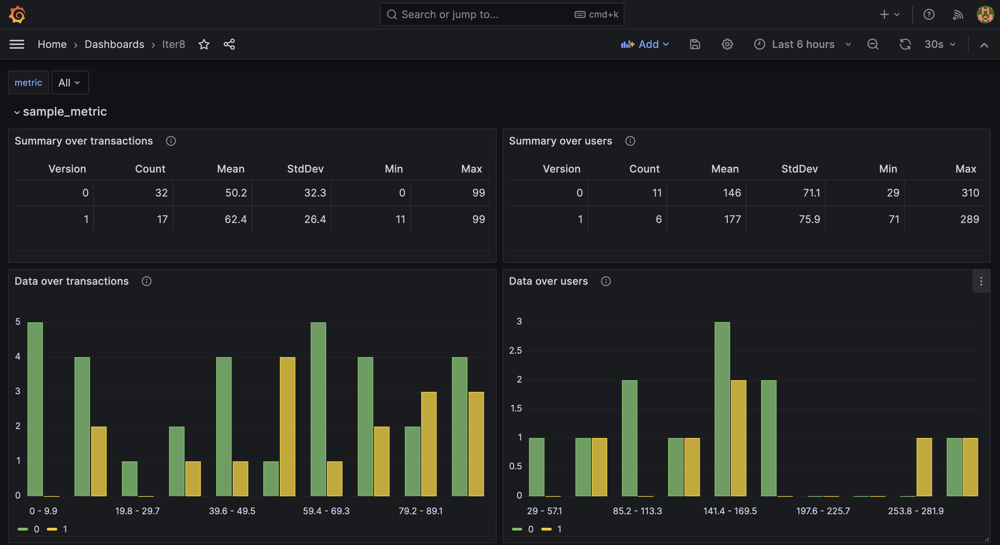

# A/B Testing a backend ML model

This tutorial describes how to do A/B testing as part of a release of backend ML model hosted on [KServe](https://github.com/kserve/kserve) when using the [Iter8 SDK](../../../user-guide/topics/ab_testing.md). In this tutorial, communication from the front end to the backend model is via HTTP calls.


***

???+ warning "Before you begin"
    1. Ensure that you have a Kubernetes cluster and the [`kubectl`](https://kubernetes.io/docs/reference/kubectl/) and [`helm`](https://helm.sh/) CLIs. You can create a local Kubernetes cluster using tools like [Kind](https://kind.sigs.k8s.io/) or [Minikube](https://minikube.sigs.k8s.io/docs/).
    2. Have access to a cluster running [KServe](https://kserve.github.io/website). You can create a [KServe Quickstart](https://kserve.github.io/website/0.11/get_started/#before-you-begin) environment as follows:
    ```shell
    curl -s "https://raw.githubusercontent.com/kserve/kserve/release-0.11/hack/quick_install.sh" | bash
    ```
    3. Have Grafana available. For example, Grafana can be installed on your cluster as follows:
    ```shell
    kubectl create deploy grafana --image=grafana/grafana
    kubectl expose deploy grafana --port=3000
    ```
 
## Install the Iter8 controller

--8<-- "docs/getting-started/install.md"

```shell
export IMG=kalantar/iter8:20231004-1030
export CHARTS=/Users/kalantar/projects/go.workspace/src/github.com/iter8-tools/iter8/charts
helm upgrade --install iter8 $CHARTS/controller \
--set image=$IMG --set logLevel=trace \
--set clusterScoped=true
```

## Deploy the sample application

A simple sample two-tier application using the Iter8 SDK is provided. 

### frontend

The frontend component uses the Iter8 SDK method `Lookup()` before each call the backend (ML model). The frontend uses the returned version number to route the request to the recommended version of backend.

Deploy the frontend:

```shell
kubectl create deployment frontend --image=iter8/abn-sample-kserve-http-frontend-go:0.17.3
kubectl expose deployment frontend --name=frontend --port=8090
```

### backend

The backend application component is an ML model. Release it using the Iter8 `release` chart:

```shell
cat <<EOF | helm upgrade --install backend $CHARTS/release -f -
environment: kserve
application: 
  versions:
  - metadata:
      labels:
        app.kubernetes.io/name: backend
        app.kubernetes.io/version: v0
    modelFormat: sklearn
    runtime: kserve-mlserver
    storageUri: "gs://seldon-models/sklearn/mms/lr_model"
EOF
```

??? note "What happens?"
    
    - An `InferenceService` named `default/backend-0` is deployed.
    - A `Service` named `default/backend` of type `ExternalName` (pointing at `knative-local-gateway.istio-system`) is deployed.
    - An Iter8 routemap (a `ConfigMap` named `backend-routemap`). Since `application.strategy` is not set, no routing template is defined.

## Generate load

In one shell, port-forward requests to the frontend component:
    ```shell
    kubectl port-forward service/frontend 8090:8090
    ```
In another shell, run a script to generate load from multiple users:
    ```shell
    curl -s https://raw.githubusercontent.com/iter8-tools/docs/v0.17.3/samples/abn-sample/generate_load.sh | sh -s --
    ```
 
## Deploy candidate

Release a candidate version of the backend model:

```shell
cat <<EOF | helm upgrade --install backend $CHARTS/release -f -
environment: kserve
application: 
  versions:
  - metadata:
      labels:
        app.kubernetes.io/name: backend
        app.kubernetes.io/version: v0
    modelFormat: sklearn
    runtime: kserve-mlserver
    storageUri: "gs://seldon-models/sklearn/mms/lr_model"
  - metadata:
      labels:
        app.kubernetes.io/name: backend
        app.kubernetes.io/version: v1
    modelFormat: sklearn
    runtime: kserve-mlserver
    storageUri: "gs://seldon-models/sklearn/mms/lr_model"
EOF
```

??? note "What happens?"
    
    - An `InferenceService` named `default/backend-1` is deployed.
    - The Iter8 routemap is updated to be aware of both model versions.

Until the candidate version is ready, calls to `Lookup()` will return only the version number `0`; the primary version of the model.
Once the candidate version is ready, `Lookup()` will return both version numbers (`0` and `1`) so that requests can be distributed across versions.

## Compare versions using Grafana

Inspect the metrics using Grafana. If Grafana is deployed to your cluster, port-forward requests as follows:

```shell
kubectl port-forward service/grafana 3000:3000
```

Open Grafana in a browser by going to [http://localhost:3000](http://localhost:3000)

[Add a JSON API data source](http://localhost:3000/connections/datasources/marcusolsson-json-datasource) `default/backend` with the following parameters:

* URL: `http://iter8.default:8080/abnDashboard`
* Query string: `namespace=default&application=backend`

[Create a new dashboard](http://localhost:3000/dashboards) by *import*. Copy and paste the contents of the [`abn` Grafana dashboard](https://raw.githubusercontent.com/iter8-tools/iter8/v0.18.3/grafana/abn.json) into the text box and *load* it. Associate it with the JSON API data source above.

The Iter8 dashboard allows you to compare the behavior of the two versions of the backend component against each other and select a winner. Since user requests are being sent by the load generation script, the values in the report may change over time. The Iter8 dashboard will look like the following:



Once you identify a winner, it can be promoted, and the candidate version deleted.

## Promote candidate

```shell
cat <<EOF | helm upgrade --install backend $CHARTS/release -f -
environment: kserve
application: 
  versions:
  - metadata:
      labels:
        app.kubernetes.io/name: backend
        app.kubernetes.io/version: v1
    modelFormat: sklearn
    runtime: kserve-mlserver
    storageUri: "gs://seldon-models/sklearn/mms/lr_model"
EOF
```

Calls to `Lookup()` will now recommend that all traffic be sent to the primary version `backend-0` (currently serving the promoted version of the code).

## Cleanup

Delete the backend:

```shell
helm delete backend
```

Delete the frontend:

```shell
kubectl delete deploy/frontend svc/frontend
```

Uninstall Iter8 controller:

--8<-- "docs/getting-started/uninstall.md"
