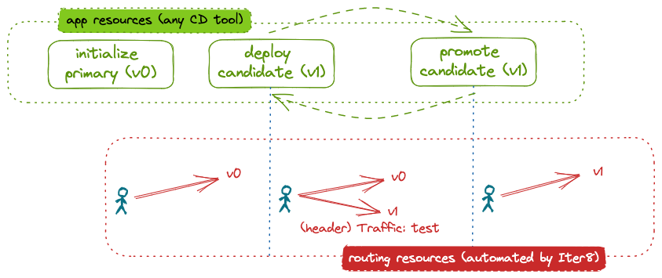

# Canary Rollout of a KServe ML Model

This tutorial shows how Iter8 can be used to implement a canary rollout of ML models hosted in a KServe environment. In a canary rollout, inference requests that match a particular pattern, for example those that have a particular header, are directed to the candidate version of the model. The remaining requests go to the primary, or initial, version of the model. Iter8 enables a canary rollout by automatically configuring the network to distribute inference requests.

After a one-time initialization step, the end user merely deploys candidate models, evaluates them, and either promotes or deletes them. Iter8 automatically handles the underlying network configuration.



???+ "Before you begin"
    1. Ensure that you have the [kubectl CLI](https://kubernetes.io/docs/reference/kubectl/).
    2. Have access to a cluster running [KServe](https://kserve.github.io/website). You can create a [KServe Quickstart](https://kserve.github.io/website/0.10/get_started/#before-you-begin) environment as follows:
    ```shell
    curl -s "https://raw.githubusercontent.com/kserve/kserve/release-0.10/hack/quick_install.sh" | bash
    ```
<!-- Istio 1.15 already installed 
    3. Install [Istio](https://istio.io). You can install the [demo profile](https://istio.io/latest/docs/setup/getting-started/).
    ```shell
    istioctl install --set profile=demo -y
    ```
-->

## Install the Iter8 controller

--8<-- "docs/tutorials/installiter8controller.md"

## Deploy a primary model

Deploy the primary version of a model using an `InferenceService`:

```shell
cat <<EOF | kubectl apply -f -
apiVersion: "serving.kserve.io/v1beta1"
kind: "InferenceService"
metadata:
  name: wisdom-0
  labels:
    app.kubernetes.io/name: wisdom
    app.kubernetes.io/version: v0
    iter8.tools/watch: "true"
spec:
  predictor:
    minReplicas: 1
    model:
      modelFormat:
        name: sklearn
      runtime: kserve-mlserver
      storageUri: "gs://seldon-models/sklearn/mms/lr_model"
EOF
```

??? note "About the primary `InferenceService`"
    Naming the model with the suffix `-0` (and the candidate with the suffix `-1`) simplifies the rollout initialization. However, any name can be specified.
    
    The label `iter8.tools/watch: "true"` lets Iter8 know that it should pay attention to changes to this `InferenceService`.

Inspect the deployed `InferenceService`:

```shell
kubectl get inferenceservice wisdom-0
```

When the `READY` field becomes `True`, the model is fully deployed.
    
## Initialize the Canary routing policy

Initialize model rollout with a canary traffic pattern as follows:

```shell
#cat <<EOF | helm template traffic --repo https://iter8-tools.github.io/iter8 traffic-templates -f - | kubectl apply -f -
cat <<EOF | helm template /Users/kalantar/projects/go.workspace/src/github.com/iter8-tools/iter8/charts/traffic-templates -f - | kubectl apply -f -
templateName: initialize-rollout
targetEnv: kserve
trafficStrategy: canary
modelName: wisdom
EOF
```

The `initialize-rollout` template (with `trafficStrategy: canary`) configures the service mesh to route all requests to the primary version of the model (`wisdom-0`). Further, it defines the routing policy that will be used by Iter8 when it observes changes in the models. By default, this routing policy sends inference requests with the header `traffic` set to the value `test` to the candidate version of the model and all remaining inference requests to the primary version of the model. For detailed configuration options, see the Helm chart.

## Verify network configuration

To verify the network configuration, you can inspect the network configuration:

```shell
kubectl get virtualservice -o yaml wisdom
```

To send inference requests to the model:

=== "From within the cluster"
    1. Create a "sleep" pod in the cluster from which requests can be made:
    ```shell
    # curl -s https://raw.githubusercontent.com/iter8-tools/docs/v0.15.0/samples/kserve-serving/sleep.sh | sh -
    source /Users/kalantar/projects/go.workspace/src/github.com/iter8-tools/docs/samples/kserve-serving/sleep.sh
    ```

    2. exec into the sleep pod:
    ```shell
    kubectl exec --stdin --tty "$(kubectl get pod --sort-by={metadata.creationTimestamp} -l app=sleep -o jsonpath={.items..metadata.name} | rev | cut -d' ' -f 1 | rev)" -c sleep -- /bin/sh
    ```

    3. Make inference requests:
    ```shell
    cat wisdom.sh
    . wisdom.sh
    ```
    or, to send a request with header `traffic: test`:
    ```shell
    cat wisdom-test.sh
    . wisdom-test.sh
    ```

=== "From outside the cluster"
    1. In a separate terminal, port-forward the ingress gateway:
      ```shell
      kubectl -n istio-system port-forward svc/knative-local-gateway 8080:80
      ```

    2. Download the sample input:
      ```shell
      # curl -sO https://raw.githubusercontent.com/iter8-tools/docs/v0.15.0/samples/kserve-serving/input.json
      ```

    3. Send inference requests:
      ```shell
      curl -H 'Content-Type: application/json' -H 'Host: wisdom.default' localhost:8080 -d @input.json -s -D - \
      | grep -e HTTP -e mm-vmodel-id
      ```
    or, to send a request with header `traffic: test`:
    ```shell
      curl -H 'Content-Type: application/json' -H 'Host: wisdom.default' localhost:8080 -d @input.json -s -D - \
      -H 'traffic: test' \
      | grep -e HTTP -e mm-vmodel-id
    ```

Note that the model version responding to each inference request is noted in the response header `mm-vmodel-id`. In the requests above, we display only the response code and this header.

## Deploy a candidate model

Deploy a candidate model using a second `InferenceService`:

```shell
cat <<EOF | kubectl apply -f -
apiVersion: "serving.kserve.io/v1beta1"
kind: "InferenceService"
metadata:
  name: wisdom-1
  labels:
    app.kubernetes.io/name: wisdom
    app.kubernetes.io/version: v1
    iter8.tools/watch: "true"
spec:
  predictor:
    minReplicas: 1
    model:
      modelFormat:
        name: sklearn
      runtime: kserve-mlserver
      storageUri: "gs://seldon-models/sklearn/mms/lr_model"
EOF
```

??? note "About the candidate `InferenceService`"
    The model name (`wisdom`) and version (`v1`) are recorded using the labels `app.kubernets.io/name` and `app.kubernets.io.version`.

    In this tutorial, the model source (field `spec.predictor.model.storageUri`) is the same as for the primary version of the model. In a real world example, this would be different.

## Verify network configuration changes

The deployment of the candidate model triggers an automatic reconfiguration by Iter8. Inspect the `VirtualService` to see that inference requests are now distributed between the primary model and the secondary model:

```shell
kubectl get virtualservice wisdom -o yaml
```

Further, you can send additional inference requests as described above. They will be handled by both versions of the model.

## Promote the candidate model

Promoting the candidate involves redefining the primary `InferenceService` using the new model and deleting the candidate `InferenceService`.

### Redefine the primary `InferenceService`

```shell
cat <<EOF | kubectl replace -f -
apiVersion: "serving.kserve.io/v1beta1"
kind: "InferenceService"
metadata:
  name: wisdom-0
  labels:
    app.kubernetes.io/name: wisdom
    app.kubernetes.io/version: v1
    iter8.tools/watch: "true"
spec:
  predictor:
    minReplicas: 1
    model:
      modelFormat:
        name: sklearn
      runtime: kserve-mlserver
      storageUri: "gs://seldon-models/sklearn/mms/lr_model"
EOF
```

??? note "What is different?"
    The version label (`app.kubernets.io/version`) was updated. In a real world example, `spec.predictor.model.storageUri` would also be updated.

### Delete the candidate `InferenceService`

Once the primary `InferenceService` has been redeployed, delete the candidate:

```shell
kubectl delete inferenceservice wisdom-1
```

### Verify network configuration changes

Inspect the `VirtualService` to see that the it has been automatically reconfigured to send requests only to the primary model.

## Clean up

Delete the candidate model:

```shell
kubectl delete --force isvc/wisdom-1
```

Delete routing artifacts:

```shell
#cat <<EOF | helm template traffic --repo https://iter8-tools.github.io/iter8 traffic-templates -f - | kubectl delete --force -f -
cat <<EOF | helm template /Users/kalantar/projects/go.workspace/src/github.com/iter8-tools/iter8/charts/traffic-templates -f - | kubectl delete -f -
templateName: initialize-rollout
targetEnv: kserve
trafficStrategy: canary
modelName: wisdom
EOF
```

Delete the primary model:

```shell
kubectl delete --force isvc/wisdom-0
```

Uninstall the Iter8 controller:

--8<-- "docs/tutorials/deleteiter8controller.md"
