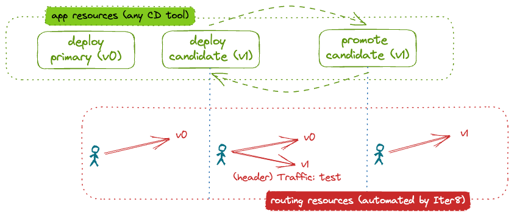

# Canary release of a KServe ML model

This tutorial shows how Iter8 can be used to release ML models hosted in a KServe environment using a canary rollout strategy. 
In a canary rollout, inference requests that match a particular pattern, for example those that have a particular header, are directed to the candidate version of the model. 
The remaining requests go to the primary, or initial, version of the model.
The user declaratively describes the desired application state at any given moment. 
An Iter8 `release` chart assists users who describe the application state at any given moment. 
The chart provides the configuration needed for Iter8 to automatically deploy application versions and configure the routing to implement the canary rollout strategy.



???+ warning "Before you begin"
    1. Ensure that you have the [`kubectl`](https://kubernetes.io/docs/reference/kubectl/) and [`helm`](https://helm.sh/) CLIs.
    2. Have access to a cluster running [KServe](https://kserve.github.io/website). You can create a [KServe Quickstart](https://kserve.github.io/website/0.11/get_started/#before-you-begin) environment as follows:
    ```shell
    curl -s "https://raw.githubusercontent.com/kserve/kserve/release-0.11/hack/quick_install.sh" | bash
    ```
<!-- Istio is installed as part of kserve install -->

## Install the Iter8 controller

--8<-- "docs/getting-started/install.md"

## Deploy initial version

Deploy the initial version of the model using the Iter8 `release` chart by identifying the environment into which it should be deployed, a list of the versions to be deployed (only one here), and the rollout strategy to be used:

```shell
cat <<EOF | helm upgrade --install wisdom --repo https://iter8-tools.github.io/iter8 release --version 0.18 -f -
environment: kserve
application: 
  metadata:
    labels:
      app.kubernetes.io/name: wisdom
  modelFormat: sklearn
  runtime: kserve-mlserver
  versions:
  - metadata:
      labels:
        app.kubernetes.io/version: v0
    storageUri: "gs://seldon-models/sklearn/mms/lr_model"
  strategy: canary
EOF
```

Wait for the backend model to be ready:

```shell
kubectl wait --for condition=ready isvc/wisdom-0 --timeout=600s
```

??? note "What happens?"
    - Because `environment` is set to `kserve`, an `InferenceService` object is created.
    - The namespace `default` is inherited from the Helm release namespace since it is not specified in the version or in `application.metadata`.
    - The name `wisdom-0` is derived from the Helm release name since it is not specified in the version or in `application.metadata`. The name is derived by appending the index of the version in the list of versions; `-0` in this case.
    - Alternatively, an `inferenceServiceSpecification` could have been provided.

    To support routing, a `Service` (of type `ExternalName`) named `default/wisdom` pointing at the KNative gateway, `knative-local-gateway.istio-system`, is deployed. The name is the Helm release name since it not specified in `application.metadata`. Further, an Iter8 [routemap](../../../user-guide/topics/routemap.md) is created.

Once the `InferenceService` is ready, the Iter8 controller automatically configures the routing by creating an Istio `VirtualService`. It is configured to route all inference requests to the only deployed version, `wisdom-0`.

### Verify routing

You can send verify the routing configuration by inspecting the `VirtualService`:

```shell
kubectl get virtualservice wisdom -o yaml
```

You can also send inference requests from a pod within the cluster:

1. Create a `sleep` pod in the cluster from which requests can be made:
```shell
curl -s https://raw.githubusercontent.com/iter8-tools/docs/v0.17.3/samples/kserve-serving/sleep.sh | sh -
```

2. Exec into the sleep pod:
```shell
kubectl exec --stdin --tty "$(kubectl get pod --sort-by={metadata.creationTimestamp} -l app=sleep -o jsonpath={.items..metadata.name} | rev | cut -d' ' -f 1 | rev)" -c sleep -- /bin/sh
```

3. To send requests without the header `traffic`:
```shell
curl -H 'Content-Type: application/json' \
http://wisdom.default -d @input.json -s -D - \
| grep -e HTTP -e app-version
```

4. Requests can also be sent with the header `traffic: test`. When a candidate is deployed, requests with this header will be routed to the candidate. When no candidate is deployed, all requests will be routed to the same model version.
```shell
curl -H 'Content-Type: application/json' \
-H 'traffic: test' \
http://wisdom.default -d @input.json -s -D - \
| grep -e HTTP -e app-version
```

The output includes the success of the request (the HTTP return code) and the version of the application that responded (in the `app-version` response header). In this example:

```
HTTP/1.1 200 OK
app-version: wisdom-0
```

??? note "To send requests from outside the cluster"
    To configure the release for traffic from outside the cluster:

    (a) In a separate terminal, port-forward the Istio ingress gateway:
    ```shell
    kubectl -n istio-system port-forward svc/istio-ingressgateway 8080:80
    ```
    (b) Download the sample input:
    ```shell
    curl -sO https://raw.githubusercontent.com/iter8-tools/docs/v0.17.3/samples/kserve-serving/input.json
    ```
    \(c) To send requests without the header `traffic`:
    ```shell
    curl -H 'Content-Type: application/json' \
    -H 'Host: wisdom.default' \
    localhost:8080 -d @input.json -s -D - \
    | grep -e '^HTTP' -e app-version
    ```
     (d) To send requests with the header `traffic: test`:
    ```shell
    curl -H 'Content-Type: application/json' \
    -H 'Host: wisdom.default' \
    -H 'traffic: test' \
    localhost:8080 -d @input.json -s -D - \
    | grep -e HTTP -e app-version
    ```

## Deploy candidate

A candidate version of the model can be deployed simply by adding a second version to the list of versions comprising the application:

```shell
cat <<EOF | helm upgrade --install wisdom --repo https://iter8-tools.github.io/iter8 release --version 0.18 -f -
environment: kserve
application: 
  metadata:
    labels:
      app.kubernetes.io/name: wisdom
  modelFormat: sklearn
  runtime: kserve-mlserver
  versions:
  - metadata:
      labels:
        app.kubernetes.io/version: v0
    storageUri: "gs://seldon-models/sklearn/mms/lr_model"
  - metadata:
      labels:
        app.kubernetes.io/version: v1
    storageUri: "gs://seldon-models/sklearn/mms/lr_model"
  strategy: canary
EOF
```

??? note "About the candidate"
    In this tutorial, the model source (field `storageUri`) for the candidate version is the same as for the primary version of the model. In a real example, this would be different. The version label (`app.kubernetes.io/version`) can be used to distinguish between versions.

When the candidate version is ready, the Iter8 controller will Iter8 will automatically reconfigure the routing so that inference requests with the header `traffic` set to `true` will be sent to the candidate model:

```
HTTP/1.1 200 OK
app-version: wisdom-1
```

All other requests will be sent to the primary model (`wisdom-0`):

```
HTTP/1.1 200 OK
app-version: wisdom-0
```

### Verify routing

You can verify the routing configuration by inspecting the `VirtualService` and/or by sending requests as described above. Those with header `traffic` set to `true` will be handled by the candidate model (`wisdom-1`) while all others will be handled by the primary version.

## Promote candidate

The candidate model can be promoted by redefining the primary version and removing the candidate:

```shell
cat <<EOF | helm upgrade --install wisdom --repo https://iter8-tools.github.io/iter8 release --version 0.18 -f -
environment: kserve
application: 
  metadata:
    labels:
      app.kubernetes.io/name: wisdom
  modelFormat: sklearn
  runtime: kserve-mlserver
  versions:
  - metadata:
      labels:
        app.kubernetes.io/version: v1
    storageUri: "gs://seldon-models/sklearn/mms/lr_model"
  strategy: canary
EOF
```

??? note "What is different?"
    The version label (`app.kubernetes.io/version`) of the primary version was updated. In a real world example, `storageUri` would also be updated (with that from the candidate version).

Once the (reconfigured) primary `InferenceService` ready, the Iter8 controller will automatically reconfigure the routing to send all requests to it.

### Verify Routing

You can verify the routing configuration by inspecting the `VirtualService` and/or by sending requests as described above. They will be handled by the primary version. Output will be something like:

```
HTTP/1.1 200 OK
app-version: wisdom-0
```

## Cleanup

Delete the models and their routing:

```shell
helm delete wisdom
```

If you used the `sleep` pod to generate load, remove it:

```shell
kubectl delete deploy sleep
```

Uninstall Iter8 controller:

--8<-- "docs/getting-started/uninstall.md"
