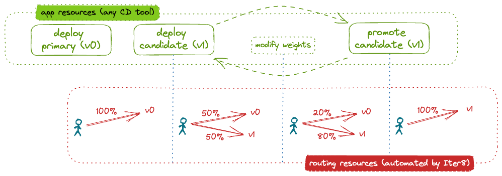

# Blue-green release

This tutorial shows how Iter8 can be used to release a basic Kubernetes application using a blue-green rollout strategy. 
In a blue-green rollout, a percentage of requests are directed to a candidate version of the model. 
This percentage can be changed over time. 
The user declaratively describes the desired application state at any given moment. 
An Iter8 `release` chart assists users who describe the application state at any given moment. 
The chart provides the configuration needed for Iter8 to automatically deploy application versions and configure the routing to implement the blue-green rollout strategy.



This tutorial uses the Kubernetes Gateway API to allow the use any service mesh that supports this API. In this case, we use demonstrate with [Linkerd](https://linkerd.io/).

???+ warning "Before you begin"
    1. Ensure that you have a Kubernetes cluster and the [`kubectl`](https://kubernetes.io/docs/reference/kubectl/) and [`helm`](https://helm.sh/) CLIs. If using a local cluster (for example, [Kind](https://kind.sigs.k8s.io/) or [Minikube](https://minikube.sigs.k8s.io/docs/)), we recommend providing the cluster with at least 16GB of memory.
    2. [Install Linkerd](https://linkerd.io/2.14/getting-started/).

## Install the Iter8 controller

--8<-- "docs/getting-started/install.md"

## Deploy initial version

Deploy the initial version of the application ([httpbin](https://httpbin.org/)) using the Iter8 `release` chart by identifying the environment into which it should be deployed, a list of the versions to be deployed (only one here), and the rollout strategy to be used. Note that we deploy the application to the namespace `test`. 

???+ note "About creating a namespace for Linkerd deployments"
    When creating a namespace, it should be annotated so that all created pods are injected with the Linkerd proxy. This can be done, for example, by using the Linkerd CLI:
    ```shell
    kubectl create ns test --dry-run=client -o yaml | linkerd inject - | kubectl apply -f -
    ```

```shell
cat <<EOF | helm -n test upgrade --install httpbin --repo https://iter8-tools.github.io/iter8 release --version 0.18 -f -
environment: deployment-gtw
application: 
  versions:
  - metadata:
      labels:
        app.kubernetes.io/version: v0
    image: kennethreitz/httpbin
  strategy: blue-green
EOF
```

??? note "What happens?"
    The environment defines what kind of application is deployed. In this case (`deployment-gtw`), a `Deployment` and a `Service` object are created.
        - The namespace `default` is inherited from the Helm release namespace since it is not specified in the version or in `application.metadata`.
        - The name `httpbin-0` is derived from the Helm release name since it is not specified in the version or in `application.metadata`. The name is derived by appending the index of the version in the list of versions; `-0` in this case.
        - Alternatively, a `deploymentSpecification` and/or a `serviceSpecification` could have been specified.

    To support routing, a `Service` (`httpbin`) is deployed. The name is the Helm release name since it not specified in `application.metadata`. Further, an Iter8 [routemap](../../../user-guide/routemap.md) is created. Finally, to support the blue-green rollout, a `ConfigMap` (`httpbin-0-weight-config`) is created to be used to manage the proportion of traffic sent to this version.

Once the application components are ready, the Iter8 controller automatically configures the routing by creating an `HTTPRoute`. It is configured to route all traffic to the only deployed version, `httpbin-0`.

### Verify routing

You can verify the routing configuration by inspecting the `HTTPRoute`:

```shell
kubectl -n test get httproute.gateway.networking.k8s.io httpbin -o yaml
```

You can also send requests from a pod within the cluster:

1. Create a `sleep` pod in the cluster from which requests can be made:
```shell
export SERVICE_MESH=linkerd
curl -s https://raw.githubusercontent.com/iter8-tools/docs/v0.18.4/samples/kserve-serving/sleep.sh | sh -
```

2. Exec into the sleep pod:
```shell
kubectl exec --stdin --tty "$(kubectl get pod --sort-by={metadata.creationTimestamp} -l app=sleep -o jsonpath={.items..metadata.name} | rev | cut -d' ' -f 1 | rev)" -c sleep -- /bin/sh
```

3. Send requests:
```shell
curl httpbin.test -s -D - | grep -e '^HTTP' -e app-version
```

The output includes the version of the application that responded (in the `app-version` response header). In this example:

```
HTTP/1.1 200 OK
app-version: httpbin-0
```

## Deploy candidate

A candidate can deployed by simply adding a second version to the list of versions comprising the application:

```shell
cat <<EOF | helm -n test upgrade --install httpbin --repo https://iter8-tools.github.io/iter8 release --version 0.18 -f -
environment: deployment-gtw
application: 
  versions:
  - metadata:
      labels:
        app.kubernetes.io/version: v0
    image: kennethreitz/httpbin
  - metadata:
      labels:
        app.kubernetes.io/version: v1
    image: kennethreitz/httpbin
  strategy: blue-green
EOF
```

??? note "About the candidate version"
    In this tutorial, the candidate image is the same as the one for the primary version. In a real world example, it would be different. The version label (`app.kubernetes.io/version`) can be used to distinguish between versions.

When the second version is deployed and ready, the Iter8 controller automatically reconfigures the routing; the `HTTPRoute` is updated to distribute traffic between versions based on the weights.

### Verify routing

You can verify the routing configuration by inspecting the `HTTPRoute` and/or by sending requests as described above. Requests will now be handled equally by both versions. Output will be something like:

```
HTTP/1.1 200 OK
app-version: httpbin-0
...
HTTP/1.1 200 OK
app-version: httpbin-1
```

## Modify weights (optional)

To modify the request distribution between the versions, add a `weight` to each version. The weights are relative to each other.

```shell
cat <<EOF | helm -n test upgrade --install httpbin --repo https://iter8-tools.github.io/iter8 release --version 0.18 -f -
environment: deployment-gtw
application: 
  versions:
  - metadata:
      labels:
        app.kubernetes.io/version: v0
    image: kennethreitz/httpbin
    weight: 30
  - metadata:
      labels:
        app.kubernetes.io/version: v1
    image: kennethreitz/httpbin
    weight: 70
  strategy: blue-green
EOF
```

Iter8 automatically reconfigures the routing to distribute traffic between the versions based on the new weights.

### Verify routing

You can verify the routing configuration by inspecting the `HTTPRoute` and/or by sending requests as described above. 70 percent of requests will now be handled by the candidate version; the remaining 30 percent by the primary version.

## Promote candidate

The candidate can be promoted by redefining the primary version and removing the candidate:

```shell
cat <<EOF | helm -n test upgrade --install httpbin --repo https://iter8-tools.github.io/iter8 release --version 0.18 -f -
environment: deployment-gtw
application: 
  versions:
  - metadata:
      labels:
        app.kubernetes.io/version: v1
    image: kennethreitz/httpbin
  strategy: blue-green
EOF
```

??? note "What is different?"
    The version label (`app.kubernetes.io/version`) of the primary version was updated. In a real world example, the image would also have been updated (with that from the candidate version).

Once the (reconfigured) primary version ready, the Iter8 controller will automatically reconfigure the routing to send all requests to it.

### Verify routing

You can verify the routing configuration by inspecting the `HTTPRoute` and/or by sending requests as described above. They will all be handled by the primary version. Output will be something like:

```
HTTP/1.1 200 OK
app-version: httpbin-0
```

## Cleanup

Delete the application and its routing configuration:

```shell
helm -n test delete httpbin
```

If you used the `sleep` pod to generate load, remove it:

```shell
kubectl delete deploy sleep
```

Uninstall Iter8 controller:

--8<-- "docs/getting-started/uninstall.md"
