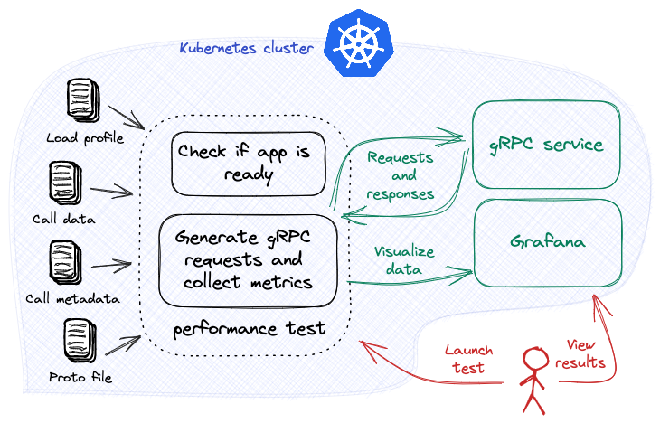

# Load test multiple gRPC endpoints

[Load Test gRPC](./load-test-grpc.md) describes how to load test a single method from a gRPC service inside Kubernetes. This tutorial expands on the previous tutorial and describes how to load test multiple endpoints from an HTTP service.



???+ warning "Before you begin"
    1. Try [Your first performance test](../getting-started/first-performance.md). Understand the main [concepts](../getting-started/concepts.md) behind Iter8 experiments.
    2. Deploy the sample gRPC service in the Kubernetes cluster.
    ```shell
    kubectl create deployment routeguide --image=golang --port=50051 \
    -- bash -c "git clone -b v1.52.0 --depth 1 https://github.com/grpc/grpc-go; cd grpc-go/examples/route_guide; sed -i "''" "'"s/localhost//"'" server/server.go; go run server/server.go"
    kubectl expose deployment routeguide --port=50051
    ```
    3. Have Grafana available. For example, Grafana can be installed on your cluster as follows:
    ```shell
    kubectl create deploy grafana --image=grafana/grafana
    kubectl expose deploy grafana --port=3000
    ```

***

## Install Iter8 controller

--8<-- "docs/tutorials/installiter8controller.md"

## Launch experiment

```shell
iter8 k launch \
--set "tasks={ready,grpc}" \
--set ready.deploy=routeguide \
--set ready.service=routeguide \
--set ready.timeout=60s \
--set grpc.host=routeguide.default:50051 \
--set grpc.protoURL=https://raw.githubusercontent.com/grpc/grpc-go/v1.52.0/examples/route_guide/routeguide/route_guide.proto \
--set grpc.endpoints.getFeature.call=routeguide.RouteGuide.GetFeature \
--set grpc.endpoints.getFeature.dataURL=https://raw.githubusercontent.com/iter8-tools/docs/v0.13.13/samples/grpc-payload/unary.json \
--set grpc.endpoints.listFeatures.call=routeguide.RouteGuide.ListFeatures \
--set grpc.endpoints.listFeatures.dataURL=https://raw.githubusercontent.com/iter8-tools/docs/v0.13.13/samples/grpc-payload/server.json
```

??? note "About this experiment"
    This experiment consists of two [tasks](../getting-started/concepts.md#design), namely, [ready](../user-guide/tasks/ready.md), and [grpc](../user-guide/tasks/grpc.md).
    
    The [ready](../user-guide/tasks/ready.md) task checks if the `routeguide` deployment exists and is available, and the `routeguide` service exists. 

    The [grpc](../user-guide/tasks/grpc.md) task sends call requests to two methods of the cluster-local gRPC service, and collects [Iter8's built-in gRPC load test metrics](../user-guide/tasks/grpc.md#metrics). The two methods are `routeguide.RouteGuide.GetFeature` and `routeguide.RouteGuide.ListFeatures`. Note that each method also has its own `dataURL` for the request payload.

## View results using Grafana
Inspect the metrics using Grafana. If Grafana is deployed to your cluster, port-forward requests as follows:

```shell
kubectl port-forward service/grafana 3000:3000
```

Open Grafana by going to [http://localhost:3000](http://localhost:3000).

[Add a JSON API data source](http://localhost:3000/connections/datasources/marcusolsson-json-datasource) `Iter8` with the following parameters:

* URL: `http://iter8.default:8080/grpcDashboard` 
* Query string: `namespace=default&experiment=default`

[Create a new dashboard](http://localhost:3000/dashboards) by *import*. Paste the contents of the [`grpc` Grafana dashboard](https://raw.githubusercontent.com/iter8-tools/iter8/v0.16.2/grafana/grpc.json) into the text box and *load* it. Associate it with the JSON API data source defined above.

The Iter8 dashboard will look like the following:


## View experiment logs
Logs are useful when debugging an experiment.

```shell
iter8 k log
```

## Cleanup
Remove the Iter8 experiment and the sample app from the Kubernetes cluster.

```shell
iter8 k delete
kubectl delete svc/routeguide
kubectl delete deploy/routeguide
```

### Uninstall the Iter8 controller

--8<-- "docs/tutorials/deleteiter8controller.md"

??? note "Some variations and extensions of this experiment"
    1. The [grpc task](../user-guide/tasks/grpc.md) can be configured with load related parameters such as the total number of requests, requests per second, or number of concurrent connections.