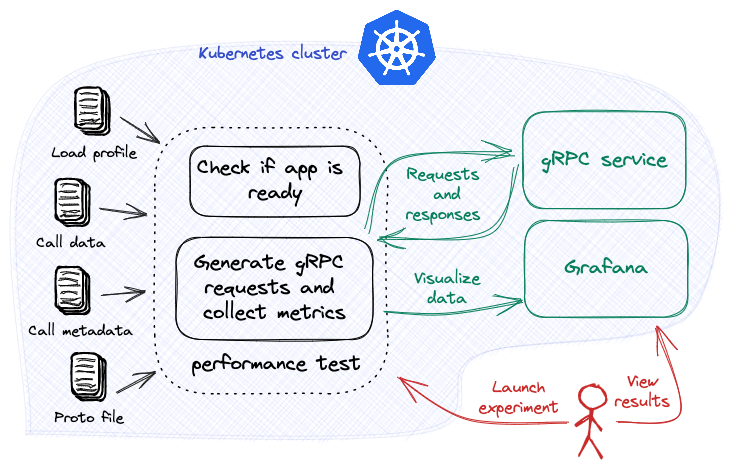

# Load Test gRPC

Load test a Kubernetes gRPC service and interpreting the experiment results using an Iter8 Grafana dashboard.

See [Load Test multiple gRPC methods](./load-test-http-multiple.md) to see a tutorial that describes how to load test multiple methods from an gRPC service.



***

???+ warning "Before you begin"
    1. Try [your first experiment](../getting-started/your-first-experiment.md). Understand the main [concepts](../getting-started/concepts.md) behind Iter8 experiments.
    2. Deploy the sample gRPC service in the Kubernetes cluster.
    ```shell
    kubectl create deployment routeguide --image=golang --port=50051 \
    -- bash -c "git clone -b v1.52.0 --depth 1 https://github.com/grpc/grpc-go; cd grpc-go/examples/route_guide; sed -i "''" "'"s/localhost//"'" server/server.go; go run server/server.go"
    kubectl expose deployment routeguide --port=50051
    ```

***

## Launch experiment

=== "Unary example"
    ```shell
    iter8 k launch \
    --set "tasks={ready,grpc}" \
    --set ready.deploy=routeguide \
    --set ready.service=routeguide \
    --set ready.timeout=60s \
    --set grpc.host=routeguide.default:50051 \
    --set grpc.protoURL=https://raw.githubusercontent.com/grpc/grpc-go/v1.52.0/examples/route_guide/routeguide/route_guide.proto \
    --set grpc.call=routeguide.RouteGuide.GetFeature \
    --set grpc.dataURL=https://raw.githubusercontent.com/iter8-tools/docs/v0.13.13/samples/grpc-payload/unary.json
    ```

=== "Server streaming example"
    ```shell
    iter8 k launch \
    --set "tasks={ready,grpc}" \
    --set ready.deploy=routeguide \
    --set ready.service=routeguide \
    --set ready.timeout=60s \
    --set grpc.host=routeguide.default:50051 \
    --set grpc.protoURL=https://raw.githubusercontent.com/grpc/grpc-go/v1.52.0/examples/route_guide/routeguide/route_guide.proto \
    --set grpc.call=routeguide.RouteGuide.ListFeatures \
    --set grpc.dataURL=https://raw.githubusercontent.com/iter8-tools/docs/v0.13.13/samples/grpc-payload/server.json
    ```

=== "Client streaming example"
    ```shell
    iter8 k launch \
    --set tasks={ready,grpc} \
    --set ready.deploy=routeguide \
    --set ready.service=routeguide \
    --set ready.timeout=60s \
    --set grpc.host=routeguide.default:50051 \
    --set grpc.protoURL=https://raw.githubusercontent.com/grpc/grpc-go/v1.52.0/examples/route_guide/routeguide/route_guide.proto \
    --set grpc.call=routeguide.RouteGuide.RecordRoute \
    --set grpc.dataURL=https://raw.githubusercontent.com/iter8-tools/docs/v0.13.13/samples/grpc-payload/client.json
    ```

=== "Bidirectional example"
    ```shell
    iter8 k launch \
    --set "tasks={ready,grpc}" \
    --set ready.deploy=routeguide \
    --set ready.service=routeguide \
    --set ready.timeout=60s \
    --set grpc.host=routeguide.default:50051 \
    --set grpc.protoURL=https://raw.githubusercontent.com/grpc/grpc-go/v1.52.0/examples/route_guide/routeguide/route_guide.proto \
    --set grpc.call=routeguide.RouteGuide.RouteChat \
    --set grpc.dataURL=https://raw.githubusercontent.com/iter8-tools/docs/v0.13.13/samples/grpc-payload/bidirectional.json
    ```

??? note "About this experiment"
    This experiment consists of two [tasks](../getting-started/concepts.md#design), namely, [ready](../user-guide/tasks/ready.md), and [grpc](../user-guide/tasks/grpc.md).
    
    The [ready](../user-guide/tasks/ready.md) task checks if the `routeguide` deployment exists and is available, and the `routeguide` service exists. 
    
    The [grpc](../user-guide/tasks/grpc.md) task sends call requests to the specified method of the cluster-local gRPC service with host address `routeguide.default:50051` and collects [Iter8's built-in gRPC load test metrics](../user-guide/tasks/grpc.md#metrics). This task supports all four gRPC service methods: unary, server streaming, client streaming, and bidirectional streaming, and will provide payload in the appropriate manner using `dataURL`.

??? note "Some variations and extensions of this experiment"
    1. The [grpc task](../user-guide/tasks/grpc.md) can be configured with load related parameters such as the total number of requests, requests per second, or number of concurrent connections.

***

View the experiment results by using the Iter8 Grafana dashboard, as described in [your first experiment](../getting-started/your-first-experiment.md).

***

## Cleanup
Remove the Iter8 experiment and the sample app from the Kubernetes cluster and the local Iter8 `charts` folder.

```shell
iter8 k delete
kubectl delete svc/routeguide
kubectl delete deploy/routeguide
```