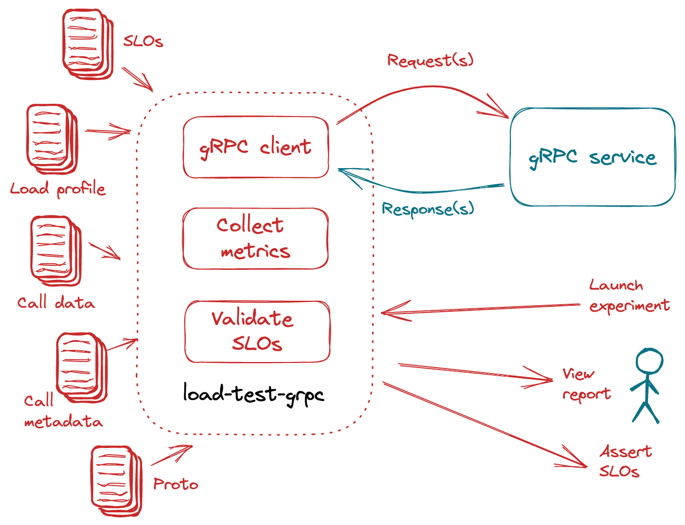

# Benchmark and Validate gRPC Services

The `load-test-grpc` experiment generates call requests for gRPC services, collects latency and error-related metrics, and validates service-level objectives (SLOs).

<p align='center'>
  
</p>

***

--8<-- "docs/tutorials/load-test-grpc/usecases.md"

***

???+ warning "Before you begin"
    Run the Greeter service in a separate terminal. Choose any language and follow the linked instructions.

    === "C#"
        [Run the gRPC service](https://grpc.io/docs/languages/csharp/quickstart/#run-a-grpc-application).

    === "C++"
        [Run the gRPC service](https://grpc.io/docs/languages/cpp/quickstart/#try-it).

    === "Dart"
        [Run the gRPC service](https://grpc.io/docs/languages/dart/quickstart/#run-the-example).

    === "Go"
        [Run the gRPC service](https://grpc.io/docs/languages/go/quickstart/#run-the-example).

    === "Java"
        [Run the gRPC service](https://grpc.io/docs/languages/java/quickstart/#run-the-example).

    === "Kotlin"
        [Run the gRPC service](https://grpc.io/docs/languages/kotlin/quickstart/#run-the-example).

    === "Node"
        [Run the gRPC service](https://grpc.io/docs/languages/node/quickstart/#run-a-grpc-application).

    === "Objective-C"
        [Run the gRPC service](https://grpc.io/docs/languages/objective-c/quickstart/#run-the-server).

    === "PHP"
        [Run the gRPC service](https://grpc.io/docs/languages/php/quickstart/#run-the-example).

    === "Python"
        [Run the gRPC service](https://grpc.io/docs/languages/python/quickstart/#run-a-grpc-application).

    === "Ruby"
        [Run the gRPC service](https://grpc.io/docs/languages/ruby/quickstart/#run-a-grpc-application).

***

## Basic example
Benchmark a gRPC service by specifying its `host`, its fully-qualified method name (`call`), and the URL of Protocol Buffer file (`protoURL`) defining the service.

```shell title="Launch load-test-grpc experiment"
iter8 launch -c load-test-grpc \
--set host="127.0.0.1:50051" \
--set call="helloworld.Greeter.SayHello" \
--set protoURL="https://raw.githubusercontent.com/grpc/grpc-go/master/examples/helloworld/helloworld/helloworld.proto"
```


## Metrics and SLOs
The following metrics are collected by default by this experiment:

- `grpc/request-count`: total number of requests sent
- `grpc/error-count`: number of error responses
- `grpc/error-rate`: fraction of error responses

In addition to default metrics mentioned above, the following latency metrics are also supported. Latency metrics have `msec` units.

- `grpc/latency/mean`: Mean latency
- `grpc/latency/stddev`: Standard deviation of latency
- `grpc/latency/min`: Min latency
- `grpc/latency/max`: Max latency
- `grpc/latency/pX`: X-th percentile latency, for any X in the range 0.0 to 100.0

Any metrics that are specified as part of SLOs are also collected. 

***

```shell title="Sample SLO specification"
--set SLOs.grpc/error-rate=0 \
--set SLOs.grpc/latency/mean=50 \
--set SLOs.grpc/latency/p90=100 \
--set SLOs.grpc/latency/p'97\.5'=200
```

When you set SLOs as shown above, the following conditions are validated.

- error rate is 0
- mean latency is under 50 msec
- 90th percentile latency is under 100 msec
- 97.5th percentile latency is under 200 msec

***

## View report
View a report of the experiment as follows which contains metrics and SLO assessments.

=== "Text"
    ```shell
    iter8 report
    ```

=== "HTML"
    ```shell
    iter8 report -o html > report.html # view in a browser
    ```

***

## Assert outcomes
Assert that the experiment completed without any failures and all the SLOs are satisfied.

```shell
iter8 assert -c completed -c nofailure -c slos
```

***

## Load profile
Control the characteristics of the generated load generated by setting the number of requests (`total`), the number of requests per second (`rps`), number of connections to use (`connections`), and the number of concurrent request workers to use which will be distributed across the connections (`concurrency`).

```shell title="Sample load profile"
--set total=500 \
--set rps=25 \
--set concurrency=50 \
--set connections=10
```

Refer to the [chart's `values.yaml` file](../../user-guide/topics/chart-docs.md) for additional parameters related to the load profile such as `duration`, `maxDuration`, `connectTimeout`, and `keepalive`.


## Call data
gRPC calls may include data serialized as [Protocol Buffer messages](https://grpc.io/docs/what-is-grpc/introduction/#working-with-protocol-buffers).

=== "Data"
    Specify call data as values.

    ```shell title="Flat"
    --set data.name="frodo"
    ```

    ```shell title="Nested"
    --set data.name="frodo" \
    --set data.realm.planet="earth" \
    --set data.realm.location="middle" 
    ```

=== "Data file"
    Use JSON data from a local file.

    ```shell
    --set dataFile="/the/path/to/data.json" # "./data.json" also works
    ```

=== "Data URL"
    Supply a URL that hosts JSON data. Iter8 will download the data from this URL and use it in the requests.
    ```shell
    --set dataURL="https://location.of/data.json"
    ```

=== "Binary data file"
    Use binary data from a local file serialized as a single binary message or multiple count-prefixed messages.

    ```shell
    --set binaryDataFile="/the/path/to/data.bin" # "./data.bin" also works
    ```

=== "Binary data URL"
    Supply a URL that hosts binary data serialized as a single binary message or multiple count-prefixed messages. Iter8 will download the data from this URL and use it in the requests.

    ```shell
    --set binaryDataURL="https://location.of/data.bin"
    ```

***

For client streaming or bi-directional calls, this experiment accepts an array of messages, each element representing a single message within the stream call. If a single object is given for data, then it is automatically converted to an array with single element.

```shell
--set data[0].name="Joe" \
--set data[1].name="Kate" \
--set data[2].name="Sara"
```
    
In case of client streaming, this experiment sends all the data in the input array, and then closes and receives.


## Call metadata
gRPC calls may include [metadata](https://grpc.io/docs/what-is-grpc/core-concepts/#metadata) which is information about a particular call.

=== "Metadata"
    Supply metadata as values.
    ```shell
    --set metadata.darth="vader" \
    --set metadata.lord="sauron" \
    --set metadata.volde="mort"
    ```

=== "Metadata file"
    Use JSON metadata from a local file.

    ```shell
    --set metadataFile="/the/path/to/metadata.json" # "./metadata.json" also works
    ```

=== "Metadata URL"
    Supply a URL that hosts JSON metadata. Iter8 will download the metadata from this URL and use it in the requests.

    ```shell
    --set metadataURL="https://location.of/metadata.json"
    ```


## Proto and reflection
The gRPC server method signatures and message formats are defined in a `.proto` source file, which may also be compiled to a `.protoset` file.

=== "Proto file"
    Use a local `.proto` source file.

    ```shell
    --set protoFile="/path/to/helloworld.proto" # "./helloworld.proto" also works
    ```

=== "Proto URL"
    Use a URL that hosts a `.proto` source file. Iter8 will download the Protocol Buffer file and use it in the experiment.

    ```shell
    --set protoURL="https://raw.githubusercontent.com/grpc/grpc-go/master/examples/helloworld/helloworld/helloworld.proto"
    ```

=== "Protoset file"
    Supply the name of a `.protoset` file that is compiled from `.proto` source files.

    ```shell
    --set protosetFile="./myservice.protoset"
    ```

=== "Protoset URL"
    Supply a URL that hosts a `.protoset` file.

    ```shell
    --set protosetURL="https://raw.githubusercontent.com/grpc/grpc-go/master/examples/helloworld/helloworld/helloworld.protoset"
    ```

=== "Reflection"
    In the absence of `.proto` and `.protoset` information, the experiment will attempt to use [server reflection](https://github.com/grpc/grpc/blob/master/doc/server-reflection.md). You can supply reflect metadata.

    ```shell
    --set reflectMetadata.clientId="5hL64dd0" \
    --set reflectMetadata.clientMood="delightful"
    ```


## Streaming gRPC

Refer to the `values.yaml` file which documents additional parameters related to streaming gRPC such as `streamInterval`, `streamCallDuration`, and `streamCallCount`.