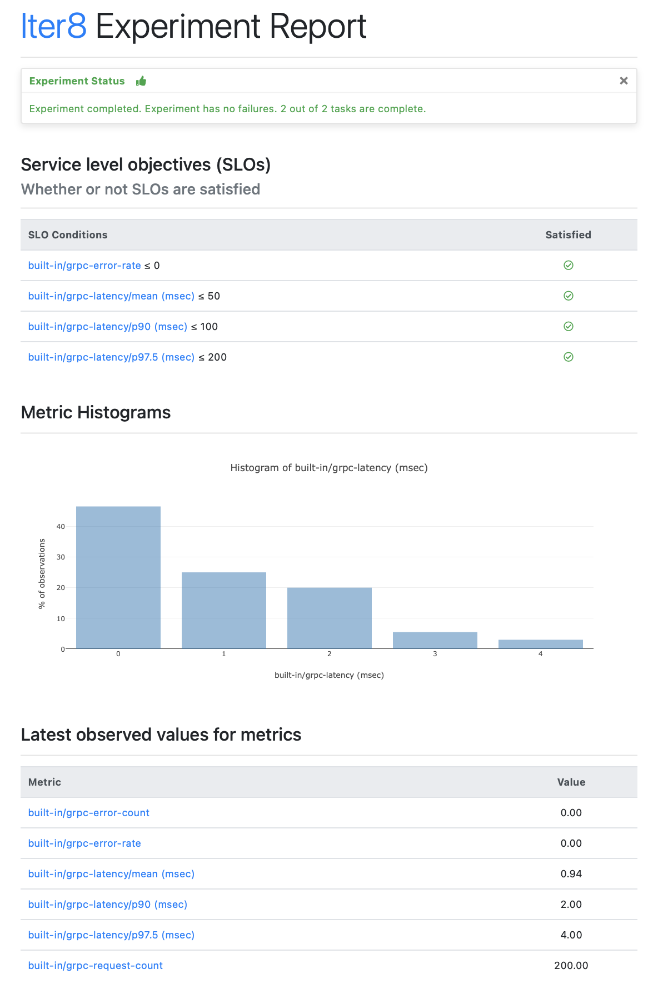

# Load Test gRPC Services with SLOs

!!! tip "Overview"
    Use Iter8's `load-test-grpc` experiment chart to generate call requests for gRPC services, collect Iter8's built-in latency and error-related metrics, and validate service-level objectives (SLOs).

    ***

    **Use-cases:** 
    
    - Benchmarking
    - Validation of service level objectives (SLOs)
    - Safe rollouts
    - Continuous delivery (CD)
    
    If the gRPC service satisfies SLOs, it may be safely rolled out, for example, from a test environment to production.  

    ***

    <p align='center'>
      
    </p>


***

???+ warning "Before you begin"
    1. [Install Iter8](../../getting-started/install.md).
    2. To run the gRPC service, choose any language and follow the linked instructions. The instructions also show how to update the service. This step is not required for this tutorial. Running the basic service is sufficient.

        === "C#"
            [Run the C# gRPC app](https://grpc.io/docs/languages/csharp/quickstart/#run-a-grpc-application).

        === "C++"
            [Run the C++ gRPC app](https://grpc.io/docs/languages/cpp/quickstart/#try-it).

        === "Dart"
            [Run the Dart gRPC app](https://grpc.io/docs/languages/dart/quickstart/#run-the-example).

        === "Go"
            [Run the Go gRPC app](https://grpc.io/docs/languages/go/quickstart/#run-the-example).

        === "Java"
            [Run the Java gRPC app](https://grpc.io/docs/languages/java/quickstart/#run-the-example).

        === "Kotlin"
            [Run the Kotlin gRPC app](https://grpc.io/docs/languages/kotlin/quickstart/#run-the-example).

        === "Node"
            [Run the Node gRPC app](https://grpc.io/docs/languages/node/quickstart/#run-a-grpc-application).

        === "Objective-C"
            [Run the Objective-C gRPC app](https://grpc.io/docs/languages/objective-c/quickstart/#run-the-server).

        === "PHP"
            [Run the PHP gRPC app](https://grpc.io/docs/languages/php/quickstart/#run-the-example).

        === "Python"
            [Run the Python gRPC app](https://grpc.io/docs/languages/python/quickstart/#run-a-grpc-application).

        === "Ruby"
            [Run the Ruby gRPC app](https://grpc.io/docs/languages/ruby/quickstart/#run-a-grpc-application).

***

## Basic example
Load test a [unary gRPC](https://grpc.io/docs/what-is-grpc/core-concepts/#unary-rpc) service as follows by specifying its `host`, its fully-qualified method name (`call`), and the URL of Protocol Buffer file (`protoURL`) defining the service.

```shell
iter8 launch -c load-test-grpc \
          --set host="127.0.0.1:50051" \
          --set call="helloworld.Greeter.SayHello" \
          --set protoURL="https://raw.githubusercontent.com/grpc/grpc-go/master/examples/helloworld/helloworld/helloworld.proto"
```

***

## Metrics and SLOs
By default, the following metrics are collected by `load-test-grpc`: 

- `request-count`: total number of requests sent
- `error-count`: number of error responses
- `error-rate`: fraction of error responses
- `latency/mean`: mean of observed latency values
- `latency/stddev`: standard deviation of observed latency values
- `latency/min`: min of observed latency values
- `latency/max`: max of observed latency values
- `latency/pX`: X^th^ percentile of observed latency values, for `X` in `[50.0, 75.0, 90.0, 95.0, 99.0, 99.9]`

In addition, any other latency percentiles that are specified as part of SLOs are also collected. 

***

```shell
iter8 launch -c load-test-grpc \
          --set host="127.0.0.1:50051" \
          --set call="helloworld.Greeter.SayHello" \
          --set protoURL="https://raw.githubusercontent.com/grpc/grpc-go/master/examples/helloworld/helloworld/helloworld.proto" \ 
          --set SLOs.error-rate=0 \
          --set SLOs.latency-mean=50 \
          --set SLOs.latency-p90=100 \
          --set SLOs.latency-p'97\.5'=200
```

1.  In the above experiment, the following latency percentiles are collected and reported.
    - `[25.0, 50.0, 75.0, 90.0, 95.0, 97.5, 99.0, 99.9]`
2.  The following SLOs are validated.
    - error rate is 0
    - mean latency is under 50 msec
    - 90th percentile latency is under 100 msec
    - 97.5th percentile latency is under 200 msec

***

### Report

The Iter8 experiment report contains metric values, and SLO validation results. View it as follows.

=== "HTML"
    ```shell
    iter8 report -o html > report.html
    # open report.html with a browser. In MacOS, you can use the command:
    # open report.html
    ```

    ??? note "The HTML report looks like this"
        

=== "Text"
    ```shell
    iter8 report
    ```

    ??? note "The text report looks like this"
        ```shell
        Experiment summary:
        *******************

          Experiment completed: true
          No task failures: true
          Total number of tasks: 2
          Number of completed tasks: 2

        Whether or not service level objectives (SLOs) are satisfied:
        *************************************************************

          SLO Conditions                            |Satisfied
          --------------                            |---------
          built-in/http-error-rate <= 0             |true
          built-in/http-latency-mean (msec) <= 50   |true
          built-in/http-latency-p90 (msec) <= 100   |true
          built-in/http-latency-p97.5 (msec) <= 200 |true
          

        Latest observed values for metrics:
        ***********************************

          Metric                              |value
          -------                             |-----
          built-in/http-error-count           |0.00
          built-in/http-error-rate            |0.00
          built-in/http-latency-max (msec)    |10.95
          built-in/http-latency-mean (msec)   |5.72
          built-in/http-latency-min (msec)    |2.63
          built-in/http-latency-p50 (msec)    |5.75
          built-in/http-latency-p75 (msec)    |6.95
          built-in/http-latency-p90 (msec)    |7.88
          built-in/http-latency-p95 (msec)    |8.50
          built-in/http-latency-p97.5 (msec)  |8.92
          built-in/http-latency-p99 (msec)    |10.00
          built-in/http-latency-p99.9 (msec)  |10.85
          built-in/http-latency-stddev (msec) |1.70
          built-in/http-request-count         |100.00
        ```

***

### Assert
Use the `iter8 assert` subcommand to check if the experiment completed without failures, and if all the SLOs are satisfied. This command will exit with code `0` if the assert conditions are satisfied, and with code `1` otherwise. Assertions are especially useful within CI/CD/GitOps pipelines.

```shell
iter8 assert -c completed -c nofailure -c slos
```

??? note "Sample output from assert"
    ```shell
    INFO[2021-11-10 09:33:12] experiment completed
    INFO[2021-11-10 09:33:12] experiment has no failure                    
    INFO[2021-11-10 09:33:12] SLOs are satisfied                           
    INFO[2021-11-10 09:33:12] all conditions were satisfied
    ```

***

## Load profile
Control the characteristics of the load generated by the `load-test-grpc` experiment by  setting the number of requests (`total`)/duration (`duration`), the number of requests per second (`rps`), number of connections to use (`connections`), and the number of concurrent request workers to use in each connection (`concurrency`).


=== "Number of requests"
    ```shell
    iter8 launch -c load-test-grpc \
              --set host="127.0.0.1:50051" \
              --set call="helloworld.Greeter.SayHello" \
              --set protoURL="https://raw.githubusercontent.com/grpc/grpc-go/master/examples/helloworld/helloworld/helloworld.proto" \
              --set data.name="frodo" \
              --set total=500 \
              --set rps=25 \
              --set concurrency=50 \
              --set connections=10
    ```

=== "Duration"
    The duration value may be any [Go duration string](https://pkg.go.dev/maze.io/x/duration#ParseDuration).

    ```shell
    iter8 launch -c load-test-grpc \
              --set host="127.0.0.1:50051" \
              --set call="helloworld.Greeter.SayHello" \
              --set protoURL="https://raw.githubusercontent.com/grpc/grpc-go/master/examples/helloworld/helloworld/helloworld.proto" \
              --set data.name="frodo" \
              --set duration="20s" \
              --set rps=25 \
              --set concurrency=50 \
              --set connections=10
    ```

When you set `total` and `qps`, the duration of the load test is automatically determined. Similarly, when you set `duration` and `qps`, the number of requests is automatically determined. If you set both `total` and `duration`, the former will be ignored.

***

## Call data
gRPC calls may include data serialized as [Protocol Buffer messages](https://grpc.io/docs/what-is-grpc/introduction/#working-with-protocol-buffers). Supply them as values, or by pointing to JSON or binary files containing the data.

=== "Data"
    The [protobuf file specifying the gRPC service](https://raw.githubusercontent.com/grpc/grpc-go/master/examples/helloworld/helloworld/helloworld.proto) used in this tutorial defines the following `HelloRequest` message format:
    ```protobuf
    message HelloRequest {
      string name = 1;
    }
    ```

    Suppose you want include the following `HelloRequest` message with every call.
    ```yaml
    name: frodo
    ```

    To do so, run the Iter8 experiment as follows.
    ```shell
    iter8 launch -c load-test-grpc \
              --set host="127.0.0.1:50051" \
              --set call="helloworld.Greeter.SayHello" \
              --set protoURL="https://raw.githubusercontent.com/grpc/grpc-go/master/examples/helloworld/helloworld/helloworld.proto" \
              --set data.name="frodo"
    ```

    ???+ note "Nested data"
        Call data may be nested. For example, consider the data:
        ```yaml
        name: frodo
        realm:
          planet: earth
          location: middle
        ```
        You can set the above data during `iter8 launch` as follows:
        ```shell
        --set data.name="frodo" \
        --set data.realm.planet="earth" \
        --set data.realm.location="middle" 
        ```

=== "Data URL"
    Suppose the call data you want to send is contained in a JSON file and hosted at the url https://location.of/data.json. Iter8 can fetch this JSON file and use the data contained in it during the gRPC load test. To do so, run the experiment as follows.

    ```shell
    iter8 launch -c load-test-grpc \
              --set host="127.0.0.1:50051" \
              --set call="helloworld.Greeter.SayHello" \
              --set protoURL="https://raw.githubusercontent.com/grpc/grpc-go/master/examples/helloworld/helloworld/helloworld.proto" \
              --set dataURL="https://location.of/data.json"
    ```

=== "Binary data URL"
    Suppose that call data you want to send is contained in a binary file as a serialized binary message or multiple count-prefixed messages, and hosted at the url https://location.of/data.bin. Iter8 can fetch this binary file and use the data contained in it during the gRPC load test. To do so, run the experiment as follows.

    ```shell
    iter8 launch -c load-test-grpc \
              --set host="127.0.0.1:50051" \
              --set call="helloworld.Greeter.SayHello" \
              --set protoURL="https://raw.githubusercontent.com/grpc/grpc-go/master/examples/helloworld/helloworld/helloworld.proto" \
              --set binaryDataURL="https://location.of/data.bin"
    ```

The `data` parameter takes precedence over the `dataURL` parameter which in turn takes precedence over the `binaryDataURL` parameter.

***

## Call metadata
gRPC calls may include [metadata](https://grpc.io/docs/what-is-grpc/core-concepts/#metadata) which is information about a particular call. Supply them as values, or by pointing to a JSON file containing the metadata.

=== "Metadata"
    You can supply metadata of type `map[string]string` (i.e., a map whose keys and values are strings) in the `gRPC` load test. Suppose you want to use the following metadata.
    ```yaml
    darth: vader
    lord: sauron
    volde: mort
    ```

    To do so, run the Iter8 experiment as follows.
    ```shell
    iter8 launch -c load-test-grpc \
              --set host="127.0.0.1:50051" \
              --set call="helloworld.Greeter.SayHello" \
              --set protoURL="https://raw.githubusercontent.com/grpc/grpc-go/master/examples/helloworld/helloworld/helloworld.proto" \
              --set metadata.darth="vader" \
              --set metadata.lord="sauron" \
              --set metadata.volde="mort"
    ```

=== "Metadata URL"
    Suppose the call metadata you want to send is contained in a JSON file and hosted at the url https://location.of/metadata.json. Iter8 can fetch this JSON file and use its contents as the metadata during the gRPC load test. To do so, run the experiment as follows.

    ```shell
    iter8 launch -c load-test-grpc \
              --set host="127.0.0.1:50051" \
              --set call="helloworld.Greeter.SayHello" \
              --set protoURL="https://raw.githubusercontent.com/grpc/grpc-go/master/examples/helloworld/helloworld/helloworld.proto" \
              --set metadataURL="https://location.of/metadata.json"
    ```

The `metadata` parameter takes precedence over the `metadataURL` parameter.

***

## Proto and reflection

