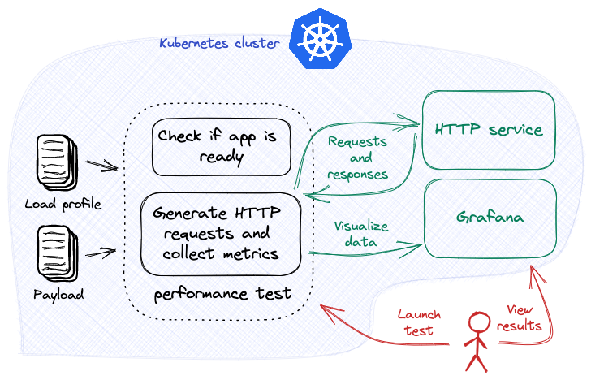

# Load test multiple HTTP endpoints

[Your first performance test](../getting-started/first-performance.md) describes how to load test a HTTP service. This tutorial expands on the previous tutorial and describes how to load test multiple HTTP endpoints.



???+ warning "Before you begin"
    1. Try [Your first performance test](../getting-started/first-performance.md). Understand the main [concepts](../getting-started/concepts.md) behind Iter8.
    2. Ensure that you have a Kubernetes cluster and the [`kubectl` CLI](https://kubernetes.io/docs/reference/kubectl/). You can create a local Kubernetes cluster using tools like [Kind](https://kind.sigs.k8s.io/) or [Minikube](https://minikube.sigs.k8s.io/docs/).
    3. Deploy the sample HTTP service in the Kubernetes cluster.
    ```shell
    kubectl create deploy httpbin --image=kennethreitz/httpbin --port=80
    kubectl expose deploy httpbin --port=80
    ```
    4. Have Grafana available. For example, Grafana can be installed on your cluster as follows:
    ```shell
    kubectl create deploy grafana --image=grafana/grafana
    kubectl expose deploy grafana --port=3000
    ```
    
***

## Install the Iter8 controller

--8<-- "docs/tutorials/installiter8controller.md"

## Launch performance test

```bash
helm upgrade --install \
--repo https://iter8-tools.github.io/iter8 --version 0.17 httpbin-test iter8 \
--set "tasks={ready,http}" \
--set ready.deploy=httpbin \
--set ready.service=httpbin \
--set ready.timeout=60s \
--set http.endpoints.get.url=http://httpbin.default/get \
--set http.endpoints.getAnything.url=http://httpbin.default/anything \
--set http.endpoints.post.url=http://httpbin.default/post \
--set http.endpoints.post.payloadStr=hello
```

??? note "About this performance test"
    This performance test consists of two [tasks](../getting-started/concepts.md#design), namely, [ready](../user-guide/tasks/ready.md) and [http](../user-guide/tasks/http.md).
    
    The [ready](../user-guide/tasks/ready.md) task checks if the `httpbin` deployment exists and is available, and the `httpbin` service exists. 
    
    The [http](../user-guide/tasks/http.md) task sends requests to three endpoints from the cluster-local HTTP service, and collects [Iter8's built-in HTTP load test metrics](../user-guide/tasks/http.md#metrics). The three endpoints are `http://httpbin.default/get`, `http://httpbin.default/anything`, and `http://httpbin.default/post`. The last endpoint also has a payload string `hello`.

## View results using Grafana
Inspect the metrics using Grafana. If Grafana is deployed to your cluster, port-forward requests as follows:

```shell
kubectl port-forward service/grafana 3000:3000
```

Open Grafana by going to [http://localhost:3000](http://localhost:3000).

[Add a JSON API data source](http://localhost:3000/connections/datasources/marcusolsson-json-datasource) `httpbin-test` with the following parameters:

* URL: `http://iter8.default:8080/httpDashboard` 
* Query string: `namespace=default&test=httpbin-test`

[Create a new dashboard](http://localhost:3000/dashboards) by *import*. Paste the contents of the [`http` Grafana dashboard](https://raw.githubusercontent.com/iter8-tools/iter8/v0.16.2/grafana/http.json) into the text box and *load* it. Associate it with the JSON API data source defined above.

The Iter8 dashboard will look like the following:


## View logs
Logs are useful for debugging.

```shell
kubectl logs -l iter8.tools/test=httpbin-test
```

## Cleanup
Remove the performance test and the sample app from the Kubernetes cluster.

```shell
helm delete httpbin-test
kubectl delete svc/httpbin
kubectl delete deploy/httpbin
```

### Uninstall the Iter8 controller

--8<-- "docs/tutorials/deleteiter8controller.md"

??? note "Some variations and extensions of this performance test"
    1. The [http task](../user-guide/tasks/http.md) can be configured with load related parameters such as the number of requests, queries per second, or number of parallel connections.
    2. The [http task](../user-guide/tasks/http.md) can be configured to send various types of content as payload.