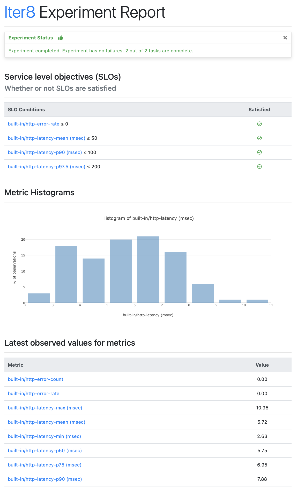

=== "Text"
    ```shell
    iter8 report
    ```

    ??? note "The text report looks like this"
        ```shell

        Experiment summary:
        *******************

          Experiment completed: true
          No task failures: true
          Total number of tasks: 2
          Number of completed tasks: 2

        Whether or not service level objectives (SLOs) are satisfied:
        *************************************************************

          SLO Conditions                   |Satisfied
          --------------                   |---------
          http/error-rate <= 0             |true
          http/latency-mean (msec) <= 50   |true
          http/latency-p90 (msec) <= 100   |true
          http/latency-p97.5 (msec) <= 200 |true
          

        Latest observed values for metrics:
        ***********************************

          Metric                     |value
          -------                    |-----
          http/error-count           |0.00
          http/error-rate            |0.00
          http/latency-max (msec)    |8.93
          http/latency-mean (msec)   |5.49
          http/latency-min (msec)    |2.71
          http/latency-p50 (msec)    |5.38
          http/latency-p75 (msec)    |6.71
          http/latency-p90 (msec)    |7.77
          http/latency-p95 (msec)    |8.27
          http/latency-p97.5 (msec)  |8.60
          http/latency-p99 (msec)    |8.80
          http/latency-p99.9 (msec)  |8.92
          http/latency-stddev (msec) |1.57
          http/request-count         |100.00
        ```

=== "HTML"
    ```shell
    iter8 report -o html > report.html # view in a browser
    ```

    ??? note "The HTML report looks like this"
        