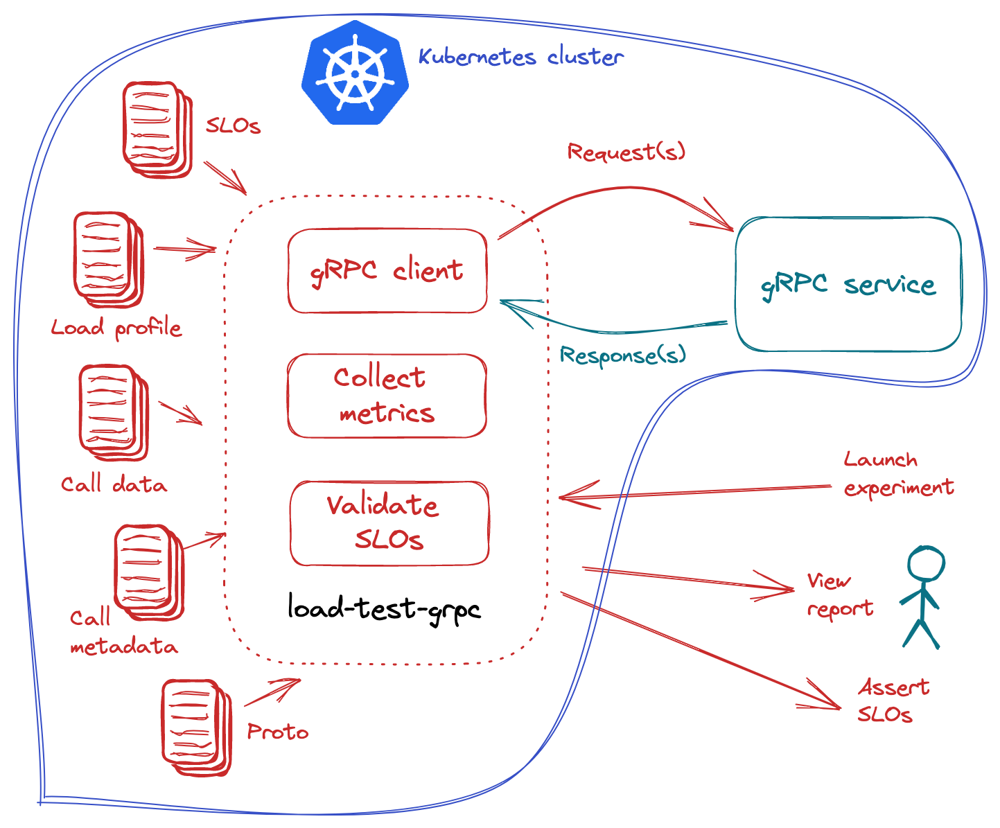

# Benchmark and Validate Kubernetes HTTP Services

Benchmark, and validate an HTTP service inside a Kubernetes cluster using the  [`load-test-http` experiment](basicusage.md). The experiment is run inside the cluster. The HTTP service may be externally exposed or local to the cluster.

<p align='center'>
  
</p>

***

???+ warning "Before you begin"
    1. Try the [basic `load-test-http` tutorial](basicusage.md).
    2. Ensure that you have a Kubernetes cluster and the [`kubectl` CLI](https://kubernetes.io/docs/reference/kubectl/). You may run a local Kubernetes cluster using tools like [Kind](https://kind.sigs.k8s.io/) or [Minikube](https://minikube.sigs.k8s.io/docs/).
    3. Deploy the sample HTTP service in the Kubernetes cluster.
    ```shell
    kubectl create deploy httpbin --image=kennethreitz/httpbin --port=80
    kubectl expose deploy httpbin --port=80
    kubectl wait --for=condition=available --timeout=60s deploy/httpbin
    ```

***

## Launch experiment
Launch a `load-test-http` experiment inside the Kubernetes cluster. Note that the HTTP URL in this experiment is `http://httpbin.default`, which refers to a hostname inside the Kubernetes cluster, specifically, the `httpbin` service in the `default` namespace. 
```shell
iter8 k launch -c load-test-http \
--set url=http://httpbin.default \
--set SLOs.http/latency-mean=50
```

??? tip "Kubernetes experiments and iter8 k"
    Notice the `iter8 k launch` invocation above. Many Iter8 subcommands like `launch`, `assert` and `report` come in two flavors, one suited for experiments that are run locally, and another suited for experiments run inside a Kubernetes cluster. 
    
    For example, `iter8 launch` executes local experiments and `iter8 assert` enables assertions on the results of local experiments; similarly, `iter8 k launch` executes Kubernetes experiments and `iter8 k assert` enables assertions on the results of Kubernetes experiments. 

<!-- Also refer to [readiness check](../../user-guide/topics/readiness.md). -->
<!-- Also refer to [experiment namespaces and groups](../../user-guide/topics/groups.md). -->

***

## Assert experiment outcomes
Assert that the experiment completed without failures, and all SLOs are satisfied. The timeout flag below specifies a period of 120 sec for assert conditions to be satisfied.

```shell
iter8 k assert -c completed -c nofailure -c slos --timeout 120s
```

***

## View experiment report
=== "Text"
    ```shell
    iter8 k report
    ```

=== "HTML"
    ```shell
    iter8 k report -o html > report.html # view in a browser
    ```

***

## View experiment logs
Fetch logs for the Kubernetes experiment.
```shell
iter8 k log
```

***

## Set parameter values
All the parameters described in the [basic usage](basicusage.md) (`iter8 launch`) of `load-test-http` are also applicable for the Kubernetes usage (`iter8 k launch`) of the `load-test-http` experiment.

***

## Cleanup
Delete all resources pertaining to this experiment from the Kubernetes cluster.

```shell
iter8 k delete
```

