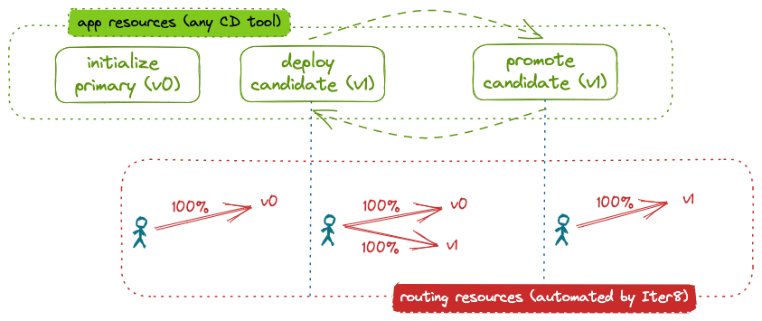

# Mirrored release

This tutorial shows how Iter8 can be used to release a new version of an application using mirroring.
When an application is mirrored, all requests are sent to the primary version of the application. A percentage of requests are also directed to a candidate version of the model. 
This percentage can be changed over time. Only the responses from the primary version are returned to the user.
The user declaratively describes the desired application state at any given moment. 
An Iter8 `release` chart assists users who describe the application state at any given moment. 
The chart provides the configuration needed for Iter8 to automatically deploy application versions and configure the routing to implement the mirrored release strategy.



???+ warning "Before you begin"
    1. Ensure that you have a Kubernetes cluster and the [`kubectl`](https://kubernetes.io/docs/reference/kubectl/) and [`helm`](https://helm.sh/) CLIs. If using a local cluster (for example, [Kind](https://kind.sigs.k8s.io/) or [Minikube](https://minikube.sigs.k8s.io/docs/)), we recommend providing the cluster with at least 16GB of memory.
    2. Install [Istio](https://istio.io). It suffices to install the [demo profile](https://istio.io/latest/docs/setup/getting-started/), for example by using: 
    ```shell
    istioctl install --set profile=demo -y
    ```

## Install the Iter8 controller

--8<-- "docs/getting-started/install.md"

## Deploy initial version

Deploy the initial version of the model using the Iter8 `release` chart by identifying the environment into which it should be deployed, a list of the versions to be deployed (only one here), and the release strategy to be used:

```shell
cat <<EOF | helm upgrade --install httpbin --repo https://iter8-tools.github.io/iter8 release --version 0.18 -f -
cat <<EOF | helm upgrade --install httpbin charts/release -f -
environment: deployment-istio
application: 
  versions:
  - metadata:
      labels:
        app.kubernetes.io/version: v0
    image: kennethreitz/httpbin
  strategy: mirror
EOF
```

??? note "What happens?"
    Because `environment` is set to `deployment-istio`, a `Deployment` and a `Service` object are created.
        - The namespace `default` is inherited from the Helm release namespace since it is not specified in the version or in `application.metadata`.
        - The name `httpbin-0` is derived from the Helm release name since it is not specified in the version or in `application.metadata`. The name is derived by appending the index of the version in the list of versions; `-0` in this case.
        - Alternatively, a `deploymentSpecification` and/or a `serviceSpecification` could have been specified.

    To support routing, a `Service` (of type `ExternalName`) named `default/httpbin` pointing at the Istio gateway, `istio-ingressgateway.istio-system`, is deployed. The name is the Helm release name since it not specified in `application.metadata`. Further, an Iter8 [routemap](../user-guide/routemap.md) is created.

Once the application components are ready, the Iter8 controller automatically configures the routing by creating an Istio `VirtualService`. It is configured to route all traffic to the only deployed version, `httpbin-0`.

### Verify routing

You can verify the routing configuration by inspecting the `VirtualService`:

```shell
kubectl get virtualservice httpbin -o yaml
```

You can also send requests from a pod within the cluster:

1. Create a `sleep` pod in the cluster from which requests can be made:
```shell
curl -s https://raw.githubusercontent.com/iter8-tools/docs/v0.18.4/samples/kserve-serving/sleep.sh | sh -
```

2. Exec into the sleep pod:
```shell
kubectl exec --stdin --tty "$(kubectl get pod --sort-by={metadata.creationTimestamp} -l app=sleep -o jsonpath={.items..metadata.name} | rev | cut -d' ' -f 1 | rev)" -c sleep -- /bin/sh
```

3. Send requests:
```shell
curl httpbin.default -s -D - | grep -e '^HTTP' -e app-version
```

The output includes the success of the request (the HTTP return code) and the version of the application that responded (in the `app-version` response header). In this example:

```
HTTP/1.1 200 OK
app-version: httpbin-0
```

??? note "To send requests from outside the cluster"
    To configure the release for traffic from outside the cluster, a suitable Istio `Gateway` is required. For example, this [sample gateway](https://raw.githubusercontent.com/kalantar/docs/release/samples/iter8-sample-gateway.yaml). When using the Iter8 `release` chart, set the `gateway` field to the name of your `Gateway`. Finally, to send traffic:

    (a) In a separate terminal, port-forward the ingress gateway:
    ```shell
    kubectl -n istio-system port-forward svc/istio-ingressgateway 8080:80
    ```
    (b) Send requests using the `Host` header:
    ```shell
    curl -H 'Host: httpbin.default' localhost:8080 -s -D - | grep -e '^HTTP' -e app-version
    ```

## Deploy candidate

A candidate can deployed by simply adding a second version to the list of versions comprising the application:

```shell
cat <<EOF | helm upgrade --install httpbin --repo https://iter8-tools.github.io/iter8 release --version 0.18 -f -
cat <<EOF | helm upgrade --install httpbin charts/release -f -
environment: deployment-istio
application: 
  versions:
  - metadata:
      labels:
        app.kubernetes.io/version: v0
    image: kennethreitz/httpbin
  - metadata:
      labels:
        app.kubernetes.io/version: v1
    image: kennethreitz/httpbin
    weight: 100
  strategy: mirror
EOF
```

??? note "About the candidate version"
    In this tutorial, the candidate image is the same as the one for the primary version. In a real world example, it would be different. The version label (`app.kubernetes.io/version`) can be used to distinguish between versions.

    To support modifying the percentage of traffic sent to the candidate, a `ConfigMap` (`httpbin-1-weight-config`) is created to be used to manage the proportion of traffic sent to this version.

When the second version is deployed and ready, the Iter8 controller automatically reconfigures the routing; the `VirtualService` is updated to mirror a portion of the traffic to the candidate version.

### Verify routing

You can verify the routing configuration by inspecting the `VirtualService`. With mirroring, only the response of the primary is returned to the user so output will continue to be:

```
HTTP/1.1 200 OK
app-version: httpbin-0
```

## Modify mirrored weight (optional)

To modify the percentage of traffic mirrored, set the weight in the candidate version:

```shell
cat <<EOF | helm upgrade --install httpbin --repo https://iter8-tools.github.io/iter8 release --version 0.18 -f -
cat <<EOF | helm upgrade --install httpbin charts/release -f -
environment: deployment-istio
application: 
  versions:
  - metadata:
      labels:
        app.kubernetes.io/version: v0
    image: kennethreitz/httpbin
  - metadata:
      labels:
        app.kubernetes.io/version: v1
    image: kennethreitz/httpbin
    weight: 50
  strategy: mirror
EOF
```

Iter8 automatically reconfigures the routing to send the desired percentage of requests to the candidate version.

### Verify routing

You can verify the routing configuration by inspecting the `VirtualService` and/or by sending requests as described above. Again, user requests will always be responded to by the primary version.

## Promote candidate

The candidate can be promoted by redefining the primary version and removing the candidate:

```shell
cat <<EOF | helm upgrade --install httpbin --repo https://iter8-tools.github.io/iter8 release --version 0.18 -f -
cat <<EOF | helm upgrade --install httpbin charts/release -f -
environment: deployment-istio
application: 
  versions:
  - metadata:
      labels:
        app.kubernetes.io/version: v1
    image: kennethreitz/httpbin
  strategy: mirror
EOF
```
??? note "What is different?"
    The version label (`app.kubernetes.io/version`) of the primary version was updated. In a real world example, the image would also have been updated (with that from the candidate version).

Once the (reconfigured) primary version ready, the Iter8 controller will automatically reconfigure the routing to send all requests to it.

### Verify routing

You can verify the routing configuration by inspecting the `VirtualService` and/or by sending requests as described above. They will all be handled by the primary version. Output will be something like:

```
HTTP/1.1 200 OK
app-version: httpbin-0
```

## Cleanup

Delete the application and its routing configuration:

```shell
helm delete httpbin
```

If you used the `sleep` pod to generate load, remove it:

```shell
kubectl delete deploy sleep
```

Uninstall Iter8 controller:

--8<-- "docs/getting-started/uninstall.md"
