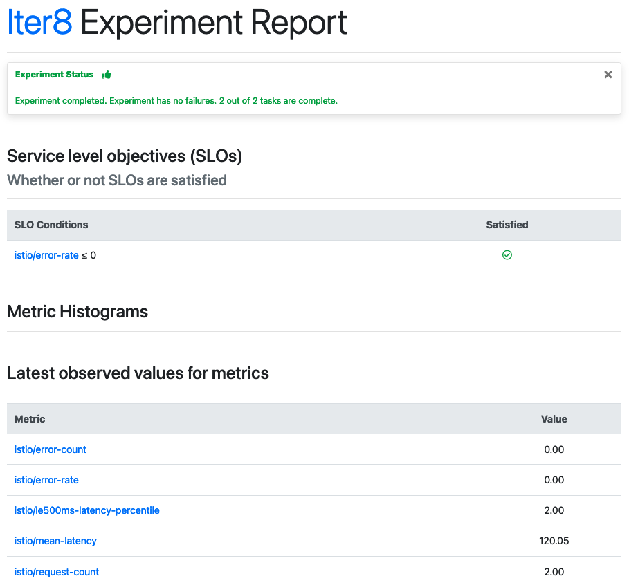

=== "Text"
    ```shell
    iter8 k report
    ```

    ??? note "The text report looks like this"
        ```shell
        Experiment summary:
        *******************

          Experiment completed: false
          No task failures: true
          Total number of tasks: 2
          Number of completed tasks: 6

        Whether or not service level objectives (SLOs) are satisfied:
        *************************************************************

          SLO Conditions        |Satisfied
          --------------        |---------
          istio/error-rate <= 0 |true
          istio/latency-mean <= 100 |true
          

        Latest observed values for metrics:
        ***********************************

          Metric                           |value
          -------                          |-----
          istio/error-count                |0.00
          istio/error-rate                 |0.00
          istio/latency-mean               |6.31
          istio/le500ms-latency-percentile |1.00
          istio/request-count              |2110.00
        ```

=== "HTML"
    ```shell
    iter8 k report -o html > report.html # view in a browser
    ```

    ??? note "The HTML report looks like this"
        