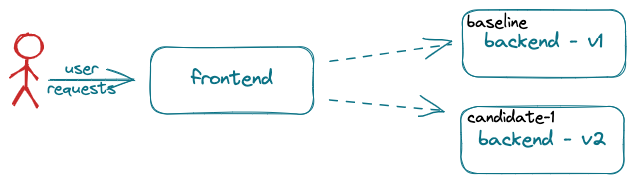

# A/B/n Testing

A/B/n testing relies on business metrics typically computed by a frontend, user-facing, application component. 



Metric values often depend on one or more interactions with backend (not user-facing) application components. To run an A/B/n test on a backend component, it is necessary to be able to associate a metric value (computed by the frontend component) to the version of the backend component that contributed to its computation. 
The challenge is that the frontend component often does not know which version of the backend component processed a given request. To address this challenge, Iter8 introduces an A/B/n SDK. 

The Iter8 SDK uses a fixed set of versions numbers (`0`, `1`, etc.) as a way to refer to the current set of versions of a Kubernetes application or ML model. The version of the application associated with a given version number changes over time as new versions are developed, deployed for testing, and either promoted or deleted. Since the set of version numbers is fixed, they can be used to configure routing to the application.

The Iter8 SDK provides two APIs to frontend application components:

a. `Lookup()` - Given an application and user session, returns a version number to be used as an index to a table of routes. So long as there are no changes in configuration, the version number (and hence the route) will be same for the same user session, guaranteeing session stickiness.

b. `WriteMetric()` -  Given an application, a user session, a metric name its value, *WriteMetric()* associates the metric value with the appropriate version of the application. 

## Configuring the Iter8 controller

The Iter8 controller is implemented using gRPC. The service is configured to watch a given set of Kubernetes resource types. The default set of types Iter8 can watch are identified in the default [`values.yaml` file](https://github.com/iter8-tools/iter8/blob/v1.1.1/charts/controller/values.yaml). Other configuration options are described in the same file.

To configure the specific resources to watch for a given application, a Kubernetes `ConfigMap` is created. It identifies the specific resources that comprise each version. For example, consider the `ConfigMap`:

```yaml
apiVersion: v1
kind: ConfigMap
metadata:
  name: backend
  labels:
    app.kubernetes.io/managed-by: iter8
    iter8.tools/kind: routemap
    iter8.tools/version: "v1.1"
immutable: true
data:
  strSpec: |
    versions:
    - resources:
      - gvrShort: svc
        name: backend
        namespace: default
      - gvrShort: deploy
        name: backend
        namespace: default
    - resources:
      - gvrShort: svc
        name: backend-candidate-1
        namespace: default
      - gvrShort: deploy
        name: backend-candidate-1
        namespace: default
```

This `ConfigMap` describes an application `backend`. It identifies two versions of the application. The first is comprised of a Kubernetes `Deployment` and a `Service` object both named `backend` in the `default` namespace.  The second is comprised of the same resource types named `backend-candidate-1` in the same namespace.

## Deployment time configuration of backend components

As versions of a watched application are deployed or deleted, the Iter8 controller keeps track of which versions are available enabling it to respond appropriately to `Lookup()` and `WriteMetric()` requests.

## Developing frontend components: use the SDK

The basic steps to author a frontend application component using the Iter8 SDK are outlined [here](using-sdk.md) for *Node.js* and *Go*. Similar steps would be required for any gRPC supported language.
