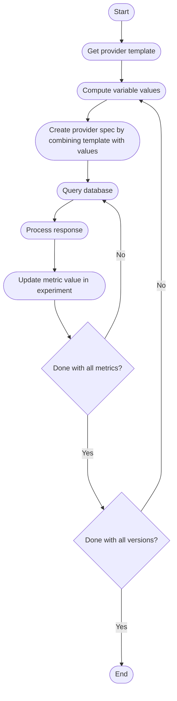

---
template: main.html
---

# custommetrics

Fetch metrics from databases (like Prometheus).

## Usage Example
In this example, the `custommetrics` task fetches metrics from the Prometheus database that is created by [Istio's Prometheus add-on](https://istio.io/latest/docs/ops/integrations/prometheus/). 

```shell
iter8 k launch \
--set "tasks={custommetrics,assess}" \
--set custommetrics.templates.istio-prom="https://raw.githubusercontent.com/iter8-tools/iter8/master/custommetrics/istio-prom.tpl" \
--set custommetrics.values.destinationWorkload=httpbin \
--set custommetrics.values.destinationWorkloadNamespace=default \
--set assess.SLOs.upper.istio-prom/error-rate=0 \
--set assess.SLOs.upper.istio-prom/latency-mean=100 \
--set runner=cronjob \
--set cronjobSchedule="*/1 * * * *"
```


## Parameters

| Name | Type | Description |
| ---- | ---- | ----------- |
| templates  | map[string]string | A map where each key is the name of a [provider](../topics/metrics.md#provider), and the corresponding value is a URL containing the [provider template](#provider-template). |
| values  | map[string]interface{} | A map that contains the values for variables in [provider templates](#provider-template). When there are two or more app versions, this map contains values that are common to all versions. |
| versionValues  | []map[string]interface{} | An array that contains version-specific values for variables in [provider templates](#provider-template). While fetching metrics for version `i`, the task merges `values` with `versionValues[i]` (latter takes precedence), and the merged map contains the values for variables in provider templates. |


## How it works

The logic of this task is illustrated by the following flowchart.



We describe the concepts or [provider spec](#provider-spec) and [provider template](#provider-template) next.

### Provider spec

Iter8 needs the information following in order to fetch metrics from a database.

1. The HTTP URL where the database can be queried.
2. The HTTP headers and method (GET/POST) to be used while querying the database.
3. For each metric to be fetched from the database:
    * The specific HTTP query to be used, in particular, the HTTP query parameters and body (if any).
    * The logic for parsing the query response and retrieving the metric value.

The above information is encapsulated by `ProviderSpec`, a data structure which Iter8 associates with each provider, and `Metric`, a data structure which Iter8 associates with each metric provided by a provider.

???+ tip "Golang type definitions for ProviderSpec and Metric"
    ```go linenums="1"
    type ProviderSpec struct {
      // URL is the database endpoint
      URL string `json:"url" yaml:"url"`
      // Method is the HTTP method that needs to be used
      Method string `json:"method" yaml:"method"`
      // Headers is the set of HTTP headers that need to be sent
      Headers map[string]string `json:"headers" yaml:"headers"`
      // Metrics is the set of metrics that can be obtained
      Metrics []Metric `json:"metrics" yaml:"metrics"`
    }

    type Metric struct {
      // Name is the name of the metric
      Name string `json:"name" yaml:"name"`
      // Description is the description of the metric
      Description *string `json:"description,omitempty" yaml:"description,omitempty"`
      // Type is the type of the metric, either gauge or counter
      Type string `json:"type" yaml:"type"`
      // Units is the unit of the metric, which can be omitted for unitless metrics
      Units *string `json:"units,omitempty" yaml:"units,omitempty"`
      // Params is the set of HTTP parameters that need to be sent
      Params *[]HTTPParam `json:"params,omitempty" yaml:"params,omitempty"`
      // Body is the HTTP request body that needs to be sent
      Body *string `json:"body,omitempty" yaml:"body,omitempty"`
      // JqExpression is the jq expression that can extract the value from the HTTP
      // response
      JqExpression string `json:"jqExpression" yaml:"jqExpression"`
    }

    type HTTPParam struct {
      // Name is the name of the HTTP parameter
      Name string `json:"name" yaml:"name"`
      // Value is the value of the HTTP parameter
      Value string `json:"value" yaml:"value"`
    }
    ```

The `ProviderSpec` and `Metric` data structures together supply Iter8 with all the information needed to query databases, process the response to extract metric values, store the metric values in experiments, and display them in experiment reports with auxiliary information (such as description and units). Metric types are defined [here](../topics/metrics.md#metric-types).

### Provider template

Rather than supplying [provider specs](#provider-spec) directly, Iter8 enables users to supply one or more [Golang templates](https://pkg.go.dev/text/template) for provider specs. Iter8 combines the provider templates with [values](#computing-variable-values), in order to generate [provider specs](#provider-spec) in YAML format, and uses them to query for the metrics.

??? tip "`istio-prom` provider template in the usage example"
    ```yaml linenums="1"
    # This file provides templated metric specifications that enable
    # Iter8 to retrieve metrics from Istio's Prometheus add-on.
    # 
    # For a list of metrics supported out-of-the-box by the Istio Prom add-on, 
    # please see https://istio.io/latest/docs/reference/config/metrics/
    #
    # Iter8 substitutes the placeholders in this file with values, 
    # and uses the resulting metric specs to query Prometheus.
    # The placeholders are as follows.
    # 
    # reporter                        string  optional
    # destinationWorkload             string  required
    # destinationWorkloadNamespace    string  required
    # elapsedTimeSeconds              int     implicit
    # startingTime                    string  optional
    # latencyPercentiles              []int   optional
    #
    # For descriptions of reporter, destinationWorkload, and destinationWorkloadNamespace, 
    # please see https://istio.io/latest/docs/reference/config/metrics/
    #
    # elapsedTimeSeconds: this should not be specified directly by the user. 
    # It is implicitly computed by Iter8 according to the following formula
    # elapsedTimeSeconds := (time.Now() - startingTime).Seconds()
    # 
    # startingTime: By default, this is the time at which the Iter8 experiment started.
    # The user can explicitly specify the startingTime for each app version
    # (for example, the user can set the startingTime to the creation time of the app version)
    #
    # latencyPercentiles: Each item in this slice will create a new metric spec.
    # For example, if this is set to [50,75,90,95],
    # then, latency-p50, latency-p75, latency-p90, latency-p95 metric specs are created.

    {{- define "istio-prom-reporter"}}
    {{- if .reporter }}
    reporter="{{ .reporter }}",
    {{- end }}
    {{- end }}

    {{- define "istio-prom-dest"}}
    {{ template "istio-prom-reporter" . }}
    destination_workload="{{ .destinationWorkload }}",
    destination_workload_namespace="{{ .destinationWorkloadNamespace }}"
    {{- end }}

    # url is the HTTP endpoint where the Prometheus service installed by Istio's Prom add-on
    # can be queried for metrics

    url: {{ default .istioPromURL "http://prometheus.istio-system:9090/api/v1/query" }}
    provider: istio-prom
    method: GET
    metrics:
    - name: request-count
      type: counter
      description: |
        Number of requests
      params:
      - name: query
        value: |
          sum(last_over_time(istio_requests_total{
            {{ template "istio-prom-dest" . }}
          }[{{ .elapsedTimeSeconds }}s])) or on() vector(0)
      jqExpression: .data.result[0].value[1] | tonumber
    - name: error-count
      type: counter
      description: |
        Number of unsuccessful requests
      params:
      - name: query
        value: |
          sum(last_over_time(istio_requests_total{
            response_code=~'5..',
            {{ template "istio-prom-dest" . }}
          }[{{ .elapsedTimeSeconds }}s])) or on() vector(0)
      jqExpression: .data.result[0].value[1] | tonumber
    - name: error-rate
      type: gauge
      description: |
        Fraction of unsuccessful requests
      params:
      - name: query
        value: |
          (sum(last_over_time(istio_requests_total{
            response_code=~'5..',
            {{ template "istio-prom-dest" . }}
          }[{{ .elapsedTimeSeconds }}s])) or on() vector(0))/(sum(last_over_time(istio_requests_total{
            {{ template "istio-prom-dest" . }}
          }[{{ .elapsedTimeSeconds }}s])) or on() vector(0))
      jqExpression: .data.result.[0].value.[1]
    - name: latency-mean
      type: gauge
      description: |
        Mean latency
      params:
      - name: query
        value: |
          (sum(last_over_time(istio_request_duration_milliseconds_sum{
            {{ template "istio-prom-dest" . }}
          }[{{ .elapsedTimeSeconds }}s])) or on() vector(0))/(sum(last_over_time(istio_requests_total{
            {{ template "istio-prom-dest" . }}
          }[{{ .elapsedTimeSeconds }}s])) or on() vector(0))
      jqExpression: .data.result[0].value[1] | tonumber
    {{- range $i, $p := .latencyPercentiles }}
    - name: latency-p{{ $p }}
      type: gauge
      description: |
        {{ $p }} percentile latency
      params:
      - name: query
        value: |
          histogram_quantile(0.{{ $p }}, sum(rate(istio_request_duration_milliseconds_bucket{
            {{ template "istio-prom-dest" $ }}
          }[{{ .elapsedTimeSeconds }}s])) by (le))
      jqExpression: .data.result[0].value[1] | tonumber
    {{- end }}    
    ```

In order to create [provider templates](#provider-template) and use them in experiments, it is necessary to have a clear understanding of how variable values are computed, and how the response from the database is processed by Iter8. We describe these steps next.

### Computing variable values

Variable values are configured explicitly by the user during experiment launch. The sole exception to this rule is the `elapsedTimeSeconds` variable which is computed by Iter8. Please see the tabs below to learn more about how to configure values and how Iter8 computes `elapsedTimeSeconds`.

=== "Configure values for one version"

    When the experiment involves a single version of the app, template variable values are supplied directly as part of the `custommetrics.values` map. See [usage example](#usage-example) for an illustration.

=== "Configure values for multiple versions"

    When the experiment involves two or more versions of the app, values that are shared by all versions are supplied as part of the `custommetrics.values` map, and values that are specific to versions are supplied as part of the `custommetrics.versionValues` list. The length of this list is the number of versions, and `custommetrics.versionValues[i]` is the map that holds values specific to version `i`. Iter8 merges `custommetrics.values` with `custommetrics.versionValues[i]` (latter takes precedence), and uses the resulting map for version `i` when substituting template variables. Configuring values for two versions is illustrated in the following usage example.

    ```shell
    iter8 k launch \
    --set "tasks={custommetrics,assess}" \
    --set custommetrics.templates.istio-prom="https://raw.githubusercontent.com/iter8-tools/iter8/master/custommetrics/istio-prom.tpl" \
    --set custommetrics.values.destinationWorkloadNamespace=default \
    --set custommetrics.values.reporter=destination \
    --set custommetrics.versionValues[0].destinationWorkload=httpbin-v1 \
    --set custommetrics.versionValues[1].destinationWorkload=httpbin-v2 \
    --set assess.SLOs.upper.istio-prom/error-rate=0 \
    --set assess.SLOs.upper.istio-prom/latency-mean=100 \
    --set runner=cronjob \
    --set cronjobSchedule="*/1 * * * *"
    ```

=== "How Iter8 computes `elapsedTimeSeconds`"
    A metric query often involves specifying the time window over which the metric need to be computed. In [provider templates](#provider-template), a special template variable named `elapsedTimeSeconds` holds the length of this time window. Its use within a template is illustrated in the following snippets.
    
    === "query"
        ```go
        sum(last_over_time(istio_requests_total{
          destination_workload="httpbin",
          destination_workload_namespace="default"      
        }[3600s]))
        ```
        The metric is computed over the recent one-hour time window (that ends at the current time).

    === "query template"
        ```go
        sum(last_over_time(istio_requests_total{
          destination_workload="httpbin",
          destination_workload_namespace="default"      
        }[{{ .elapsedTimeSeconds }}s]))
        ```
        The metric is computed over a recent time window (that ends at the current time). The length of this window is determined by the value of the template variable `elapsedTimeSeconds`.

    Iter8 computes the value of the `elapsedTimeSeconds` variable dynamically in this task. This is the desirable behavior in multi-loop experiments (see [usage example](#usage-example)), where metrics need to be fetched periodically, and the time window over which metrics are computed stretches farther back with each loop. The following sequence diagram illustrates how `elapsedTimeSeconds` changes over loops.

    ```mermaid
    sequenceDiagram
        startingTime-)loop1: elapsedTimeSeconds=60;
        startingTime-)loop2: elapsedTimeSeconds=120;
        startingTime-)loop3: elapsedTimeSeconds=180;
    ```

    ***

    Iter8 computes `elapsedTimeSeconds` based on another variable named `startingTime`.    The default value of `startingTime` is the time at which the experiment is launched. The user can override the default by explicitly configuring `startingTime` during experiment launch, in the [RFC 3339](https://www.rfc-editor.org/rfc/rfc3339) format (for example, `2020-02-01T09:44:40Z` or `2020-02-01T09:44:40.954641934Z`). Iter8 sets `elapsedTimeSeconds` as the difference (in seconds) between the current time and `startingTime`. This logic is illustrated in the following flowchart.
    

    ```mermaid
    graph TD
      A([Start]) --> B{startingTime parameter supplied?};
      B ---->|Yes| C([elapsedTimeSeconds = currentTime - startingTime]);
      B ---->|No| D([startingTime = time when experiment was launched]);
      D --> C;
      C --> E([End]);
    ```

    Note that the above design enables the user to supply different `startingTime` values for different app versions (for instance, based on the creation timestamps of the versions).

    === "Single `startingTime` value"
        ```shell
        --set custommetrics.values.startingTime="2020-02-01T09:44:40Z"
        ```

    === "Two versions with different `startingTime` values"
        ```shell
        --set custommetrics.versionValues[0].startingTime="2020-02-01T09:44:40Z" \
        --set custommetrics.versionValues[1].startingTime="2020-02-05T14:22:15Z"
        ```

### Processing response

The metrics provider is expected to respond to Iter8's HTTP request for a metric with a JSON object. The format of this JSON object is provider-specific. Iter8 uses [jq](https://stedolan.github.io/jq/) to extract the metric value from the JSON response of the provider. The `jqExpression` used by Iter8 is supplied as part of the metric definition. When the `jqExpression` is applied to the JSON response, it is expected to yield a number.


=== "Prometheus response example"
    The format of the Prometheus JSON response is [defined here](https://prometheus.io/docs/prometheus/latest/querying/api/#format-overview). A sample Prometheus response is as follows.
    ```json linenums="1"
    {
      "status": "success",
      "data": {
        "resultType": "vector",
        "result": [
          {
            "value": [1556823494.744, "21.7639"]
          }
        ]
      }
    }    
    ```

=== "Prometheus jqExpression example"
    Consider the `jqExpression` defined in the [sample Prometheus metric](#metrics-withwithout-auth). Let us apply it to the [sample JSON response from Prometheus](#json-response).
    ```shell
    echo '{
      "status": "success",
      "data": {
        "resultType": "vector",
        "result": [
          {
            "value": [1556823494.744, "21.7639"]
          }
        ]
      }
    }' | jq ".data.result[0].value[1] | tonumber"
    ```
    Executing the above command results yields `21.7639`, a number, as required by Iter8. 

    > **Note:** The shell command above is for illustration only. Iter8 uses Python bindings for `jq` to evaluate the `jqExpression`.

## Defining and using providers

1. Understand how the `custommetrics` task works; this is described in [this section](#how-it-works).
2. Create your provider template and serve it from a URL. A sample provider template is in [this section](#provider-template).
3. Configure the `custommetrics` task with one or more provider templates. An example of `custommetrics` configuration is in [this section](#usage-example).
4. The metrics fetched by this task can be used to assess app versions in Iter8 experiments. An example that illustrates the use of both `custommetrics` and `assess` tasks together is in [this section](#usage-example).