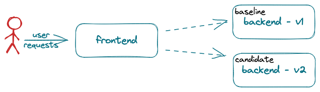

# A/B/n Testing

A/B/n testing relies on business metrics typically computed by a frontend, user-facing, application component. 



Metric values often depend on one or more interactions with backend (not user-facing) application components. To run an A/B/n test on a backend component, it is necessary to be able to associate a metric value (computed by the frontend component) to the version of the backend component that contributed to its computation. 
The challenge is that the frontend component often does not know which version of the backend component processed a given request. To address this challenge, Iter8 introduces an A/B/n SDK. 

The Iter8 SDK uses a fixed set of versions numbers (`0`, `1`, etc.) as a way to refer to the current set of versions of a Kubernetes application or ML model. The version of the application associated with a given version number changes over time as new versions are developed, deployed for testing, and either promoted or deleted. Since the set of version numbers is fixed, they can be used to configure routing to the application.

The Iter8 SDK provides two APIs to frontend application components:

a. **Lookup()** - Given an application and user session, returns a version number to be used as an index to a table of routes. So long as there are no changes in configuration, the version number (and hence the route) will be same for the same user session, guaranteeing session stickiness.

b. **WriteMetric()** -  Given an application, a user session, a metric name its value, *WriteMetric()* associates the metric value with the appropriate version of the application. 

## Configuring the Iter8 controller

The Iter8 controller is implemented using gRPC. The service is configured to watch a given set of Kubernetes resource types. The default set of types Iter8 can watch are identified in the default [`values.yaml` file](https://github.com/iter8-tools/iter8/blob/8e5aedf7e4b611d700a49cde8a082af09d6f1e14/charts/traffic/values.yaml#L14-L40). Other configuration options are described in the same file.

To configure the specific resources to watch for a given application, a Kubernetes `ConfigMap` is created. It identifies the specific resources that comprise each version. For example, consider the `ConfigMap`:

```yaml
apiVersion: v1
kind: ConfigMap
metadata:
  name: backend
  labels:
    app.kubernetes.io/managed-by: iter8
    iter8.tools/kind: routemap
    iter8.tools/version: "v0.16"
immutable: true
data:
  strSpec: |
    versions:
    - resources:
      - gvrShort: svc
        name: backend
        namespace: default
      - gvrShort: deploy
        name: backend
        namespace: default
    - resources:
      - gvrShort: svc
        name: backend-candidate-1
        namespace: default
      - gvrShort: deploy
        name: backend-candidate-1
        namespace: default
```

This `ConfigMap` describes an application `backend`. It identifies two versions of the application. The first is comprised of a Kubernetes `Deployment` and a `Service` object both named `backend` in the `default` namespace.  The second is comprised of the same resource types named `backend-candidate-1` in the same namespace.

## Deployment time configuration of backend components

As versions of a watched application are deployed or deleted, the Iter8 controller keeps track of which versions are available enabling it to respond appropriately to `Lookup()` and `WriteMetric()` requests.

## Developing frontend components: Using the SDK

The basic steps to author a frontend application component using the Iter8 SDK are outlined below for *Node.js* and *Go*. Similar steps would be required for any gRPC supported language.

### Use/import language specific libraries

The gRPC protocol buffer definition is used to generate language specific implementation. These files can be used directly or packaged and imported as a library. As examples, the [Node.js sample](https://github.com/iter8-tools/docs/tree/main/samples/abn-sample/frontend/node) uses manually generated files directly. On the other hand, the [Go sample](https://github.com/iter8-tools/docs/tree/main/samples/abn-sample/frontend/go) imports the library provided by the core Iter8 service implementation. In addition to the API specific methods, some general gRPC libraries are required.

=== "Node.js"
    The manually generated node files [`abn_pd.js`](https://raw.githubusercontent.com/iter8-tools/docs/main/samples/abn-sample/frontend/node/abn_pb.js) and [`abn_grpc_pb.js`](https://raw.githubusercontent.com/iter8-tools/docs/main/samples/abn-sample/frontend/node/abn_grpc_pb.js) used in the sample application can be copied and used without modification.

    ```javascript
    var grpc = require('@grpc/grpc-js');

    var messages = require('./abn_pb.js');
    var services = require('./abn_grpc_pb.js');
    ```

=== "Go"
    ```go
    import (
        "google.golang.org/grpc"
        "google.golang.org/grpc/credentials/insecure"

        pb "github.com/iter8-tools/iter8/abn/grpc"
    )
    ```

### Instantiate a gRPC client

Instantiate a client to the Iter8 controller:

=== "Node.js"
    ```javascript
    var client = new services.ABNClient(abnEndpoint, grpc.credentials.createInsecure());
    ```

=== "Go"
    ```go
    opts := []grpc.DialOption{grpc.WithTransportCredentials(insecure.NewCredentials())}
    conn, err := grpc.Dial(fmt.Sprintf("%s:%s", getAbnService(), getAbnServicePort()), opts...)
    if err != nil {
        panic("Cannot establish connection with abn service")
    }
    c := pb.NewABNClient(conn)
    client = &c
    ```

### Define routing

Track identifiers are mapped to a static set of endpoints. One approach is to maintain a map from track identifier to endpoint:

=== "Node.js"
    ```javascript
    const versionNumberToRoute = [
        "http://backend.default.svc.cluster.local:8091",
        "http://backend-candidate-1.default.svc.cluster.local:8091",
    ]
    ```

=== "Go"
    ```go
	versionNumberToRoute = []string{
		"http://backend.default.svc.cluster.local:8091",
		"http://backend-candidate-1.default.svc.cluster.local:8091",
	}
    ```

### Using `Lookup()`

Given a user session identifier, `Lookup()` returns a version number that can be used to route requests. In code sample below, the user session identifier is assumed to be passed in the `X-User` header of user requests. The version number is used as an index to the `versionNumberToRoute` map defined above. A default is used if the call to `Lookup()` fails for any reason.

=== "Node.js"
    ```javascript
    var application = new messages.Application();
    application.setName('default/backend');
    application.setUser(req.header('X-User'));
    client.lookup(application, function(err, versionRecommendation) {
        if (err) {
            // use default route (see above)
            console.warn("error calling Lookup()")
        } else {
            // use route determined by recommended track
            console.info('lookup suggested track %d', versionRecommendation.getVersionnumber())
            versionNumber = versionRecommendation.getVersionnumber()
            if (versionNumber != NaN && 0 <= versionNumber && versionNumber < versionNumberToRoute.length) {
                route = versionNumberToRoute[versionNumber]
            }
        }

        // call backend service using route
        ...
    });
    ```

=== "Go"
    ```go
	route := versionNumberToRoute[0]
    user := req.Header["X-User"][0]
    s, err := (*client).Lookup(
        ctx,
        &pb.Application{
            Name: "default/backend",
            User: user,
        },
    )
	if err == nil && s != nil {
		versionNumber := int(s.GetVersionNumber())
		if err == nil && 0 <= versionNumber && versionNumber < len(versionNumberToRoute) {
			route = versionNumberToRoute[versionNumber]
		} // else use default value for route
	}

    // call backend service using route
    ...
    ```

### Using *WriteMetric()*

As an example, a single metric named *sample_metric* is assigned a random value between 0 and 100 and written.

=== "Node.js"
    ```javascript
    var mv = new messages.MetricValue();
    mv.setName('sample_metric');
    mv.setValue(random({min: 0, max: 100, integer: true}).toString());
    mv.setApplication('default/backend');
    mv.setUser(user);
    client.writeMetric(mv, function(err, session) {});
 
    ```

=== "Go"
    ```go
    _, _ = (*client).WriteMetric(
        ctx,
        &pb.MetricValue{
            Name:        "sample_metric",
            Value:       fmt.Sprintf("%f", rand.Float64()*100.0),
            Application: "default/backend",
            User:        user,
        },
    )
    ```
