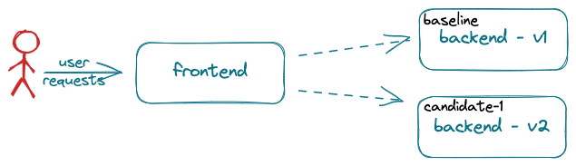

# A/B/n Testing

A/B/n testing relies on business metrics typically computed by a frontend, user-facing, application component. 

<p align='center'>

</p>

Metric values often depend on one or more interactions with backend (not user-facing) components. To run an A/B/n test on a backend component, it is necessary to be able to associate a metric value (computed by the frontend component) to the version of the backend component that contributed to its computation. The challenge is that the frontend component often does not know which version of the backend component processed a given request. To address this challenge, Iter8 introduces an A/B/n SDK which provides a frontend component with two APIs:

a. **Lookup()** - Identifies a version of a backend component to send a request to. Given a user session, *Lookup()* returns a track identifier that can be used to route requests. So long as there are no changes in configuration, the track identifier (and hence route) will be same for the same user session, guaranteeing session stickiness. Note that the track identifier is not a version identifier; the version associated with a track changes over time as the versions being tested chanage.

b. **WriteMetric()** - Associates a metric value with a backend component. Given a user session, *WriteMetric()* identifies the implementing version and writes the metric to a metric store associated with that version. By default, Iter8 uses a Kubernetes secret to store the metrics. The [abnmetrics](../tasks/abnmetrics.md) experiment task can be used to read the metrics stored by *WriteMetric()*.

The Iter8 SDK is implemented using gRPC. The formal definition of the API is in this [protocol buffer document](https://raw.githubusercontent.com/iter8-tools/docs/main/samples/abn-sample/frontend/abn.proto).

## Configuring the Iter8 A/B/n Service

An Iter8 A/B/n service implements the gRPC API. This service is configured, at deployment, to watch the resoruce objects for a set of applications so that it can identify new versions and their mapping to a track label.

To watch for versions of an application, specify the list of the types of the objects that must be present and ready for a version to be considered ready:

`--set "apps.<namespace>.<application_name>.resources={<comma separated list resoure types>}"`

Valid resource types are corresponding Kubenetes resource types (specified by group, version and resource) are listed below. When the required condition value is `true`, the resource object is considered ready.

| Type Name | Kubernetes Resource Type (GVR) | Required Condition |
| ---- | ---- | ----------- |
| service  | v1 services | - |
| deployment | apps/v1 deployments | Available |
| ksvc | serving.knative.dev/v1 services | Ready |

If more than one candidate version can be deployed at the same time, specify the maximum number using:

`--set apps.<namespace>.<application_name>.maxNumCandidates=<number>`

From the above configuration, Iter8 infers the names of the expected resource objects using these assumptions:

- All resource objects for all versions are deployed in the same namespace
- There is only 1 resource object of a given type in each version
- All objects in the baseline version are named using only the application name
- All objects in a candidate version are named as `<application_name>-candidate-<index>` where index is 1, 2, etc.
- The baseline track label is the name of the application
- Candidate track labels are of the form `<application_name>-candidate-<index>`

## Deployment Time Configuration of Backend Components

As versions of the backend component are deployed or deleted, the Iter8 A/B/n service maintains a mapping of track label to available version. Using this runtime mapping it is then able to respond appropriately to *Lookup()* and *WriteMetric()* requests.

To build and maintain it's mapping, the A/B/n service watches the resource objects specified as part of the A/B/n service configuration (see above). 
In particular, the configuraiton requires that the Kubernetes objects comprising the backend component adhere to a naming convention: all Kubernetes objects that comprise the new version deployed for a particular track should be named using the track label (ie, `<application_name>-candidate-<index>`) and should have the label `app.kubernetes.io/version` set to the version label.

For example, for an application `foo` where we will test up to 2 candidate versions at a time, the tracks will be `foo`, `foo-candidate-1`, and `foo-candidate-2`. To deploy a candidate version `ver` as track `foo-candidate-2`, the resource objects must all be named `foo-candidate-2` and have label `app.kubernetes.io/version: ver`.

## Developing Frontend Components: Using the SDK

The basic steps to author a frontend application component using the Iter8 SDK are outlined below for *Node.js* and *Go*. Similar steps would be required for any gRPC supported langauge.

### Use/Import language specific libraries

The gRPC protocol buffer definition is used to generate language specific implementation. These files can be used directly or packaged and imported as a library. As examples, the Node.js sample uses manually generated files directly. The Go sample imports the library provided by the core Iter8 implementation. In addition to the API specific methods, some general gRPC libaries are required.

=== "Node.js"
    The manually generated node files [`abn_pd.js`](https://raw.githubusercontent.com/iter8-tools/docs/main/samples/abn-sample/frontend/node/abn_pb.js) and [`abn_grpc_pb.js`](https://raw.githubusercontent.com/iter8-tools/docs/main/samples/abn-sample/frontend/node/abn_grpc_pb.js) used in the sample application can be copied and used without modification in other projects.

    ```javascript
    var grpc = require('@grpc/grpc-js');

    var messages = require('./abn_pb.js');
    var services = require('./abn_grpc_pb.js');
    ```

=== "Go"
    ```go
    import (
        "google.golang.org/grpc"
        "google.golang.org/grpc/credentials/insecure"

        pb "github.com/iter8-tools/iter8/abn/grpc"
    )
    ```

### Instantiate a gRPC client

Instantiate a client to the Iter8 A/B/n service:

=== "Node.js"
    ```javascript
    var client = new services.ABNClient(abnEndpoint, grpc.credentials.createInsecure());
    ```

=== "Go"
    ```go
    opts := []grpc.DialOption{grpc.WithTransportCredentials(insecure.NewCredentials())}
    conn, err := grpc.Dial(fmt.Sprintf("%s:%s", getAbnService(), getAbnServicePort()), opts...)
    if err != nil {
        panic("Cannot establish connection with abn service")
    }
    c := pb.NewABNClient(conn)
    client = &c
    ```

### Define routing

Track identifiers are mapped to a static set of endpoints. One approach is to maintain a map from track label to endpoint:

=== "Node.js"
    ```javascript
    const trackToRoute = {
        "backend":   "http://backend.default.svc.cluster.local:8091",
        "backend-candidate-1": "http://backend-candidate-1.default.svc.cluster.local:8091",
    }
    ```

=== "Go"
    ```go
    trackToRoute = map[string]string{
        "backend":             "http://backend.default.svc.cluster.local:8091",
        "backend-candidate-1": "http://backend-candidate-1.default.svc.cluster.local:8091",
    }
    ```

### Using *Lookup()*

Given a user session identifier, *Lookup()* returns a track identifier that can be used to route requests. In code sample below, the user session identifier is assumed to be passed in the `X-User` header of user requests. The track identifier is used as an index to the `trackToRoute` map defined above. A default is used if the call to *Lookup* fails for any reason.

=== "Node.js"
    ```javascript
    var application = new messages.Application();
    application.setName('default/backend');
    application.setUser(req.header('X-User'));
    client.lookup(application, function(err, session) {
        if (err || (session.getTrack() == '')) {
            // use default route (see above)
            console.warn("error or null")
        } else {
            // use route determined by recommended track
            console.info('lookup suggested track %s', session.getTrack())
            route = trackToRoute[session.getTrack()];
        }

        // call backend service using route
        ...
    });
    ```

=== "Go"
    ```go
    route := trackToRoute["backend"]
    user := req.Header["X-User"][0]
    s, err := (*client).Lookup(
        ctx,
        &pb.Application{
            Name: "default/backend",
            User: user,
        },
    )
    if err == nil && s != nil {
        r, ok := trackToRoute[s.GetTrack()]
        if ok {
            route = r
        }
    }

    // call backend service using route
    ...
    ```

### Using *WriteMetric()*

As an exmple, a single metric named *sample_metric* is assigned a random value between 0 and 100 and written to the metric store.

=== "Node.js"
    ```javascript
    var mv = new messages.MetricValue();
    mv.setName('sample_metric');
    mv.setValue(random({min: 0, max: 100, integer: true}).toString());
    mv.setApplication('default/backend');
    mv.setUser(user);
    ```

=== "Go"
    ```go
    _, _ = (*client).WriteMetric(
        ctx,
        &pb.MetricValue{
            Name:        "sample_metric",
            Value:       fmt.Sprintf("%f", rand.Float64()*100.0),
            Application: "default/backend",
            User:        user,
        },
    )
    ```
